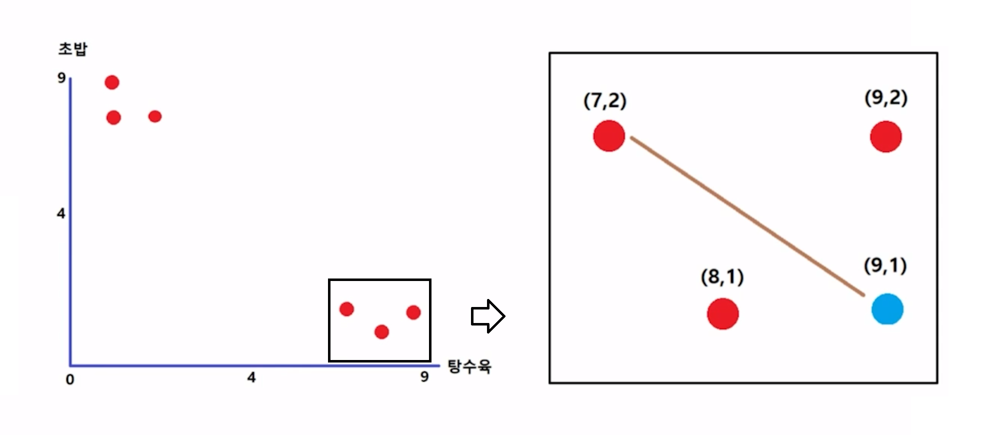
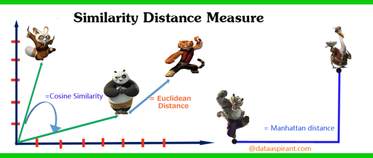

## 01 - KNN

### KNN(K-Nearest Neighbor)

새로운 데이터가 주어졌을 때 기존 데이터 가운데 가장 가까운 K개 이웃의 정보로 새로운 데이터 예측

### 데이터

다음과 같이 여러 사람의 평점 데이터가 주어져 있고, 희동은 짜장면만 평점을 매기지 않았을 때, 이를 예측하는 알고리즘이 KNN

|  | 탕수육(1차원) | 초밥(2차원) | 짜장면(3차원) |
| --- | --- | --- | --- |
| 마이콜 | 2 | 8 | 1 |
| 고길동 | 7 | 2 | 9 |
| 사오정 | 8 | 1 | 7 |
| 저팔계 | 1 | 9 | 1 |
| 손오공 | 9 | 2 | 9 |
| 둘리 | 1 | 8 | 2 |

|  | 탕수육 | 초밥 | 짜장면 |
| --- | --- | --- | --- |
| 희동 | 9 | 1 | ? |



- $length = \sqrt{(1-2)^2+(2-1)^2}$
- 가까이에 있는 class에 속하게 되며, 위의 **?** 값은 평균 또는 최빈값 등으로 계산함

### 과정 요약

Step 1 : 모든 User 데이터와의 거리 계산

Step 2 : 가까운 거리에 있는 K개의 User 데이터 찾기

Step 3 : 평균, 빈도 등으로 아이템 선호도 예측

### Source Code

[GitHub - KNN Algorithm Example](https://github.com/sweetchild222/vanilla-algorithm)

```python
k = 3 # 몇 개까지를 가까운 거리에 있는 유저라고 볼 것인가
user = [9, 1, 0]
neighbor_list = [
	[2,8,1],
	[7,2,9],
	[8,1,7],
	[1,9,1],
	[9,2,9],
	[1,8,2]]

prediction = predict_classification(user, neighbor_list, k)

print('Predict %f.' % (prediction))
```

```python
def predict_classification(user, neighbor_list, k):

	# 비슷한 취향을 가진 K개의 User 데이터를 리턴 받음
	neighbors = get_neighbors(user, neighbor_list, k)

	predict_candidate = [row[-1] for row in neighbors]
	print('predict_candidate : ', predict_candidate)
	prediction = max(set(predict_candidate), key=predict_candidate.count)
	return prediction
```

```python
def get_neighbors(user, neighbor_list, k):
	distances = list()
	for neighbor in neighbor_list:
		dist = euclidean_distance(user, neighbor)
		distances.append((neighbor, dist))
	distances.sort(key=lambda tup: tup[1])

	print('neighbors distances : ', distances)

	near_neighbors = list()
	for i in range(k):
		near_neighbors.append(distances[i][0])

	print('near neighbors : ', near_neighbors)

	return near_neighbors
```

```python
def euclidean_distance(user, neighbor):
	distance = 0.0
	for i in range(len(user)-1):
		distance += (user[i] - neighbor[i])**2
	return sqrt(distance)
```

### 거리를 구하는 다양한 방법



[[Py3.5] 5-most popular similarity measures implementation in python](https://dbrang.tistory.com/1201)

- Mahalanobis distance는 보통 변수가 너무 많아지거나 비선형적 데이터를 사용할 때 사용
- 어느 방법이 성능/예측률이 더 좋은지는 정해져 있지 않음
- 개발자가 데이터 셋의 성질, 양 등을 종합적으로 판단하여 선택