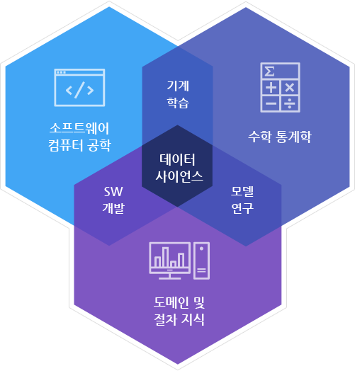
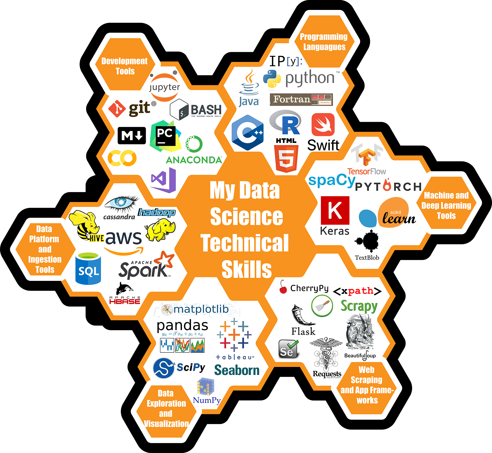
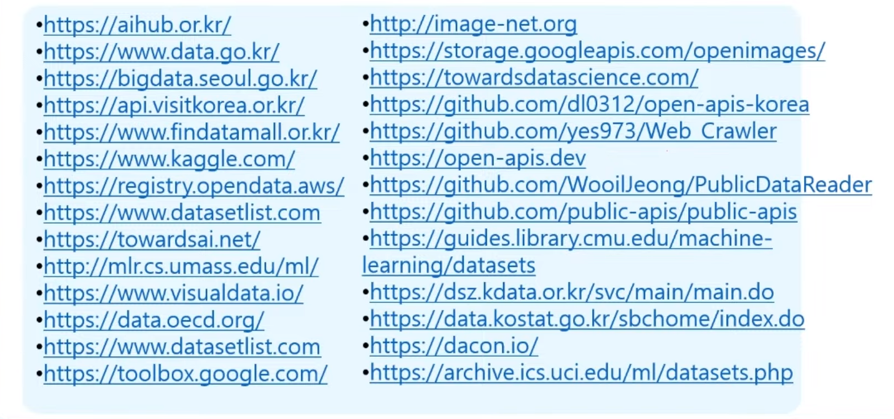
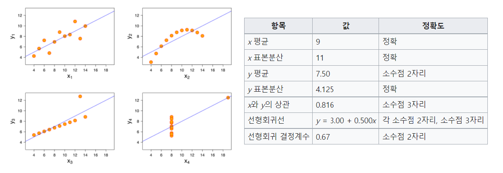
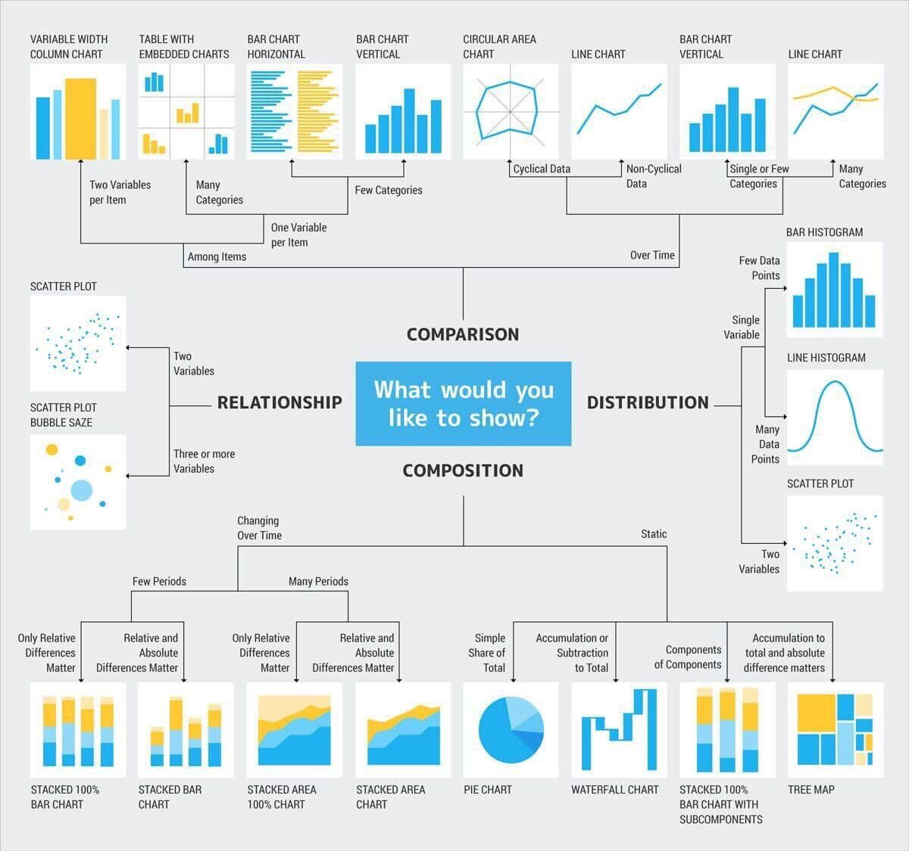

## 02 - 데이터 분석

### 데이터 과학의 정의와 툴셋

 

데이터의 분석과 활용이 개인과 조직의 새로운 힘이 되고 경쟁력이 되는 시대입니다. 데이터 사이언스는 **데이터 수집, 큐레이션, 통계 분석과 기계학습** 등의 다양한 기술과 지식을 활용하여 **복잡한 데이터**로부터 **인사이트를 얻거나 지능화된 시스템을 구현**하기 위한 모든 업무를 총칭합니다.
[출처: 솔트룩스]

### 데이터 분석 프로세스

목표 설정 → 데이터 획득 → 데이터 준비 → 데이터 탐색 → 모델링 및 구축 → 발표 및 적용

| 과정 | 수집 | 처리 | 분석 | 적용 |
| --- | --- | --- | --- | --- |
| 툴 | requests BeautifulSoup Scrapy | Database SQLAlchemy Pandas | Pandas Numpy Scipy | Matplotlib Plot.ly |

→ Jupyter Notebook에서 많이 사용

### Jupyter Notebook

- Jupyter Notebook이란
    - Jupyter = Ju(lia) + Pyt(hon) + R
    - 웹 기반 + 통합 개발 환경 + 인터랙티브
    - 노트북 = 문서(마크다운) + 코드 + 시각화 + 수식 표현 ⇒ 실행되는 문서
    - IPython에서 시작(2014년)
    - 데이터 과학 분야의 표준 도구(De Facto)
    - 코드 작성과 실행, 출력 보기, 시각화 출력
- 용도
    - 데이터 분석과 개발 과정 전반에서 사용
    - 개발 프로토타입을 만들 때
    - 일반 개발용(지원 언어 40+)
- 사용자
    - 데이터를 다루는 사람 누구나
    - 개발과 기록을 한 번에, 내보내기와 공유
- 시작하기
    - 설치형
        - 일반 설치(Python, pip)
        - anaconda(⭐) : 패키지 + 환경 관리
        - docker
    - 서비스형
        - Google Colab
        - Kaggle(⭐)
        - Cloud : AWS, GCP, Azure

### 데이터 구하기

- Raw Data : RDB, DataWarehouse, Data Lake, File(CSV, log, txt, Excel), Service, …
- Open Dataset, Open API
    
    
    
- 스크래핑
    - 파이썬으로 쉽고 편하게 스크래핑 개발 가능
    - requests, urllib3
    - scrapy
    - selenium
    - 파싱 : BeautifulSoup, lxml, JSON
    - 07/29 라이브 “데이터 크롤링의 세계” 참고
- 직접 입력
- 유료 데이터 구매

### 데이터 처리와 분석

> 데이터 과학의 80%는 데이터 클리닝에 소비되고, 나머지 20%는 그걸 불평하는데 쓰인다.
- Anthony Goldbloom, Kaggle Founder/CEO
> 
- pandas + python + SciPy + NumPy
- 데이터 로딩 → 닦고 채우고 지우고 자르고 붙이고 돌리고 묶고 분류하고 계산하고 변형한 뒤
- 분석, 저장하거나 다음 단계로 전달

### 시각화

**앤스컴 콰르텟(Anscombe's quartet)**

기술통계량은 유사하지만 분포나 그래프는 매우 다른 4개의 데이터셋. 데이터 분석 전, 시각화의 중요성과 특이치 및 주영향관측값(influential observation)의 영향을 보여주기 위해 만들어짐.

- 시각화의 목적
    - 사람들이 이해하기 쉽게 **전달**
    - EDA의 중요한 과정
    - **데이터 탐색** : 데이터 이해, 트렌드와 패턴 파악, 특이값 찾아내기, 모델 선정
    - 패턴을 인식하는 인간의 능력 활용하기
    - 데이터 리터러시(데이터 문해력)
- 시각화 방법 선택 → **다방면으로** 살펴보기
    
    
    
- 많이 사용하는 라이브러리
    - matplotlib : 기본
    - seaborn : matplotlib 기반
    - plot.ly and plot.ly express : JavaScript, Interactive
    - Bokeh
    - Altair and vega
    - 모두 Jupyter Notebook에서 사용 가능

### 데이터 분석 개선하기

- 협업
    - nbconvert, nbviewer, binder : Publish
- Jupyter Lab : 차세대 Notebook
- 성능
    - 코드 : 프로파일링(%time, %timeit, %prun)
    - GPU 가속 : CUDA, cuDF
    - Clustering/parallelism : dask, vaex
- JIT : PyPy, numba
- Cloud
    - AWS SageMaker
    - GCP AI Platform
    - Azure ML Notebook
    - Jetbrains DataLore
- Alt. Tool
    - VSCode도 노트북 지원
    - Jetbrains DataSpell

### Closing

- 컨퍼런스/커뮤니티 : PyCon, PyData, JupyterCon
- 참조
    - [도서] 파이썬 라이브러리를 활용한 데이터 분석
    - [도서] 파이썬 데이터 사이언스 핸드북
    - [도서] 밑바닥부터 시작하는 데이터 과학
    - [Web] jupyterbook, kaggle, dacon, github, etc.
