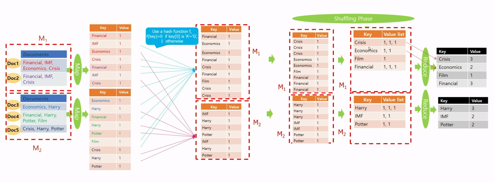
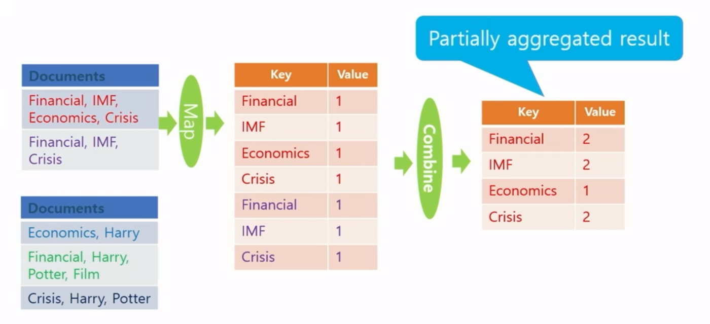
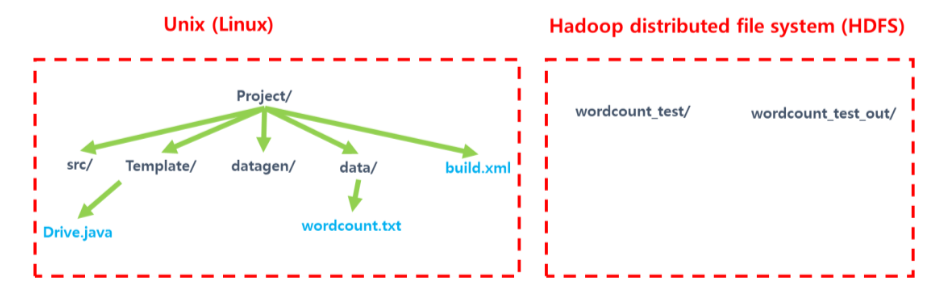

## 이론

### 프로젝트 개요

**병렬 분산 시스템**과 **맵 리듀스 프레임워크**를 이해하고, 하둡을 이용하여 여러 가지 빅데이터 분석 문제들에 대해서 맵 리듀스 알고리즘을 자바 언어로 구현하고 실행

### 프로젝트 목표

- 병렬 분산 알고리즘 구현이 가능한 맵 리듀스 프레임워크를 이해
- 맵 리듀스 프레임워크를 사용할 수 있는 Hadoop 설치 및 맵 리듀스 알고리즘 코드를 실행
- 하둡을 이용하여 빅데이터 분석 및 처리용 맵 리듀스 알고리즘을 구현하는데 필요한 지식과 코딩 능력을 배양

### Scaling-out is superior to Scaling-up

- Scale-out : 아주 많은 저렴한 서버 사용
- Scale-up : 적은 수의 고성능 서버 사용
- 데이터 중심(data-intensive) 어플리케이션 분야에서는 scaling-out을 선호함
- 고가의 서버들을 가격 관점에서 선형으로 성능이 증가하지 않음
    
    ex) 두 배 성능의 프로세서 한 개를 가진 컴퓨터의 가격이 일반적인 프로세서 한 개를 가진 컴퓨터 가격의 두 배보다 훨씬 더 비쌈
    

### MapReduce

- 데이터 중심 프로세싱(Data-intensive Processing)
    - 한 대의 컴퓨터의 능력으로 처리가 어려움
    - 많은 수의 컴퓨터를 하나로 묶어 처리해야 함
    - 즉, MapReduce 프레임워크의 역할
- 맵 리듀스는 빅데이터를 이용한 효율적인 계산이 가능한 첫 번째 프로그래밍 모델
    - 기존의 병렬 컴퓨팅 방법은 프로그래머가 낮은 레벨의 시스템까지 잘 알고 많은 시간을 쏟아야 함

### MapReduce Framework

- 빅데이터 응용 분야에서 최근 주목 받고 있음
- 값싼 컴퓨터들을 모아서 클러스터를 만들고, 여기에 빅데이터를 처리하기 위한 Scalable 병렬 소프트웨어의 구현을 쉽게 할 수 있도록 도와주는 간단한 프로그래밍 모델
    - ‘scalable’은 사용자 수나 데이터가 급증해도 프로그램이 멈추거나 성능이 크게 떨어지지 않는다는 의미
- 구글의 MapReduce 혹은 오픈소스인 Hadoop은 MapReduce Framework의 우수한 구현 형태임
- 맵 리듀스 프레임워크에서 각각의 record 또는 tuple은 (key, value) 쌍으로 표현
- 맵 리듀스 프레임워크는 메인 함수를 한 개의 master machine에서 수행하는데, 이 머신은 Map 함수를 수행하기 전에 전처리를 하거나 Reduce 함수의 결과를 후처리를 하는데 사용할 수 있음
- 컴퓨팅은 Map과 Reduce라는 사용자 정의 함수 한 쌍으로 이루어진 맵 리듀스 페이즈를 한 번 수행하거나 여러 번 반복해서 수행 가능
- 한 번의 맵 리듀스 페이즈는 Map → (combine) → Reduce 순서로 진행되며, 때에 따라 Reduce를 수행하지 않기도 함
- 드라이버에 해당하는 메인 프로그램에서 맵리듀스 페이즈를 수행시킴

### MapReduce Programming Model

- 함수형 프로그래밍(Functional Programming) 언어의 형태
- 유저는 아래 세 가지 함수를 구현하여 제공해야 함(Square brackets []는 값이 여러 개 존재할 수 있음을 의미함)
    - Main 함수
    - Map 함수 : (key1, val1) → [(key2, val2)]
    - Reduce 함수 : (key2, [val2]) → [(key3, val3)]

### MapReduce Phase

1. Map phase
    - 가장 먼저 수행되며, 데이터의 여러 파티션에 병렬 분산으로 호출되어 수행
    - 각 머신마다 수행된 Mapper는 맵 함수가 입력 데이터의 한 줄 마다 Map 함수 호출
    - Map 함수는 (key, value) 쌍 형태로 결과를 출력하고, 여러 머신에 나눠 보내며 같은 key를 가진 쌍은 같은 머신으로 보내짐
2. Shuffling phase
    - 모든 머신에서 Map phase가 끝나면 시작
    - Map phase에서 각각의 머신으로 보내진 (key, value) 쌍을 key를 이용하여 정렬 후, 각각의 key 마다 같은 key를 가진 쌍을 모아서 value-list를 만들어 (key, value-list) 형태로 key에 따라 여러 머신에 분산하여 보냄
3. Reduce phase
    - 모든 머신에서 Shuffling phase가 끝나면, 각 머신마다 Reduce phase가 시작
    - 각각의 머신에서는 Shuffling phase에서 해당 머신으로 보낸 (key, value-list) 쌍 마다 Reduce 함수가 호출되며, 하나가 끝나면 다음 Reduce 함수가 호출 됨
    - 출력이 있다면 (key, value) 쌍 형태로 출력

### Hadoop

- Apache 프로젝트의 오픈소스 맵 리듀스 프레임워크의 오픈 소스
- 하둡 분산 파일 시스템(Hadoop Distibuted File System; HDFS)
    - 빅데이터 파일을 여러 대의 컴퓨터에 나누어 저장
    - 각 파일은 여러 개의 순차적인 블록으로 저장
    - 하나의 파일의 각각의 블록은 fault-tolerance를 위해 여러 개로 복사되어 여러 머신에 나눠 저장.
        - fault-tolerance
        시스템을 구성하는 일부 부품에서 결함(fault) 또는 고장(failure)이 발생하여도 정상적 혹은 부분적으로 기능을 수행 할 수 있는 것
- 빅 데이터를 수천 대의 값 싼 컴퓨터에 병렬 처리하기 위해 분산
- 주요 구성 요소들
    - MapReduce : 소프트웨어의 수행을 분산
    - HDFS : 데이터를 분산
- 하나의 Namenode(master)와 여러 개의 Datanode(slaves)
    - Namenode : 파일 시스템을 관리하고 클라이언트가 파일에 접근할 수 있게 함
    - Datanode : 컴퓨터에 들어있는 데이터에 접근할 수 있게 함.
- Java로 맵 리듀스 알고리즘 구현

### MapReduce의 함수

- Map
    - org.apache.hadoop.mapreduce 패키지의 Mapper 클래스를 상속받아 map 메소드를 수정
    - 입력 텍스트 파일에서 라인 단위로 호출되고 입력은 (key, value-list)의 형태
    - key는 입력 텍스트 파일에서 맨 앞 문자를 기준으로 맵 함수가 호출된 라인의 첫 번째 문자까지 오프셋
    - value는 텍스트의 해당 라인 전체가 들어있음
- Reduce
    - mapreduce 패키지 내의 Reducer 클래스를 상속 받아 reduce 메소드를 수정
    - Shuffling phase의 출력을 입력으로 받는데 (key, value-list)의 형태
    - value-list는 맵 함수의 출력에서 같은 key를 갖는 (key, value) 쌍들의 value 리스트
- Combine
    - reduce 함수와 유사하나, 각 머신에서 Map phase에서 map 함수의 출력 크기를 줄여서 Shuffling phase와 Reduce phase의 비용을 줄이는데 사용

### MapReduce를 이용한 Word Counting 알고리즘

- 두개의 머신 $M_1$, $M_2$가 있고, 각 문서는 한 개의 라인만 있다고 가정
1. 머신 $M_i$마다 mapper가 하나씩 수행되고 mapper는 map 함수를 각 라인 하나마다 차례대로 호출함.
2. 텍스트 문서의 각 라인마다 map 함수가 호출되고, 문서를 스캔하면서, 각 단어를 key로 하고, 값 1을 value로 하여 (key, value) 쌍을 출력
3. 출력한 (key, value) 쌍의 key에 따라서 해시 함수를 이용하여 여러 머신에 분산 시켜 보냄
4. Shuffling phase에서 정렬을 한 후에 같은 key를 가진 value들을 모아서 value-list를 만들어 (key, value-list) 형태를 출력
5. 머신 $M_i$마다 reducer가 하나씩 수행되고 reducer는 reduce 함수를 (key, value-list) 쌍 마다 차례대로 호출



### Combine 함수

- Map 함수의 결과 크기를 줄여줌
- 각각의 머신에서 Reduce 함수를 이용하는 것처럼 수행됨
- 셔플링 비용을 줄여줌 → 맵 리듀스 알고리즘 디자인에서 사용하는 것이 좋음
- 본 강의에서는 예제 알고리즘에서는 설명의 편의를 위해 사용 X



### Overview

- Mapper and Reducer
    - 각 머신에서 독립적으로 수행
    - Mapper는 Map 함수, Reducer는 Reduce 함수를 각각 수행
- Combine functions
    - 각 머신에서 Map 함수가 끝난 다음에 Reduce 함수가 하는 일을 부분적으로 수행
    - 셔플링 비용과 네트워크 트래픽을 감소시킴
- Mapeer와 Reducer는 필요하다면 setup() and cleanup()을 수행할 수 있음
    - setup() : 첫 Map 함수나 Reduce 함수가 호출 되기 전 가장 먼저 수행
        - 모든 Map 함수에 Broadcast 해서 전달해야 할 파라미터 정보를 Main에서 받아을 때 사용
        - 모든 Map 함수들이 공유하는 자료구조를 초기화 할 때 사용
    - cleanup() : 마지막 Map함수나 Reduce 함수가 끝나면 수행
        - 모든 Map 함수들이 공유하는 자료구조의 결과를 출력하는 데 사용
    - 한 개의 MapReduce job을 수행 할 때, Map phase만 수행하고 중단 할 수도 있음

## 실습

### 실습 환경 세팅

```bash
## 1. Hadoop 설치(Standalone Mode - 코딩 및 디버깅 용) 

# 패키징 파일 다운로드
wget http://kdd.snu.ac.kr/~kddlab/Project.tar.gz

# 설치
tar zxf Project.tar.gz
sudo chown -R hadoop:hadoop Project
cd Project
sudo mv hadoop-3.2.2/usr/local/hadoop
sudo apt update
sudo apt install ssh openjdk-8-jdk ant -y
./set_hadoop_env.sh
source ~/.bashrc

## 2. Hadoop 실행 준비 (Ubuntu Hadoop 계정으로 실행)

# Empty 'ssh key' generation
ssh-keygen -t rsa -P ""
# 저장할 파일을 물으면 default로 enter만 입력

cat $HOME/.ssh/id_rsa.pub >> $HOME/.ssh/authorized_keys

# 확인
ssh localhost
# 질문이 뜨면 yes 입력
# 동일한 명령어 실행 시 비밀번호를 묻지 않고 prompt를 띄우면 성공

# Path를 지정하기 위해 /home/hadoop(hadoop 계정)에서 실행
source ~/.bashrc

# Namenode format(Disk의 format과 같은 개념)
hadoop namenode -format

# DFS(분산 파일시스템) daemon start
start-dfs.sh

# MapReduce daemon start(Standalone Mode에서는 불필요)
start-mapred.sh

# 맵 리듀스 코드를 수행할 준비가 완료되었는지 확인
# 수행중인 java 프로세스 리스트를 확인
jps
# NameNode
# SecondaryNameNode
# DataNode
# TaskTracker(Standalone Mode에서는 불필요)
# JobTracker(Standalone Mode에서는 불필요)
# 위 thread 들이 모두 실행되고 있으면 성공(Standalone Mode에서는 3개만 확인)

# hadoop 계정의 HDFS 상에 지금은 아무런 디렉토리나 파일이 없음
hdfs dfs -ls

# hadoop 계정의 HDFS 상에서 맨 위에 user 디렉토리를 생성
hdfs dfs -mkdir /user

# hadoop 계정의 HDFS 상에서 /user 디렉토리 안에 hadoop 디렉토리 생성
hdfs dfs -mkdir /user/hadoop
```

### Linux와 HDFS



- 데이터 생성과 코딩은 Linux에서 하고 MapReduce 코드와 입력 데이터는 HDFS에 옮겨서 MapReduce 알고리즘을 수행
- Linux 디렉토리
    - src/(MapReduce 코드)
        - Driver.java(MapReduce 코드 컴파일을 위한 파일)
        - Wordcount.java
    - template/(과제를 위한 template)
    - datagen/(과제 데이터를 생성하기 위한 코드)
    - data/(과제를 위한 데이터)
    - build.xml(MapReduce 코드 컴파일을 위한 파일)
- Hadoop 디렉토리
    - wordcount_test/(MapReduce 코드 실행을 위한 데이터 디렉토리)
    - wordcount_test_out/(MapReduce 코드 실행 결과를 저장하는 디렉토리)

### WordCount 실습

- Project/src/에 MapReduce java 코드 생성
- Project/src/Driver.java에 다음 명령어 추가
    
    `pgd.addClass("program name", class name, "description");`
    
- 컴파일 및 실행
    
    ```bash
    # HDFS 명령어(유닉스의 명령어 대부분을 그대로 사용)
    # ex) $hdfs dfs -유닉스명령어
    
    # MapReduce 코드 컴파일
    # Unix의 make와 동일
    # src/ 의 모든 파일을 컴파일하여 ssafy.jar를 생성
    # Project 디렉토리에 있는 build.xml 파일의 정의대로 수행
    ant
    
    cd Project/
    
    # 테스트 데이터를 HDFS에 copy
    cd /home/hadoop/Project/data
    hdfs dfs -mkdir wordcount_test
    hdfs dfs -put wordcount-data.txt wordcount_test
    
    # 반드시 wordcount_test_out 디렉토리를 삭제한 후에 실행
    hdfs dfs -rm -r wordcount_test_out
    
    # hadoop 실행
    # hadoop jar [jar file] [program name] <input arguments ...>
    hadoop jar ssafy.jar wordcount wordcount_test wordcount_test_out
    
    # 결과 확인(reduce 함수를 2개 사용하면 아래와 같은 출력 파일 2개가 생성)
    hdfs dfs -cat wordcount_test_out/part-r-00000 | more
    hdfs dfs -cat wordcount_test_out/part-r-00001 | more
    ```
    
- 맵 리듀스 입출력에 사용 가능한 Default Class
    - 맵 리듀스의 입출력에 사용하는 타입들은 Shuffling phase에서 정렬하는 데 필요한 비교 함수 등 여러 함수가 이미 정의되어 있음
        - 하둡의 맵 리듀스의 Map 함수, Reduce 함수, Combine 함수 등에서 입출력에 사용할 수 있는 클래스와 해당하는 java 타입
            - Test - String
            - IntWritable - int
            - LongWritable - long
            - FloatWritable - float
            - DoubleWritable - double
    - 만일 새로운 클래스를 정의하여 입출력에 사용하고 싶다면 필요한 여러 함수도 함께 정의해주어야 함