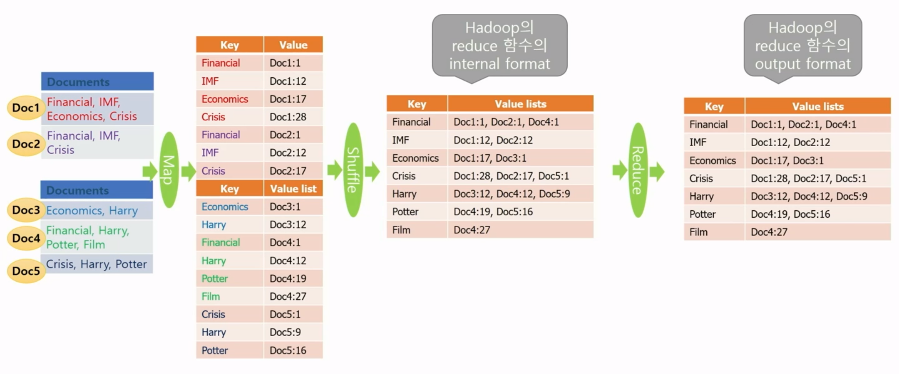
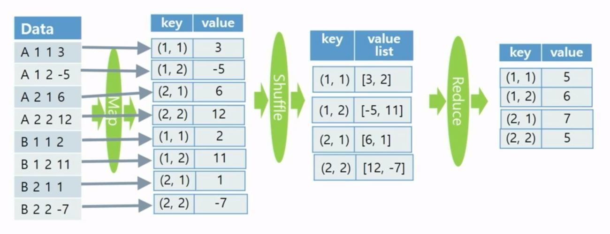

## 이론

### Partitioner Class

- Map 함수의 출력인 (key, value) 쌍이 key에 의해서 어느 Reducer (머신)으로 보내질 것인지 정해지는데, 이러한 결정을 정의하는 Class
- Hadoop의 기본 타입은 Hash 함수가 Default로 제공되고 있어서 key에 대한 해시 값에 따라 어느 Reducer (머신)으로 보낼지를 결정함
    - Text / IntWritable / LongWritable / FloatWritable / DoubleWritable

### Inverted Index

- 각 단어마다 그 단어가 나타나는 문서 아이디 doc와 그 문서에서 나오는 위치 position을 doc:position 형태로 리스트를 만듦
- 검색에서 유용하게 쓰임
ex) ‘Harry Potter’를 검색하면, 각각 ‘Harry’와 ‘Potter’를 갖는 inverted index를 intersection하여 두 단어를 모두 포함한 문서를 output으로 할 수 있음

### Matrix Addition

<aside>
➕ 행렬 덧셈

---

$\begin{pmatrix}
a_{11} & a_{12} \\
a_{21} & a_{22} \\
\end{pmatrix} + 
\begin{pmatrix}
b_{11} & b_{12} \\
b_{21} & b_{22} \\
\end{pmatrix} = 
\begin{pmatrix}
a_{11} + b_{11} & a_{12} + b_{12} \\
a_{21} + b_{21} & a_{22} + b_{22} \\
\end{pmatrix}$

 $c_{ij} = a_{ij} + b_{ij}$

</aside>

