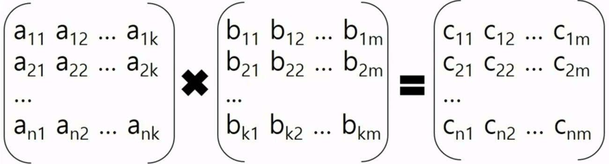
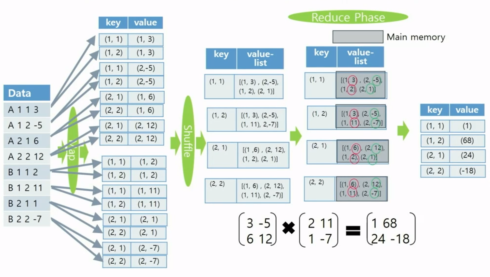
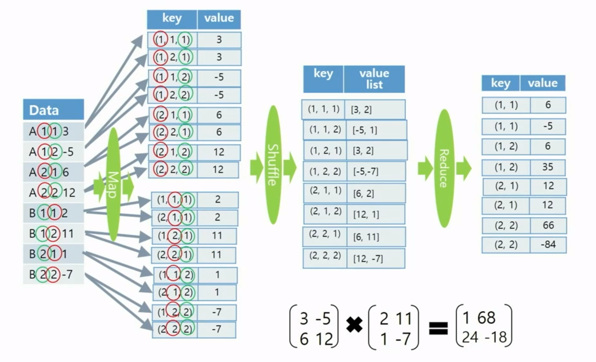
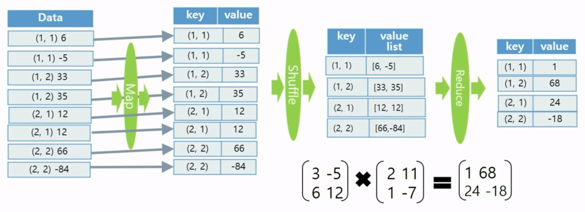

## 이론

### Matrix Multiplication

<aside>
✖️ 행렬 곱셈

---

$\begin{pmatrix}
a_{11} & a_{12} \\
a_{21} & a_{22} \\
\end{pmatrix} \times 
\begin{pmatrix}
b_{11} & b_{12} \\
b_{21} & b_{22} \\
\end{pmatrix} = 
\begin{pmatrix}
c_{11} & c_{12} \\
c_{21} & c_{22} \\
\end{pmatrix}$

 $c_{11} = (a_{11} \times b_{11}) + (a_{12} \times b_{21})$

</aside>

### 1-Phase Matrix Multiplication

- 위의 식을 일반화 하면 $c_{ij} = a_{ip} \times b_{pj}$ 임
- A행렬 i행 p열
    - key : (i, 1), (i, 2), (i, 3), … , (i, m)
    - value : (p, $a_{ip}$)
- B행렬 p행 j열
    - key : (1, j), (2, j), (3, j), … , (n, j)
    - value : (p, $b_{pj}$)

### 2-Phase Matrix Multiplication

- A행렬 i행 p열
    - key : (i, 1, p), (i, 2, p), … , (i, m, p)
    - value : ($a_{ip}$)
- B행렬 p행 j열
    - key : (1, j, p), (2, j, p), … , (n, j, p)
    - value : ($b_{pj}$)
- Phase 1
    
    
    
- Phase 2
    
    
    

### 1-Phase vs 2-Phase

- Map-Reduce Phase 수행이 오버헤드가 크기 때문에 value list를 메인 메모리에 모두 적재할 수 있다면 1-Phase 알고리즘을 사용하는 것이 속도 면에서 효율적임
- 하지만, value list를 메인 메모리에 모두 적재할 수 없다면 메인 메모리가 거의 필요 없는 2-Phase 알고리즘을 사용