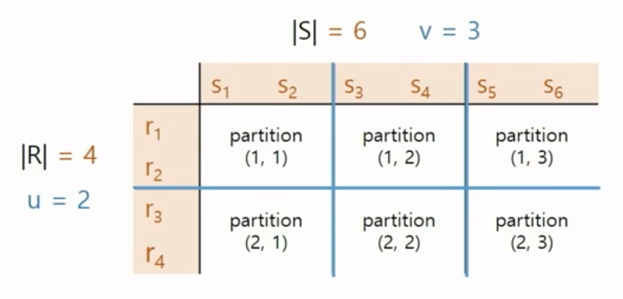
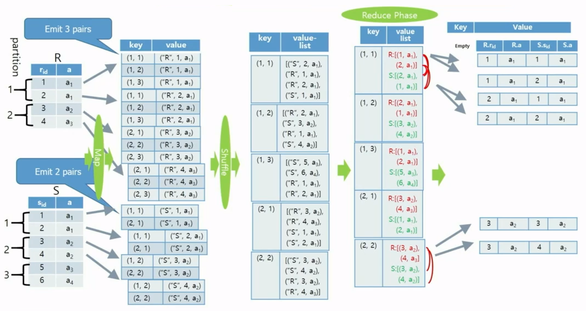
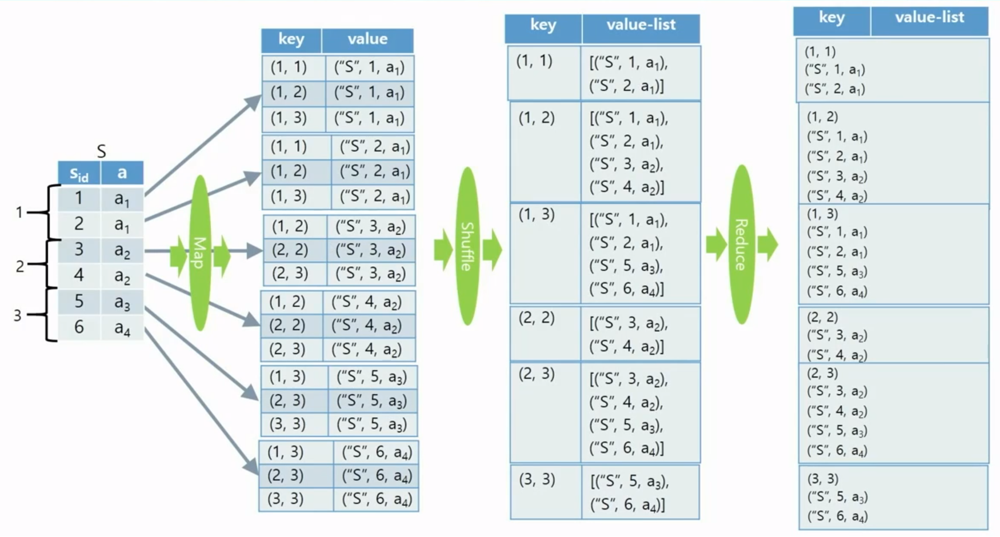

## 이론

### Theta-Join Algorithm

- 조인에 참여하는 두 릴레이션의 속성 값을 비교하여 조건을 만족하는 tuple만 반환
- 세타 조인의 조건은 { =, ≠, ≥, ≤, >, < } 중 하나

### All Pair Partition(모든 쌍 분할) Algorithm

- 테이블 R과 S에 대하여 |R| * |S| 튜플 쌍을 모두 고려함
    - R과 S를 각각 u개 파티션과 v개 파티션으로 분할함
    - |R| * |S| 튜플(레코드) 쌍을 u*v개의 disjoint 한 파티션으로 분할함
        - |R|은 테이블 R에 들어있는 튜플 개수
        - |S|는 테이블 S에 들어있는 튜플 개수
    - 각각의 파티션을 한 개의 reduce 함수로 처리함
- 장점
    - 어떤 조인 조건도 처리 가능
    - 모든 reduce 함수에 들어가는 입력 사이즈가 다 비슷함
- 단점
    - 모든 튜플 쌍을 다 검사해야함
    - 각각의 reduce 함수의 출력 사이즈가 많이 다를 수 있음
- ex) R을 2개, S를 3개로 분산 처리 할 때의 모든 파티션 쌍
    - Partition(i, j)는 R의 i번째 파티션과 S의 j번째 파티션의 튜플들이 수집됨
    
    
    

### Illustration of All Pair Partition for Equi-Join

### 셀프-조인을 위한 모든 쌍 분할 Algorithm

- Self-Join은 한 개의 입력 테이블 D에 들어 있는 레코드들 간에 조인하는 것을 말함
- 입력 테이블에 있는 레코드들을 m개의 파티션으로 분할
    - $D_{1}, D_{2}, ... , D_{m}$ : m distinct groups of records
- Map function
    - $D_{1}$에 있는 각각의 튜플 p에 대해서 아래와 같은 (key, value) 쌍을 출력
    - 파티션이 m개이고 튜플의 파티션 아이디를 i라 할 때,
    <(1, i), p>, <(2, i), p>, … , <(i, i), p> , <(i, i+1), p>, … , <(i, m), p>
- Reduce function
    - (x, y) : $D_{x}$ 파티션과 $D_{y}$ 파티션 사이의 모든 레코드 쌍에 대하여 조인 (x ≤ y)
        - x = y : $D_{x}$(=$D_{y}$) 파티션에 있는 모든 레코드 쌍의 조인
        - x ≠ y : $D_{x}$ 파티션과 $D_{y}$ 파티션에 있는 모든 레코드 쌍의 조인

### Illustration of All Pair Partition for Self-Join

