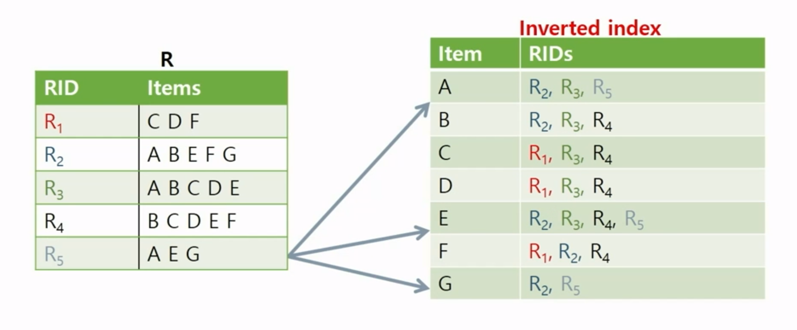
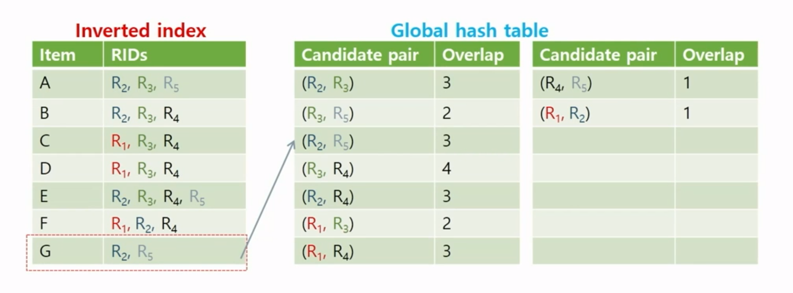
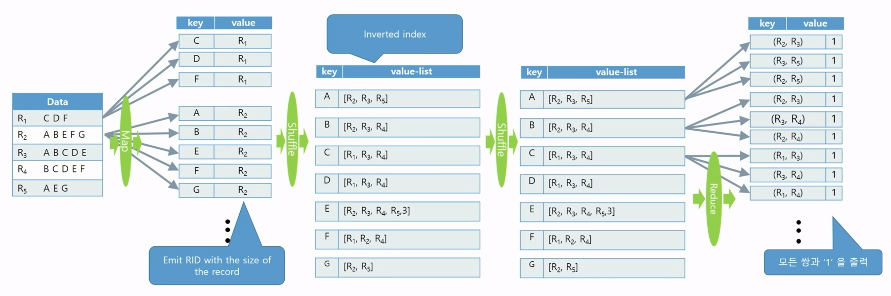
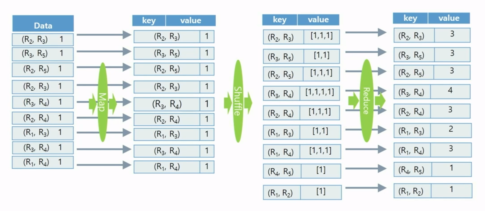
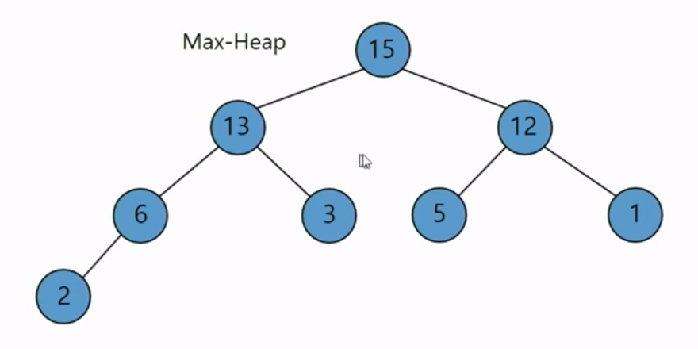
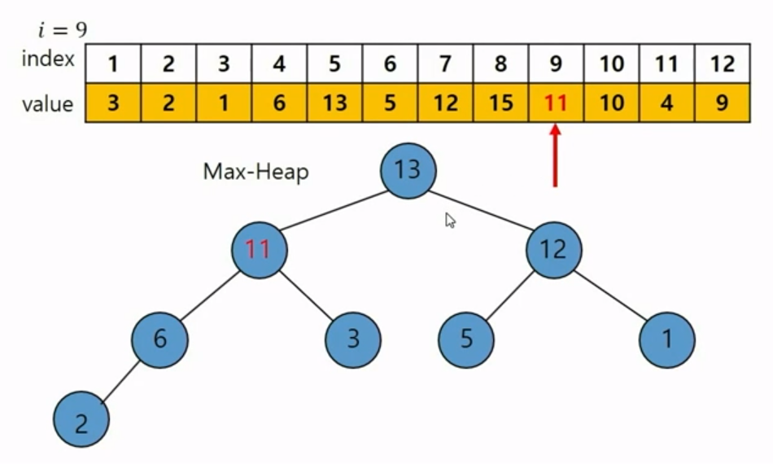
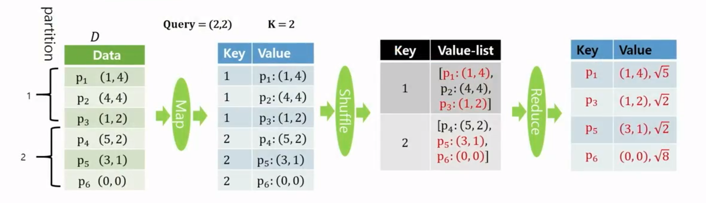
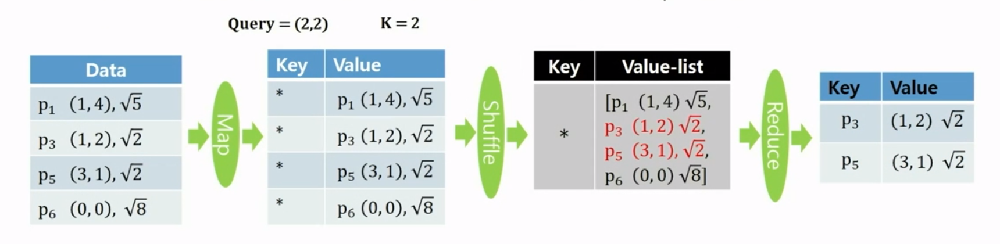

## 이론

### Common Item Counting for Every Pairs of Sets

- Set 데이터에 있는 모든 튜플 간에 중복된 Item 개수를 카운트
- All Pair Partition 방법을 사용하면 데이터의 모든 튜플 쌍을 살펴봐야하는데, Inverted Index를 사용하면 한개의 Item이라도 중복되는 튜플 쌍만 살펴보기 때문에 더 빠르게 처리할 수 있음
- 과정
    1. 각 아이템들에 대한 Inverted Index를 만든다.
        
        
        
    2. Inverted Index를 스캔하면서 각 item에 대한 리스트마다 들어있는 record의 모든 ID 쌍에 대하여 Hash table에 있는 카운트를 증가시킨다.
        
        
        

### MapReduce Algorithm for Common Item Counting

- Phase 1
    
    
    
    - 셋(Set) 데이터에 있는 각 튜플에 들어있는 항목(item)을 key로 하는 Inverted Index를 만든다.
    - Inverted Index의 각 item마다 리스트에 있는 항목들의 모든 쌍을 key로 하고 1을 value로 하여 출력한다.
- Phase 2
    
    
    
    - 모든 튜플 ID 쌍에 대하여 word counting 알고리즘을 사용하여 카운팅한다.

### Top-K Closest Point Search

- 질의 포인트(Query Point)와 점들로 구성된 데이터 셋이 있을 때에 질의 포인트로부터 가장 가까운 K개 포인트를 뽑음
- Max-Heap 자료구조를 이용
    
    
    
    - Binary tree 형태인데, 어떤 노드에서든 부모가 자식보다 더 크거나 같은 수를 가지며, 자식 노드는 부모 노드보다 더 작거나 같은 수를 가짐
    - root node에 Max-heap에 들어있는 데이터 중 가장 큰 수가 들어감

### Max-Heap을 사용하여 가장 작은 Top-K개 숫자를 찾는 알고리즘

- 데이터를 읽어가면서 Map-Heap에는 현재까지 본 수 중에서 가장 작은 K개의 숫자를 유지
- K = 8일 때, 먼저 8개의 수를 읽을 때까지 무조건 Max-Heap에 넣는다.
- 데이터를 하나씩 보는데 그 숫자가 Max-Heap의 루트 노드에 들어있는 수보다
    - 작으면 Top-K개 숫자가 바뀌어야 하므로 Max-Heap에서 루트 노드에 들어있는 데이터를 삭제하고 지금 본 숫자를 Max-Heap에 넣는다.
    - 크면 Top-K개 숫자가 변하지 않으므로 건너뛴다.

### Illustration of Top-K Closest point Search

- Phase 1
    
    
    
    - Map 함수
        - 각 점을 입력 받는다.
        - 파티션을 m개로 나눌 때, 점의 파티션 아이디를 pid라고 하면 (key, value) 쌍을 (pid, input)으로 한다.
    - Reduce 함수
        - Query point와 Value-list에 있는 포인트들과 거리를 계산 후 가장 가까운 K개만 출력
- Phase 2
    
    
    
    - Map 함수
        - 각 점을 입력 받는다.
        - 똑같은 값 *를 key로 하고, value는 입력 포인트 그대로 하여 (key, value) 쌍을 내보낸다.
    - Reduce 함수
        - Phase 1의 각 reduce 함수마다 출력한 포인트들을 모아서 Top K개만 출력한다.