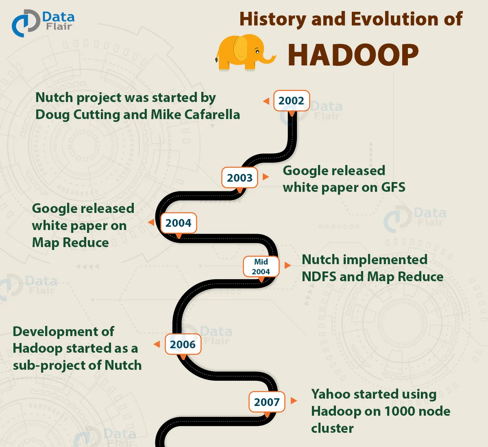
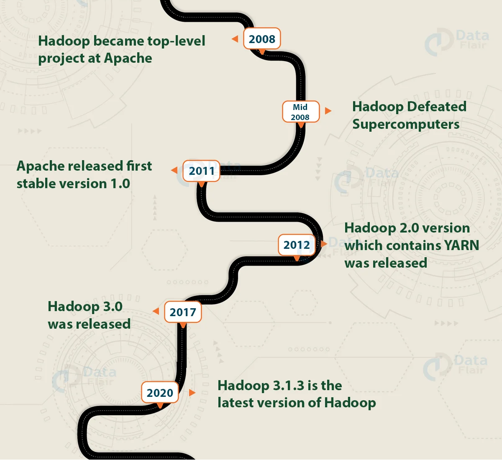
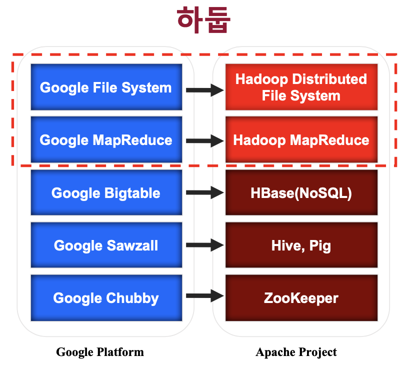
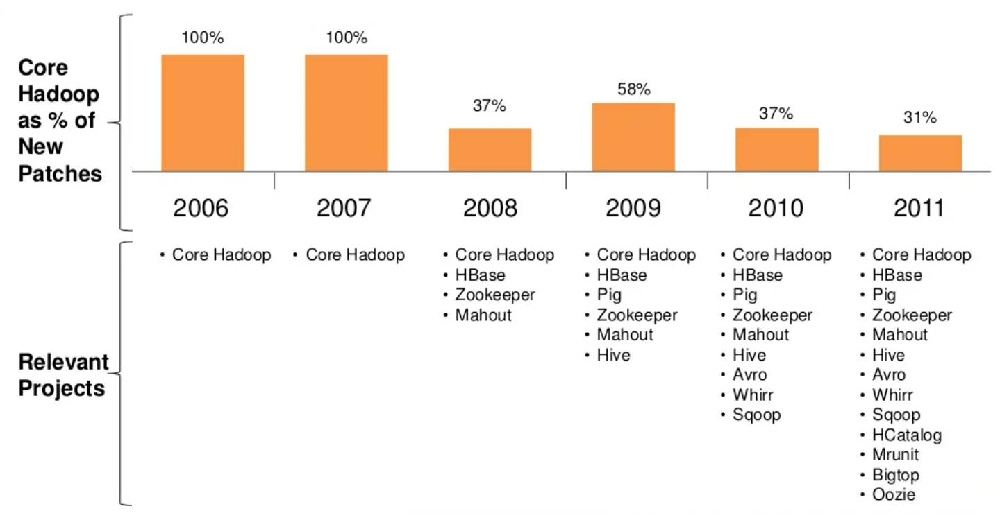
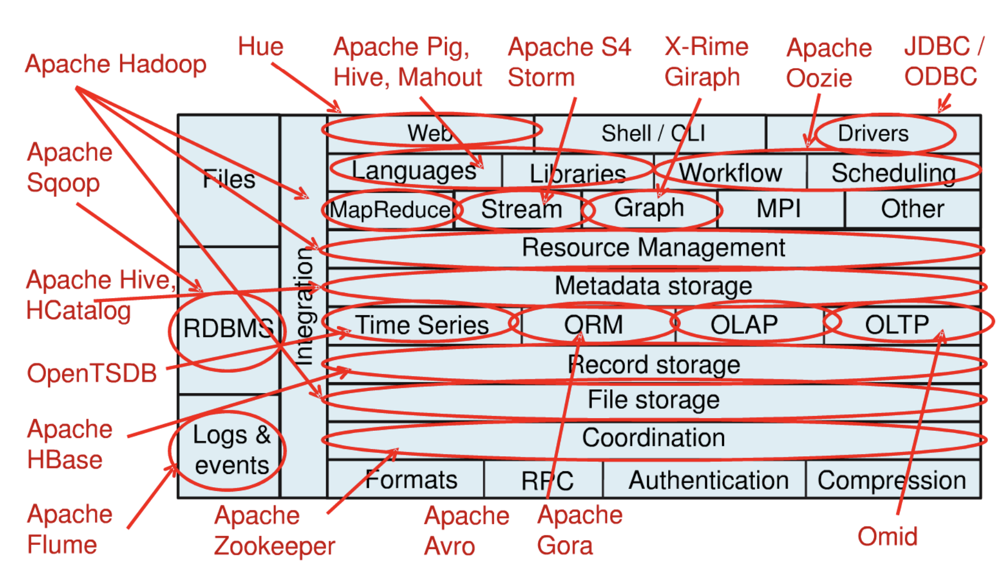
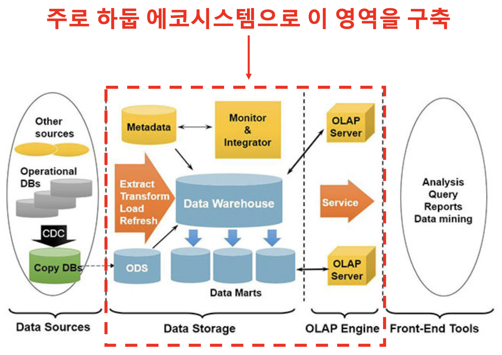

## 1강 - 하둡의 탄생과 생태계의 활용1

### Why Hadoop?

- 데이터 홍수의 시대
    - 우리는 데이터 홍수의 시대에 살고 있으며, 하둡은 비정형 데이터를 포함한 빅데이터를 다루기 위해 가장 적절한 플랫폼
- 글로벌 하둡 마켓의 성장
    - “Hadoop Market is expected to reach $99.31B by 2022 at a CAGR of 42.1%”- Forbes
- 하둡 엔지니어 수요 증가
    - 데이터 증가로 하둡을 적용하는 회사들이 급증
    - 하둡 전문가는 항상 부족
    - 하둡은 2007년 첫 탄생 이후 3.X 버전까지 나온 굉장히 성숙한 기술
    - 하둡 에코시스템은 Governace, Finnace, Banking, Insurance, Healthcare 등 사회 전반에 걸친 모든 요소들과 밀접히 연결되어 사용

### History of Hadoop

- Doug Cutting이 인덱싱 라이브러리 Lucene을 오픈소스로 공개
- 아들 프로젝트 Nutch와 Hadoop 탄생

- Google에서 발표한 논문이 Apache Project로 탄생하면서, Hadoop Eco-system이 만들어짐.

- HBase : 분산 데이터베이스(NoSQL 류의 DB - MongoDB, Cassandra 등)
- Mahout : Machine Learning 알고리즘 등 복잡한 알고리즘을 분산 플랫폼에 저장된 데이터로 처리할 수 있도록 함
- Pig : Hadoop에 저장된 데이터를 다루는 데에 사용하는 스크립트 언어
- Sqoop : 관계형 데이터베이스(MySQL, MariaDB, Oracle 등)와 Hadoop 간에 데이터를 주고 받을 때, 용이하게 하는 프레임워크
- HCatalog : Hadoop에 저장된 데이터의 스키마(메타 정보)를 하나의 카탈로그 서비스 내에서 관리하겠다는 목적으로 만들어진 프로젝트
- Mrunit : JUnit과 같은 테스팅 프레임워크

- Red Hot: The 2021 Machine Learning, AI and Data (MAD) Landscape
    
    [2021-MAD-Landscape-v3.pdf](asset/2021-MAD-Landscape-v3.pdf)
    

### Hadoop이 변화시킨 흐름

- 초창기의 Big Data = Hadoop
    - 시장 초기의 “Big Data”의 의미는 “Big”에 초점을 맞춘 Hadoop 중심의 기술 용어
- 하둡 덕분에 이제는 더 이상 많은 데이터를 저장하기 위해 큰 비용이 들지 않음
- 많은 기업에서 오픈소스 빅데이터 플랫폼을 도입
- Big Data에서 Big Data로
    - Data로부터 새로운 Insight와 사업 기회를 찾기 위한 노력과 시장 확대
- Hardware의 발달
    - 컴퓨터의 발전, IoT 기기에 부착된 센서들은 많은 데이터를 만들어 냄
- 경쟁력
    - 기술 → 가격 → **기회(Data)**
    - Hadoop과 같은 오픈소스 빅데이터 플랫폼 기술이 발전하면서 데이터 저장/분석 인프라의 가격 경쟁력이 확보 됨. 이에 따라 Data 분석 역량이 새로운 가치 창출의 기회를 만들어 내는 시대가 됨
- Machine Learning
    - 넘치는 데이터, 사람이 감당할 수 없다
    - 똑똑한 기계를 만들어 “**생각의 아웃소싱**”

### References

[[Youtube] SKPlanet Tacademy 하둡의 탄생과 생태계의 활용](https://www.youtube.com/watch?v=OPodJE1jYbg&t=368s)

[[Data-Flair] Hadoop Tutorial](https://data-flair.training/blogs/hadoop-tutorial/)

[[Velog] Apache Hadoop](https://velog.io/@dnstlr2933/%EC%95%84%ED%8C%8C%EC%B9%98-%ED%95%98%EB%91%A1-T-%EC%95%84%EC%B9%B4%EB%8D%B0%EB%AF%B8)
