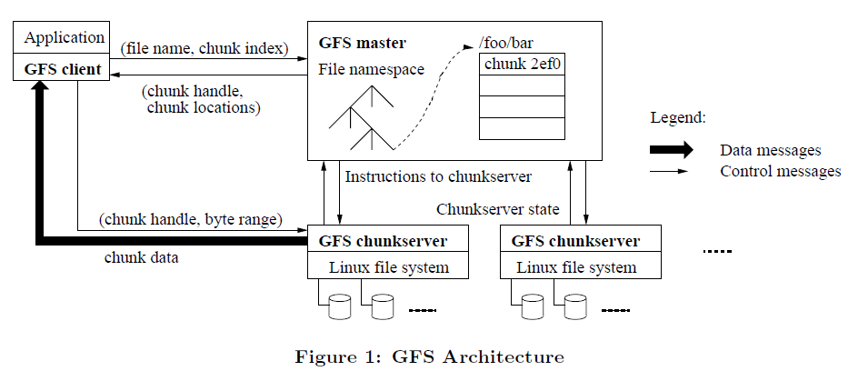
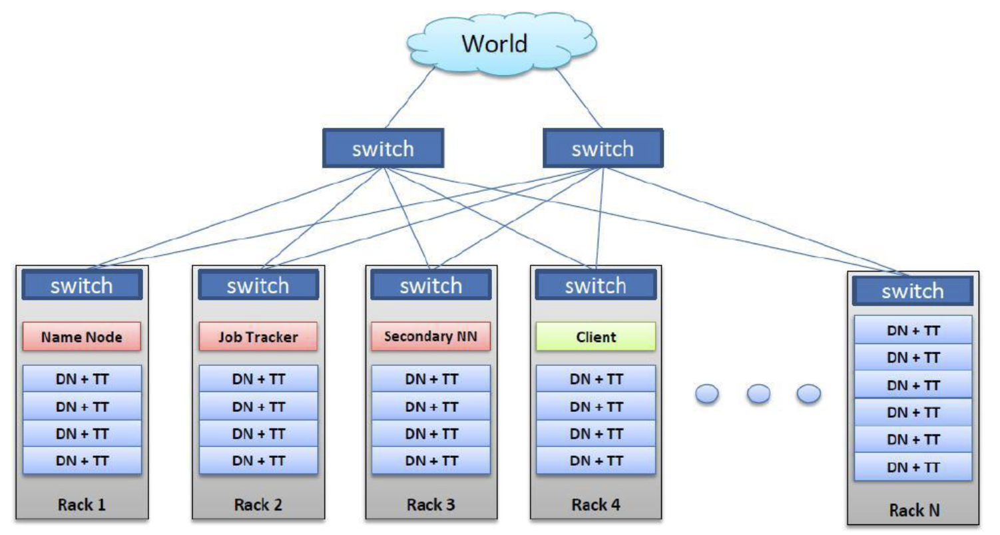
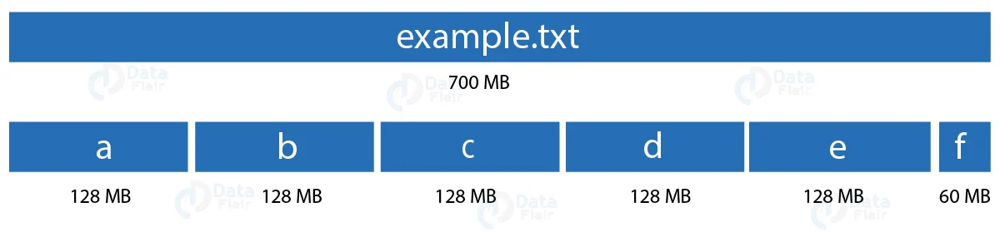
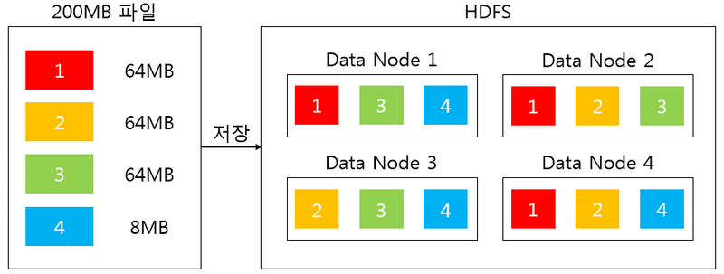
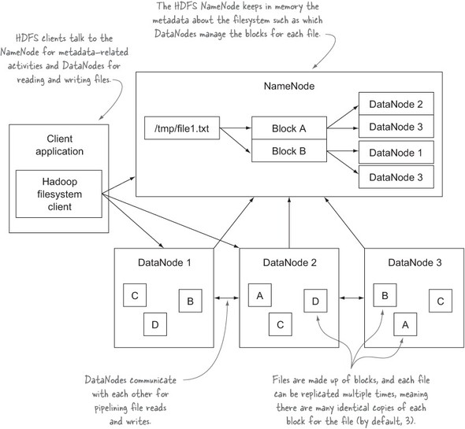
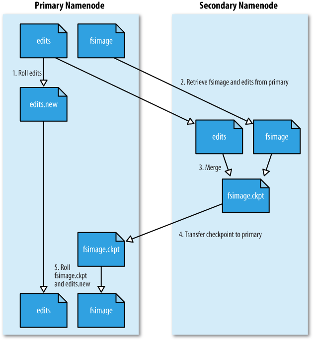
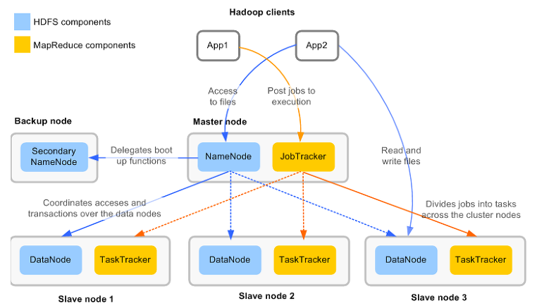
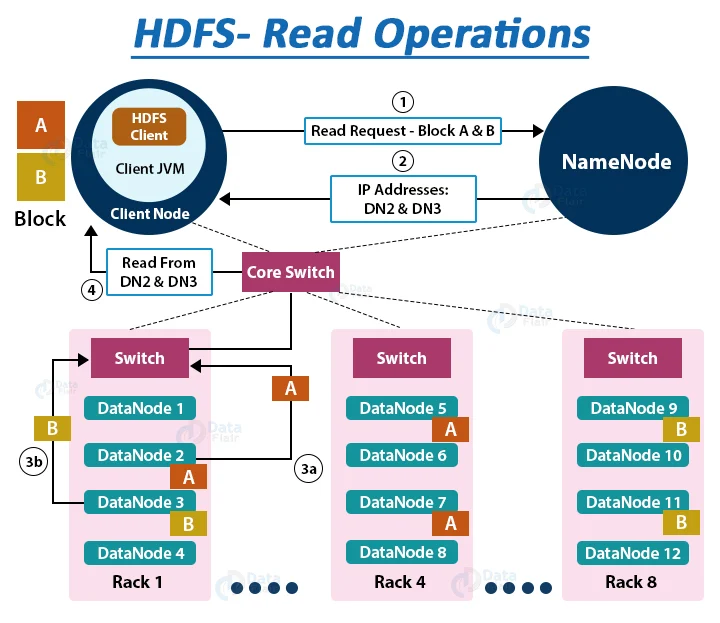
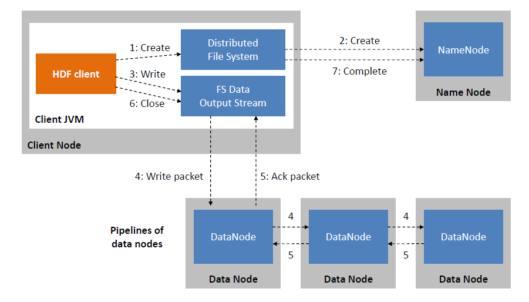

## 3강 - 하둡 분산파일시스템 이해(1)

### 분산 플랫폼의 아키텍처

- 분산 플랫폼의 아키텍처
    - Master-Slave 구조
        - Slave는 n대의 서버로 확장
    - 마스터가 없는 구조
        - Master가 가지고 있어야 하는 정보를 모든 노드가 공유하는 구조

### 구글 파일시스템(GFS)



- Master-Slave 구조
- 마스터에 부하가 가지 않는 상황을 만들어 주어야 함
    - client와 chunkserver를 direct로 연결하여, 실제 트래픽을 주고 받도록 하며, master는 데이터를 프로세싱 하거나 주고 받는 동작을 하지 않도록 설계 됨

### 구글 플랫폼의 철학

1. 한 대의 고가 장비보다 여러 대의 저가 장비가 낫다(Scale-up, Scale-out)
2. 데이터는 분산 저장한다
    - 분산(Distributed) ≠ 병렬(Parallel)
        - 분산은 데이터 중심, 병렬은 CPU 중심
3. 시스템(H/W)은 언제든 죽을 수 있다(Smart S/W로 대비)
4. 시스템 확장이 쉬워야 한다
5. …

 ⇒ 분산 & 자동화

### 하둡의 특성

- 수천 대 이상의 리눅스 기반 범용 서버들을 하나의 클러스터로 사용
- Master-Slave 구조
- 파일은 블록(block) 단위로 저장
- 블록 데이터의 복제본 유지로 인한 신뢰성 보장(기본 3개의 복제본)
- 높은 내고장성(Fault-Tolerance)
- 데이터 처리의 지역성 보장(Locality)

### 하둡 클러스터 네트워크 및 데몬 구성



- Name Node : Master Server 역할(HDFS에 대한 Master Daemon)
    - Master는 부하를 최소화해야 하기 때문에 다른 daemon을 함께 띄우지 않음
- Data Node & Task Tracker : 보통 하나의 쌍으로 daemon을 실행시키며, Slave 영역임
    - Data Node : 데이터 저장 및 관리
    - Task Tracker : Application 업무 처리
- Job Tracker : DFS에 저장된 데이터에 대한 application 연산을 처리하기 위해서 application 관리를 하는 master daemon, 별도의 서버에서 실행함

### 블록(Block)



- 하나의 파일을 여러 개의 Block으로 저장
- 설정에 의해 하나의 Block은 64MB 또는 128MB 등의 큰 크기로 나누어 저장
    - HDFS의 블록은 128MB와 같이 매우 큰 단위
    - 블록이 큰 이유는 탐색 비용을 최소화할 수 있기 때문
    - 블록이 크면 하드디스크에서 블록의 시작점을 탐색하는 데 걸리는 시간을 줄일 수 있고, 네트워크를 통해 데이터를 전송하는 데에 더 많은 시간을 할당 가능하기 때문
- 블록 크기가 128MB 보다 작은 경우는 실제 크기 만큼만 용량을 차지함

### 하둡의 저장 특징

- Name Node(Master) : 데이터의 위치, 형식 보관
- Data Node(Slave) : 실 데이터 저장
- 시간의 흐름에 따라 발생하는 데이터(Time Series Data) 등의 큰 데이터를 hadoop 명령어 또는 Kafka 등 다른 플랫폼의 도움을 받아 클러스터에 저장
- Master에는 데이터가 저장되지 않으며, slave에 블록화되어 분산 저장
- 데이터를 복사하여 여러 개를 저장
- Data Node는 주기적으로 Name Node에 시그널을 보내며, 일정 시간동안 Name Node에 시그널이 도착하지 않을 시에, Name Node는 해당 Data Node에 장애가 발생하였다고 판단함. 이 때, Data Node는 장애가 발생한 Data Node에 있는 블록과 같은 블록은 가지고 있는 Data Node들이 서로 통신하여 블록의 수를 유지하도록 함. 장애가 복구되어 블록 수가 정해진 수보다 많아졌을 때에도 관리를 해 줌



### 블록 크기 분할과 추상화에 따른 이점

- 블록 단위로 나누어 저장하기 때문에 디스크 사이즈보다 더 큰 파일을 보관할 수 있음
- 블록 단위로 파일을 나누어 저장하기 때문에 700G * 2 = 1.4T 크기의 HDFS에 1T의 파일 저장 가능
- 파일 단위보다 블록 단위로 추상화를 하면 스토리지의 서브 시스템을 단순하게 만들 수 있으며, 파일 탐색 지점이나 메타 정보를 저장할 때 사이즈가 고정되어 있으므로 구현이 용이
- 내고장성을 제공하는데 필요한 복제(replication)을 구현할 때 매우 적합
- 같은 파일을 분산 처리하여 데이터 처리 성능을 개선할 수 있음
- 같은 노드에 같은 블록이 존재하지 않도록 복제하여 노드가 고장일 경우 다른 노드의 블록으로 복구할 수 있음

### 블록의 지역성(Locality)

- 네트워크를 이용한 데이터 전송 시간 감소
- 대용량 데이터 확인을 위한 디스크 탐색 시간 감소
- 적절한 단위의 블록 크기를 이용한 CPU 처리시간 증가
- 참고: 클라우드 스토리지를 이용(ex. S3)하는 경우 HDFS를 사용하는 것보다 성능 저하가 있을 수 있음

### 블록 캐싱

- 데이터 노드에 저장된 데이터 중 자주 읽는 블록은 블록 캐시(Block Cache)라는 데이터 노드의 메모리에 명시적으로 캐싱할 수 있음
- 파일 단위로 캐싱할 수도 있어서 조인에 사용되는 데이터들을 등록하여 읽기 성능을 높일 수 있음

### 네임 노드(Name Node)의 역할



- 전체 HDFS에 대한 Name Space 관리
- Data Node로부터 Block 리포트를 받음
- Data에 대한 Replication 유지를 위한 커맨더 역할 수행
- 파일시스템 이미지 파일 관리(fsimage)
- 파일시스템에 대한 Edit Log 관리

### 보조 네임노드(SNN)



- 네임노드(NN)와 보조 네임노드(SNN)
    - Active/Standby 구조 아님
    - fsimage와 edits 파일을 주기적으로 병합
- 체크 포인트
    - 1시간 주기로 실행
    - edits 로그가 일정 사이즈 이상이면 실행
- 이슈 사항
    - 네임노드가 SPOF
    - 보조 네임노드의 장애 상황 감지 툴 없음

### 데이터 노드(Data Node)의 역할



- Data Node는 물리적으로 로컬 파일시스템에 HDFS 데이터를 저장
- Data Node는 HDFS에 대한 지식이 없음
- 일반적으로 RAID 구성을 하지 않음(JBOD 구성)
- 블록 리포트(블록 스캐너) : Name Node가 시작될 때, 그리고 (주기적으로) 로컬 파일시스템에 있는 모든 HDFS 블록들을 검사 후 정상적인 블록의 목록을 만들어 Name Node에 전송

### HDFS 읽기 연산 처리 매커니즘



```java
FileSystem fileSystem = FileSystem.get(conf);
Path path = new Path("/path/to/file.ext");
if (!fileSystem.exists(path)) {
System.out.println("File does not exists");
return;
}
FSDataInputStream in = fileSystem.open(path);
int numBytes = 0;
while ((numBytes = in.read(b))> 0) {
System.out.prinln((char)numBytes));// code to manipulate the data which is read
}
in.close();
out.close();
fileSystem.close();
```

### HDFS 쓰기 연산 처리 매커니즘



- 데이터 복제 시 클라이언트가 Name Node로부터 Data Node 리스트를 전달 받음
- 파이프라인 형태로 데이터 복사(4kb 단위)
- 네트워크 트래픽은 클라이언트와 Data Node간에만 발생

```java
FileSystem fileSystem = FileSystem.get(conf);
// Check if the file already exists
Path path = new Path("/path/to/file.ext");
if (fileSystem.exists(path)) {
System.out.println("File " + dest + " already exists");
return;
}
// Create a new file and write data to it.
FSDataOutputStream out = fileSystem.create(path);
InputStream in = new BufferedInputStream(new FileInputStream(
new File(source)));
byte[] b = new byte[1024];
int numBytes = 0;
while ((numBytes = in.read(b)) > 0) {
out.write(b, 0, numBytes);
}
// Close all the file descripters
in.close();
out.close();
fileSystem.close();
```

### References

[[논문 리뷰] The Google File System(GFS) 리뷰 (1)](https://ingu627.github.io/paper/gfs1/)

[HDFS 기본 개념 (Hadoop Distributed File System)](https://628story.tistory.com/3)