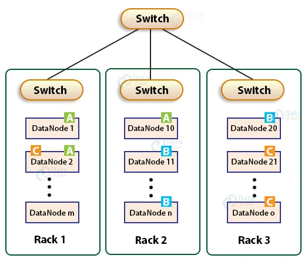
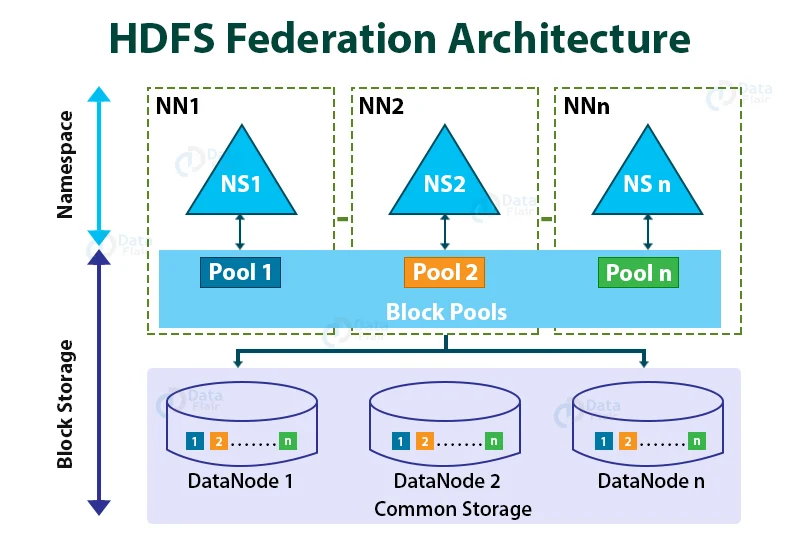
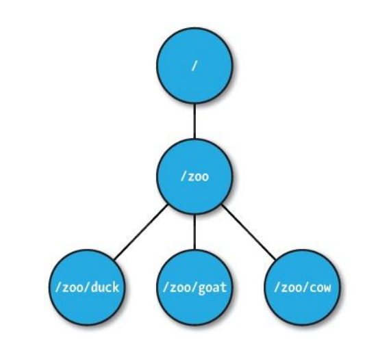

## 4강 - 하둡 분산파일시스템 이해(2)

### HDFS Commands


- Hadoop HDFS 명령어의 대부분은 Linux와 동일함
- Hadoop에서만 사용하는 명령어
    - `hadoop fs -setrep <rep> <path>` : replication 설정
    - `hadoop fs -text <src>` : hadoop에 저장된 데이터의 내용을 열람
    - `hadoop fs -stat [format] <path>` : 저장된 데이터의 통계정보 출력
    - `hadoop fs -usage <command>` : 해당 명령어의 사용 방법 출력
    - `hadoop fs -getmerge <src> <localdest>` : 많은 양의 파일을 merge하여 local disk로 받음

**Commands Tutorial Links**

[HDFS Commands 1](https://data-flair.training/blogs/top-hadoop-hdfs-commands-tutorial/)

[HDFS Commands 2](https://data-flair.training/blogs/hadoop-hdfs-commands/)

[HDFS Commands 3](https://data-flair.training/blogs/hdfs-hadoop-commands/)

### Rack Awareness



블록을 저장할 때, 2개의 블록은 같은 rack에, 나머지 하나의 블록은 다른 rack에 저장하도록 구성

→ rack 단위 장애 발생(전원, 스위치 등)에도 전체 블록이 유실되지 않도록 구성함

### HDFS Safe Mode

- HDFS의 세이프 모드(Safe Mode)는 데이터 노드를 수정할 수 없는 상태
- 세이프 모드가 되면 데이터는 읽기 전용 상태가 되고, 데이터 추가와 수정이 불가능하며 데이터 복제도 일어나지 않음
- 관리자가 서버 운영 정비를 위해 세이프 모드를 설정할 수 있음
- 네임노드에 문제가 생겨 정상적인 동작을 할 수 없을 때 자동으로 세이프 모드로 전환
→ 주로 missing block이 발생하는 경우, 혹은 클러스터 재구동 시 블록 리포트를 다 받기 전까지 세이프 모드로 동작
- 세이프 모드 상태일 때 파일 복사를 시도하면 아래와 같은 에러 메세지 발생
    
    ```
    $ hadoop fs -put ./sample.txt /usr/sample.txt
    put: Cannot create file/user/sample2.txt._COPYING_. Name node is in safe mode.
    ```
    
- 세이프 모드 명령어 및 복구
    
    ```bash
    # 세이프 모드 상태 확인
    $ hdfs dfsadmin -safemode get
    Safe mode is OFF
    
    # 세이프 모드 진입
    $ hdfs dfsadmin -safemode enter
    Safe mode is ON
    
    # 세이프 모드 해제
    $ hdfs dfsadmin -safemode leave
    Safe mode is OFF
    
    # 세이프 모드이면 대기하다가, 세이프모드가 끝나면 회복
    $ hdfs dfsadmin -safemode wait
    Safe mode is OFF
    ```
    
    - HDFS 운영 중 Safe mode에 진입한 경우, 네임 노드의 문제인지 데이터 노드의 문제인지 파악이 필요하며, `$ hadoop fsck` 명령으로 HDFS의 무결성을 체크하고, `$ hdfs dfsadmin -report` 명령으로 각 데이터 노드의 상태를 확인하여 문제를 확인하고 해결한 후 세이프 모드를 해제 해야 함

### Corrupt Blocks

`$ hadoop fsck <path> [-move | -delete | -openforwrite] [-files [-blocks [-locations | -racks]]]`


- HDFS는 하트비트를 통해 데이터 블록에 문제가 생기는 것을 감지하고 자동으로 복구를 진행
- 다른 데이터 노드에 복제된 데이터를 가져와서 복구하지만, 모든 복제 블록에 문제가 생겨 복구하지 못하게 되면 커럽트 상태가 됨
- Corrupt 상태의 파일들은 삭제하고, 원본 파일을 다시 HDFS에 올려주어야 함

### HDFS 휴지통 설정 및 명령어

- HDFS는 데이터 삭제 시 영구적 데이터를 삭제하지 않도록 휴지통(Trash) 설정을 할 수 있음
- core-site.xml에서 아래와 같이 설정
    
    ```xml
    <!-- 체크포인트를 삭제하는 시간 간격(분) -->
    <!-- 0이면 휴지통 기능을 끔 -->
    <property>
    	<name>fs.trash.interval</name>
    	<value>1440</value>
    </property>
    
    <!-- 체크포인트를 확인하는 간격(분) -->
    <!-- fs.trash.interval과 같거나 작아야 함 -->
    <!-- 체크포인터가 실행될 때마다 체크포인트를 생성하고, 유효기간이 지난 체크포인트는 삭제 -->
    <property>
    	<name>fs.trash.checkpoint.interval</name>
    	<value>120</value>
    </property>
    ```
    
- 휴지통 관련 명령어
    
    ```bash
    # 휴지통을 비움
    $ hadoop fs -expunge
    
    # 휴지통을 이용하지 않고 삭제
    $ hadoop fs -rm -skipTrash /user/data/file
    ```
    

### 운영자 Commands 목록

- 주로 실행이나 설정에 관련된 명령어가 많음

[HDFS Commands Guide](https://hadoop.apache.org/docs/current/hadoop-project-dist/hadoop-hdfs/HDFSCommands.html#Administration_Commands)

| Command | Description |
| --- | --- |
| namenode | 네임 노드 실행 |
| datanode | 데이터 노드 실행 |
| secondarynamenode | 세컨더리 네임 노드 실행 |
| balancer | HDFS 전체 노드의 데이터 밸런싱 처리 |
| cacheadmin | 자주 읽는 데이터에 대한 캐시 처리 |
| crypto | 암호화 처리 |
| dfsadmin | HDFS 관리를 위한 Admin 유틸리티 명령 |
| dfsrouter | HDFS 연합 라우팅 실행 |
| dfsrouteradmin | 데이터 노드 라우팅 설정 |
| haadmin | HA 실행 명령어(QJM 또는 NFS) |
| journalnode | QJM을 이용한 HA, 저널 노드용 명령어 |
| mover | 데이터 마이그레이션용 유틸리티 명령어 |
| nfs3 | NFS3 게이트웨이 명령어 |
| portmap | NFS3 게이트웨이 포트맵 명령어 |
| storagepolicies | HDFS 저장 정책 설정 명령어 |
| zkfc | 주키퍼 FailOver 컨트롤러 실행 |

### HDFS 운영자 커맨드 - dfsadmin

- -report
    - HDFS의 각 노드들의 상태를 출력하며, HDFS의 전체 사용량과 각 노드의 상태를 확인할 수 있음
    - 사용 예)
        - `$ hdfs dfsadmin -report -live` : live한 data node 포함 Hadoop 상태 report
        - `$ hdfs dfsadmin -report -dead` : dead한 data node report
- -safemode
    - 세이프모드에 진입하거나 빠져나올 수 있음
    - 위의 HDFS Safe Mode 부분 참고
- -setQuota
    - 특정 디렉토리에 용량 Quota를 설정, n의 단위는 bytes
        - `$ sudo -u hdfs hdfs dfsadmin -setSpaceQuota n directory`
    - 특정 디렉토리에 용량 Quota 설정을 해제
        - `$ sudo -u hdfs hdfs dfsadmin -clrSpaceQuota directory`

### HDFS Balancers

- 하둡을 운영하다보면, 서로 다른 스펙의 데이터 노드를 하나의 클러스터로 구성하게 됨
- 이 경우 노드 간 디스크 크기가 다를 수 있고, 전체 데이터의 밸런싱이 되지 않는 문제가 발생할 수 있음
- 신규 데이터 노드를 추가하는 경우에도 발생할 수 있음
→ 이 경우 NameNode에서 데이터 적재량이 적은 노드를 우선적으로 선정하여 block을 추가하는데, 이 때 특정 노드에 부하가 몰릴 수 있음
- 하둡 파일(hdfs-site.xml) 설정 중 Balancer와 연관된 중요한 설정이 있음
    
    ```xml
    <!-- 얼마나 많은 thread가 일을 처리하게 할 것인가 -->
    <property>
    	<name>dfs.datanode.balance.max.concurrent.moves</name>
    	<value>50</value>
    </property>
    
    <!-- Data Node 기준으로 bandwidth를 얼마나 줄 것인가 -->
    <property>
    	<name>dfs.datanode.balance.bandwidthPerSec</name>
    	<value>104857600</value>
    </property>
    ```
    
    - 이미 운영중인 동작 중인 job들에 대하여 리소스를 부여해야 하기 때문에, 일반적으로 보수적(리소스를 많이 잡지 않도록)으로 설정

### WEB HDFS REST API

[WebHDFS REST API](https://hadoop.apache.org/docs/stable/hadoop-project-dist/hadoop-hdfs/WebHDFS.html)

- HDFS는 REST API를 이용하여 파일을 조회하고, 생성, 수정, 삭제하는 기능을 제공함
- 이 기능을 이용하여 원격지에서 HDFS의 내용에 접근하는 것이 가능
- hdfs-site.xml에 아래의 설정이 필요
    
    ```xml
    <property>
    	<name>dfs.webhdfs.enable</name>
    	<value>true</value>
    </property>
    
    <property>
    	<name>dfs.namenode.http-address</name>
    	<value>0.0.0.0:50070</value>
    </property>
    ```
    

### HDFS 암호화 - KMS(Key Management Server)

[Hadoop Key Management Server (KMS) - Documentation Sets](https://hadoop.apache.org/docs/current/hadoop-kms/index.html)

- 하둡 KMS는 KeyProvider API를 기반으로 하는 암호화 키 관리 서버(REST API 제공)

### Hadoop 2.0 Cluster Architecture


- Master Server의 장애를 해결하기 위한 부분이 가장 큰 변화 포인트
- Standby NameNode 추가
    - 데이터는 가지고 있지만 평소에는 동작하지 않다가 Active NameNode에 장애가 발생하였을 때, Active로 전환됨

### Name Node 고가용성(High Availability)


- HDFS 고가용성은 이중화된 두 대의 서버인 Active NameNode와 Standby NameNode를 이용하여 지원
- Active NameNode와 Standby NameNode는 Data Node로부터 블록 리포트와 하트비트를 모두 받아서 동일한 메타데이터를 유지하고, 공유 스토리지를 이용하여 에디트 파일을 공유
- Active NameNode는 NameNode의 역할을 수행하고, Standby NameNode는 Active NameNode와 동일한 메타데이터 정보를 유지하다가, Active NameNode에 문제가 발생하면 Standby NameNode가 Active NameNode로 동작
- Active NameNode에 문제가 발생하는 것을 자동으로 확인하는 것이 어렵기 때문에 보통 주키퍼를 이용하여 장애 발생시 자동으로 변경할 수 있도록 구성함
- 에디트 로그 공유 방식 1 : NFS(Network File System)
    - NFS를 이용하는 방법은 에디트 파일을 공유 스토리지를 이용하여 공유하는 방법
    - 공유 스토리지에 에디트 로그를 공유하고 펜싱을 이용하여 하나의 NameNode만 에디트 로그를 기록함
    - NameNode 두 개가 모두 Active NameNode가 될 수 있는 상황이 발생하여, 동시에 Shared Storage의 데이터를 수정하면 NameNode의 중요 정보가 Crash 되며, 분산 환경에서는 이 상태를 SplitBrain 이라고 함
    - 두 개의 Active NameNode가 발생하는 상황을 막기 위해 dfs.ha.fencing.methods 설정을 통해 Active NameNode를 kill 시키거나 Shared Storage를 unmout 해 줌 → sshfence인 경우 아래처럼 NameNode를 kill 시킴
        
        fuser -v -k -n tcp <namenode port>
        
    - 그렇지만 네트워크 장애의 경우, 기존 Active NameNode가 Zookeeper와 Standby NameNode로만 통신이 되지 않고, Shared Storage와 통신이 되는 상황이라면 Standby NameNode에서 fencing처리는 네트워크 단절로 인해 수행할 수 없으며, 기존 Active NameNode는 여전히 Live한 상태가 됨(SplitBrain 발생 가능성 존재)
- 에디트 로그 공유 방식 2 : Journal Node 그룹 사용
    - QJM(Quorum Journal Manager)은 NameNode 내부에 구현된 HDFS 전용 구현체로, 고가용성 에디트 로그를 지원하기 위한 목적으로 설계됨
    - QJM은 저널 노드 그룹에서 동작하며, 각 에디트 로그는 전체 저널 노드에 동시에 쓰여짐
        
        → ZooKeeper의 동작 방식과 유사
        
    - HDFS 고가용성은 Active NameNode를 선출하기 위해 Zookeeper를 이용

### HDFS Federation



- 하나의 NameNode에서 관리하는 파일, 블록 개수가 많아지면 물리적 한계가 있음
- 이를 해결하기 위해 HDFS Federation을 Hadoop 2.0 이상에서 지원
- HDFS Federation을 사용하면 파일, 디렉토리의 정보를 가지는 네임스페이스와 블록 정보를 가지는 블록 풀을 각 NameNode가 독립적으로 관리
- 네임스페이스와 블록 풀을 네임스페이스 볼륨이라 하고, 네임스페이스 볼륨은 독립적으로 관리되기 때문에 하나의 NameNode에 문제가 생겨도 다른 NameNode에 영향을 주지 않음

### Apache ZooKeeper

- ZooKeeper는 분산 시스템의 코디네이터로 주로 아래와 같은 목적으로 사용
    1. 설정 관리(Configuration Management)
    2. 분산 클러스터 관리(Distributed Cluster Management)
    3. 명명 서비스(Naming Service: e.g. DNS)
    4. 분산 동기화(Distributed Synchronization: locks, barriers, queues)
    5. 분산 시스템에서 리더 선출(Leaders election in a distributed system)
    6. 중앙집중형 신뢰성 있는 데이터 저장소(Centralized and highly reliable data registry)
- Apache ZooKeeper의 구성
    
    
    
    - n개의 서버로 단일 클러스터를 구성하며 이를 서버 앙상블이라 함
    - ZooKeeper 서비스는 복수의 서버에 복제되며, 모든 서버는 데이터 카피본을 저장
    - Leader는 구동 시 ZooKeeper 내부 알고리즘에 의해 자동 선정
    - Followers 서버들은 클라이언트로부터 받은 모든 업데이트 이벤트를 리더에게 전달함
    - 클라이언트는 모든 ZooKeeper 서버에서 읽을 수 있으며, 리더를 통해 쓸 수 있고 과반수 서버의 승인(합의)가 필요
- Apache ZooKeeper의 데이터 모델
    
    
    
    - 절대 경로로 ‘/’로 구분
    - 변경이 발생하면 버전 번호가 증가
    - 데이터는 항상 전체를 읽고 씀
    - znode는 1M 이하의 데이터를 가질 수 있으며, 자식 노드를 가질 수 있음
    - 영속 종류에 따라
        1. Persistent Nodes(영구 노드) : 명시적으로 삭제되기 전까지 존재함
        2. Ephemeral Nodes(임시 노드) : 세션이 유지되는 동안 활성(세션이 종료되면 삭제 됨), 자식 노드를 가질 수 없음
        3. Sequence Nodes(순차 노드) : 경로의 끝에 일정하게 증가하는 카운터 추가됨, 영구 및 임시 노드 모두에 적용 가능
    
- Apache ZooKeeper Operations
    
    
    
    - 주요 operation은 create, delete, exists, getChildren, getData, setData 등이 있음
    - Java, C, Python, Ruby, Scala 등 언어별 바인딩을 제공
- Apache ZooKeeper WATCH
    - Znode가 변경 시 Noti를 클라이언트로 trigger 해주어, ZooKeeper의 znode의 변화를 통지 받음. 오퍼레이션 실행 시 watcher 등록 → zk.getChildren("/mysvc/nodes", watcher)
    
    
    
    - 이벤트의 종류
        
        
        
        - 노드의 자식이 변경된 경우(NodeChildrenChanged)
        - 노드가 생성된 경우(NodeCreated)
        - 노드의 데이터가 변경된 경우(NodeDataChanged)
        - 노드가 삭제된 경우(NodeDeleted)

### References

[[Youtube] SKPlanet Tacademy | 하둡 분산파일시스템 이해(2)](https://www.youtube.com/watch?v=41hpU-4ki4M&t=1042s)

[[Blog] ZooKeeper란?](https://alnova2.tistory.com/1044)