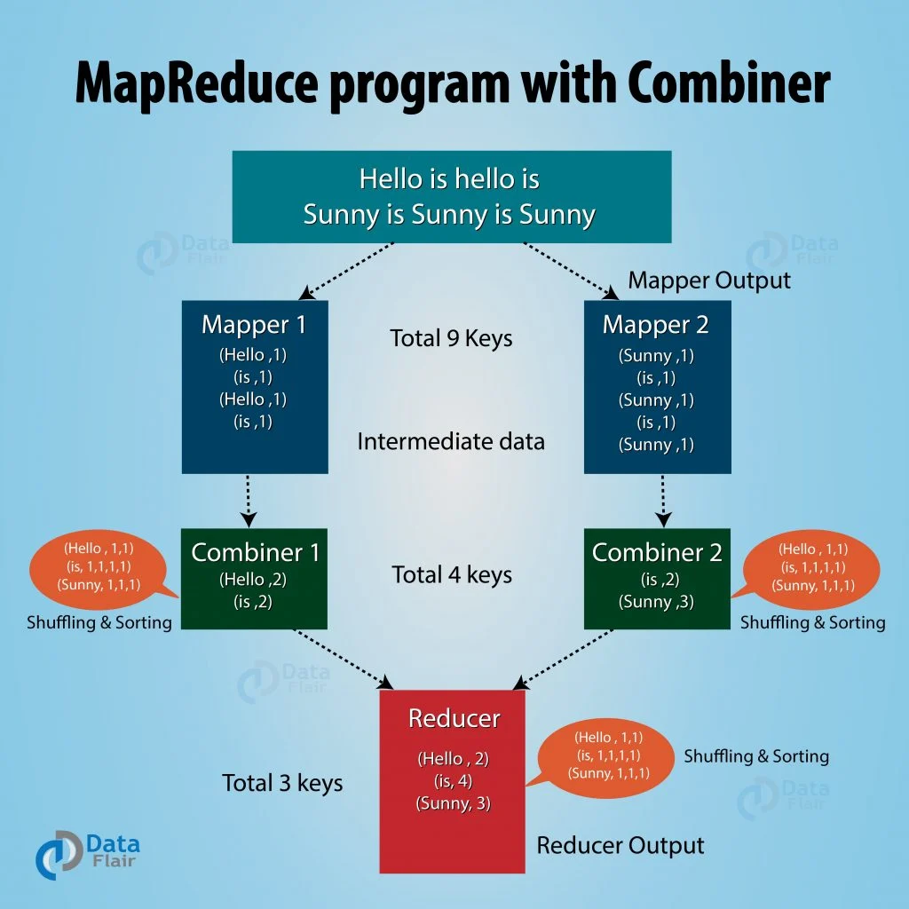
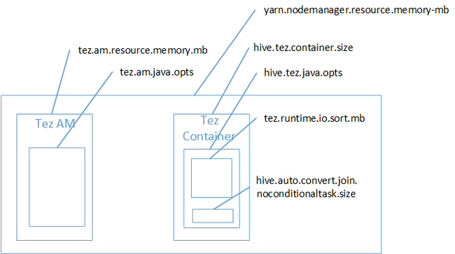

## 5강 - 하둡 맵리듀스

### MapReduce란 무엇인가?

- 2004년 구글에서 발표한 Large Cluster에서 Data Processing을 하기 위한 알고리즘
    
    [MapReduce: Simplified Data Processing on Large Clusters](https://static.googleusercontent.com/media/research.google.com/ko//archive/mapreduce-osdi04.pdf)
    
- Hadoop MapReduce는 구글 알고리즘 논문을 소프트웨어 프레임워크로 구현한 구현체
- **Key-Value 구조**가 알고리즘의 핵심
- 모든 문제를 해결하기에 적합하지 않을 수 있음(데이터의 분산 처리가 가능한 연산에 적합)
- HDFS에 분산 저장되어 있는 데이터를 병렬 처리하여 취합하는 역할
- Map Function과 Reduce Funtion으로 구성
    - Map Function : (key1, value) → (key2, value2)
    - Reduce Funtion : (key2, List of value2) → (key3, value3)
- Java, C++, Python 등 다양한 Language 지원
- Job에 대한 구동 및 관리는 하둡이 알아서 함(개발자는 비즈니스 로직 구현에 집중)

### MapReduce의 장/단점

- 장점
    - 단순하고 사용이 편리
    - 특정 데이터 모델이나 스키마, 질의에 의존적이지 않은 유연성
    - 저장 구조의 독립성
    - 데이터 복제에 기반한 내구성과 재수행을 통한 내고장성 확보
    - 높은 확장성
- 단점
    - 고정된 단일 데이터 흐름
    - 기존 DBMS보다 불편한 스키마 질의
    - 단순한 스케줄링
    - 작은 데이터를 저장/처리하기에 적합하지 않음
    - 개발도구의 불편함
    - 기술지원의 어려움

### MapReduce의 구동 방식

- Local
    - 단일 JVM에서 전체 Job을 실행하는 방식
- Classic
    - Hadoop 버전 1.0 대까지 유지하던 MapReduce 분산 처리 방식으로 Job Tracker와 Task Tracker를 사용하는 MapReduce 버전 1
- YARN
    - Hadoop 버전 2.0 이상에서 사용하는 MapReduce 분산 처리 방식으로 MapReduce 이외의 워크로드 수용이 가능한 MapReduce 버전 2

### MapReduce I

- 주요 컴포넌트
    - Client
        - 구현된 MapReduce Job을 제출하는 실행 주체
    - JobTracker
        - MapReduce Job이 수행되는 전체 과정을 조정하며, Job에 대한 Master 역할 수행
    - TaskTracker
        - Job에 대한 분할된 Task를 수행하며, 실질적인 Data Processing의 주체
    - HDFS
        - 각 단계들 간의 Data와 처리과정에서 발생하는 중간 파일들을 공유하기 위해 사용
- InputSplits
    
    
    
    
    
    
    
    - InputSplit은 물리적 Block들을 논리적으로 그룹핑한 개념
    - InputSplit은 Mapper의 입력으로 들어오는 데이터를 분할하는 방식을 제공하기 위해 데이터의 위치와 읽어들이는 길이를 정의함
- 구동 절차
    
    
    
    1. Job 실행
    2. 신규 Job ID 할당(JobTracker) 및 수신
    3. Job Resource 공유
    4. Job 제출
    5. Job 초기화
    6. InputSplit 정보 검색
    7. TaskTracker에 Task를 할당
    8. TaskTracker가 공유되어 있는 Job Resource를 local로 복사
    9. TaskTracker가 child JVM 실행
    10. MapTask 또는 ReduceTask 실행
- MapReduce 데이터 처리 흐름
    
    
    
- MapReduce 예제
    
    
    
- MapReduce 구현을 위한 Interface
    
    
    
    - MapReduce Application이 동작할 때,  Shuffle 과정에서 발생할 수 있는 트래픽을 최소화하도록 프로그래밍을 해야 성능이 잘 나오게 됨
        
        → 이 역할을 하는 데에 가장 중요한 2개가 Combiner와 Patitioner
        
- InputFormat에서 하는 역할
    
    
    
    - InputFormat은 입력 파일이 분할되는 방식(InputSplit)이나 읽어들이는 방식(RecordReader)을 정의하는 클래스
    - InputFormat은 물리적 Input File을 논리적 InputSplit으로 나누고, 각각의 InputSplit을 Mapper에 할당하는 역할을 함
- InputFormat의 종류
    
    
    
    - SequenceFile
        - SequenceFile은 hadoop 자체적으로 구현된 Binary 파일 포맷으로 Key-Value Pair로 구성
        - Binary 파일이라서 Text 파일 포맷보다 연산 속도가 빠름
        - 쓰기, 읽기, 정렬을 하기 위한 Writer, Reader, Sorter 클래스가 기본으로 제공됨
        - Mapper에서 생성하는 Immediate 결과 파일을 저장하는 방식으로 사용
        - 압축 여부에 따라 3가지 포맷이 존재
            1. Uncompressed key/value records : 압축을 하지 않는 방식
            2. Record compressed key/value records : Value만 압축하는 방식
            3. Block compressed key/value records : Block 단위로 압축하는 방식
        - 주로 Small File들이 많이 생성되는 경우 키+타임스탬프 형태로 이를 보완할 수 있어 자주 사용됨
        - Shuffling 과정에서 압축을 통해 트래픽 전송량을 줄이기 위한 목적으로도 사용됨
- RecordReader의 역할
    
    
    
    - 실제 파일에 접근하여 데이터를 읽어들임
    - 읽어들인 데이터를 Key-Value 형태로 반환함
- Mapper의 역할
    
    
    
    - MapReduce 프로그램에서 사용자의 비즈니스 로직이 구현된 첫 번재 데이터 처리 구건(Phase)
    - Intermediate 결과 파일을 로컬 디스크에 Key-Value Pair로 Partition 정보를 포함하여 생성
- Combiner의 역할
    
    
    
    
    
    - Reduce에서 해야하는 연산을 미리 Mapper 서버에서 전송하기 전에 한 번 줄여줌
- Partitioner의 역할
    
    
    
    - 서로 다른 Mapper에서 생성된 중간 결과 Key-Value Pair들을 Key 중심으로 같은 키를 갖는 데이터는 물리적으로 동일한 Reducer로 보내기 위한 용도로 사용
    - 기본(Default) Partitioner는 데이터의 Key 값을 해싱 처리하고 Reducer의 개수만큼 모듈러 연산
    
    ```java
    package org.apache.hadoop.mapreduce.lib.partition;
    
    @InterfaceAudience.Public
    @InterfaceStability.Stable
    public class HashPartitioner<K, V> extends Partitioner<K, V> {
    	/** Use {@link Object#hashCode()} to partition. */
    	public int getPartition(K key, V value, int numReduceTasks) {
        return (key.hashCode() & Integer.MAX_VALUE) % numReduceTasks;
      }
    }
    ```
    
- Shuffling & Sort 과정
    
    
    
    - Mapper의 Immediate 결과 파일이 Reducer로 전달되는 과정이 Shuffling(이 때 트래픽 발생)
    - 서로 다른 Mapper로부터 받은 데이터를 Key 중심으로 Sorting 수행
        
        → 같은 키에 해당하는 리스트를 Reducer로 전달
        
- Reducer의 역할
    
    
    
    - Reducer는 Mapper의 출력 결과를 입력으로 받아서 데이터를 처리
    - 처리된 데이터를 OutputFormat의 형태에 맞게 결과로 출력
    - MapReduce Application에서 Reducer의 구현은 선택적인 옵션
- OutputFormat 역할 및 종류
    
    
    
    - TextOutputFormat
        - Default OutputFormat이며, 텍스트 파일의 하나의 라인에 Key-Value Pair를 출력
    - SequenceFileOutputFormat
        - 주로 Mapper의 output을 Reducer로 보내기 전, Key-Value Pair 구조를 압축하도록 출력
    - MultipleOutputsFormat
        - 출력 파일의 이름을 Key-Value 등에서 추출된 문자열로 구성하고, 해당 파일에 데이터를 쓸 수 있음(여러 개의 파일로 쓰기 가능함)
    - LazyOutputFormat
        - 결과로 출력할 데이터가 있는 경우에만 파일을 생성하는 OutputFormat의 Wrapper로 사용
    - DBOutputFormat
        - 관계형 데이터베이스나 Hbase로 데이터를 쓰기 위한 OutputFormat
- `setup` 함수를 이용하는 방법
    - MapReduce 프레임워크는 `map`, `reduce` 함수의 실행 전 `setup` 함수를 호출합니다. 작업에 필요한 설정값과 전처리를 여기서 처리합니다. Context에서 설정값을 가져와서 설정에 이용하면 됩니다.
        
        ```java
        @Override
        public void setup(Context context) throws IOException, InterruptException {
        	conf = context.getConfiguration();
        	caseSensitive = conf.getBoolean("wordcount.case.sensitive", ...);
        }
        ```
        
- 카운터를 이용하는 방법
    - 카운터(Counter)는 enum을 이용하여 카운터를 등록하고, Context에서 카운터를 가져와서 사용하면 됩니다.
        
        ```java
        // 문자의 개수를 세는 카운터
        static enum CountersEnum {
        	INPUT_WORDS
        }
        
        // 카운터 이용
        Counter counter = context.getCounter("User Custom Counter", CountersEnum.INPUT_WORDS.toString());
        counter.increment(1);
        ```
        
    - 카운터를 이용하면 MapReduce 실행 로그에서 카운터 값을 확인할 수 있습니다.
        
        ```
        	WRONG_MAP=0
        	WRONG_REDUCE=0
        User Cunstom Counter
        	INPUT_WORDS=9
        File Input Format Counters
        	Bytes Read=57
        ```
        
- 분산 캐시를 이용하는 방법
    - 분산 캐시는 Job에 `addCacheFile`을 이용하여 등록합니다. map, reduce에서 이용할 때는 `getCacheFiles`를 이용합니다.
        
        ```java
        // main()
        if("-skip".equals(remainingArgs[1])) {
        	job.addCacheFile(new Path(remainingArgs[++i].toUri());
        	job.getConfiguration().setBoolean("wordcount.skip.patterns", true);
        }
        
        // setUp에서 이용하는 방법
        URI[] patternsURIs = Job.getInstance(conf).getCacheFiles();
        ```
        
- MapReduce Job 진행 상황과 상태 갱신
    
    
    
    - Task 진행율
        - Map Task : 제출된 Map 개수에 대한 처리 비율
        - Reduce Task : 총 진행을 3단계로 나누어 계산(Shuffle 포함)
    - Counter를 통한 피드백
        - Task는 카운터를 가지고 있으며, Hadoop 프레임워크에 내장되거나 사용자 정의 가능
        - MapReduce 앱 구현 시 원하는 지점에서 카운터를 실행하는 방식으로 이벤트 카운트 가능
    - 진행 상황의 통지
        - Task는 보고 플래그가 설정되어 있다면 TaskTracker에게 진행 상황을 3초마다 보고
        - TaskTracker는 JobTracker에게 Heartbeat를 보낼 때, 진행 중인 모든 Task의 상태를 포함하여 전송
        - Client Job은 매 초마다 JobTracker를 polling하여 최신 정보를 갱신
- MapReduce Job Completion
    - JobTracker는 하나의 Job에 대한 마지막 Task가 완료되었을 경우 상태를 “성공”으로 변경
    - 클라이언트는 상태를 검사하고, 사용자에게 알려주기 위한 메세지를 출력
        - waitForcompletion 메소드가 종료되고, Job 통계와 카운터가 콘솔로 출력됨
    - JobTracker의 설정에 따라 HTTP Job 통지 가능
        - Callback을 받고자 하는 클라이언트는 job.end.notification.url을 설정

### MapReduce II - YARN(Yet Another Resource Negotiator)

- MapReduce I과 YARN의 차이점
    - 이전 버전의 MapReduce 시스템은 4,000노드 이상의 매우 큰 클러스터 상에서 동작 시 병목현상 이슈가 발생함(JobTracker에 발생)
    - 확장성 문제를 해결하기 위해 JobTracker의 책임을 여러 컴포넌트로 분리
        - ResourceManager : 클러스터의 컴퓨팅 리소스 이용 상태를 관리하고 할당하는 것을 조정함
        - ApplicationMaster : 클러스터에서 실행 중인 Job의 LifeCycle을 관리
        - NodeManager : 컨테이너를 모니터링하고, Job이 할당 받은 그 이상의 리소스가 사용되지 않도록 보장
    - JobTracker와 다르게 응용 프로그램의 각 인스턴스는 ApplicationMaster를 고정적으로 할당시켜 응용 프로그램의 지속성을 유지
    - Cluster Resource Management와 Data Processing 영역을 분리하여, MapReduce 이외의 다른 Data Processing 방식도 수용 가능한 아키텍처로 변경(ex: MPI)
        
        
        
    - Hadoop 1.0과 YARN의 Architecture 비교
        - Hadoop 1.0
            
            
            
            - Master Node : 하둡 클러스터의 Resource와 Job 관리를 함께 수행. 병목이 발생하는 지점
            - Data Node : 한 노드에서 실행할 수 있는 Map과 Reduce Task의 개수 제한. M/R만 처리
        - YARN
            
            
            
            - Resource Manager : 클라이언트가 요청한 어플리케이션마다 자원을 관리. 하둡 클러스터 내 1개
            - Node Manager : 각 슬레이브 노드마다 1개, 컨테이너와 자원의 상태를 RM에 통지
            - Application Manager : 어플리케이션의 실행을 관리하고 상태를 RM에 통지. 어플리케이션마다 1개
            - Container : 어플리케이션을 수행하는 역할. 제한된 자원을 소유하며, 상태를 AM에 통지
        - Hadoop 1.0에 비해 2.0의 구조는 많이 복잡해짐. YARN을 통해 Job을 구동하면 클러스터의 상태에 따라 Job Initialization 시간이 10~30초 걸리는데, 이는 간단한 작업을 수행해도 많은 시간이 걸림을 의미함. 따라서 Hadoop은 적은 양의 데이터를 처리하기에는 적절하지 않은 플랫폼임
- YARN MapReduce 동작 흐름
    
    
    
    1. 클라이언트가 RM에 어플리케이션 제출
    2. NM을 통해 AM 실행
    3. AM은 RM에 자신을 등록
    4. AM은 RM에 컨테이너 할당할 공간/위치를 받음
    5. AM은 NM에 컨테이너를 실행 요청(어플리케이션 정보를 NM에 제공)
    6. 컨테이너는 어플리케이션의 상태정보를 AM에 알림
    7. 클라이언트는 어플리케이션의 실행정보를 얻기 위해 AM와 직접 통신
    8. 어플리케이션이 종료되면 AM은 RM에게서 자신의 자원을 해제하고 종료
- YARN MapReduce Job 제출
    - Job 제출 과정은 이전 버전과 유사
    - Job 제출 과정
        - 사용자 API를 사용하여 Job 제출 실행
        - ResourceManager로부터 새로운 어플리케이션 ID를 할당 받음
        - 클라이언트는 Job 리소스를 분산 파일 시스템으로 복사
        - 리소스 매니저의 submitApplication을 호출하여 Job 제출
- YARN MapReduce Job 초기화(Initialization)
    - 리소스 매니저는 submitApplication이 호출되면 스케줄러로 요청을 전달
    - 스케줄러의 Job 할당 과정
        - 컨테이너를 할당하고, ResourceManager는 NodeManager의 관리를 받도록 ApplicationMaster를 할당 받은 컨테이너로 배포
        - ApplicationMaster는 Job의 진행 상황을 감시하기 위한 다수의 북키핑 객체를 생성하면서 Job을 초기화
        - AppicationMaster가 Task로부터 Job의 진행 상황과 완료를 통보 받음
        - 공유파일시스템으로부터 계산된 InputSplit을 받음
        - ApplicationMaster는 mapreduce.job.reduces 속성으로 정해진 다수의 Reduce 객체와 Map Task 객체를 생성하고 Task 수행 방법을 결정(작은 Job일 경우 동일 JVM에서 Task를 실행, uber mode가 true인 경우에만 실행됨, default는 false)
        - ApplicationMaster는 모든 Task를 실행 전에 출력 디렉토리를 생성하는 Job 설정 메소드를 호출
- YARN MapReduce Task 할당
    - Uber Task로 실행하기 적합하지 않은 Job일 경우 ApplicationMaster는 ResourceManager에 컨테이너를 요청
        - 모든 요청은 Heartbeat 호출에 대한 Feedback으로 전송됨
        - Map Task의 데이터 Locality와 특별히 InputSplit이 위치한 호스트 및 해당 랙 정보 포함
    - Task는 데이터 Locality를 고려하여 할당함
    - 메모리 할당 방식
        - MapReduce I
            - 클러스터 구성 시 설정된 고정 개수의 슬롯을 가짐
            - 슬롯은 최대 메모리 허용치가 클러스터 단위로 고정되어 있음
            - 적은 태스크가 주어질 경우 이용률이 떨어짐
        - YARN
            - 어플리케이션은 메모리의 최소 할당과 최대 할당에 대한 요청이 가능
            - 기본적인 메모리 할당은 스케줄러에 지정되어 있음
- YARN MapReduce Task 실행
    - Task 실행 과정
        - ApplicationMaster는 NodeManager에 협조를 얻어 컨테이너를 작동. Task는 Java 어플리케이션으로 실행 됨(YarnChild)
        - 어플리케이션은 Task가 필요로 하는 리소스를 로컬로 가져옴(Localization)
        - Map이나 Reduce Task 실행
    - MapReduce I과 동일하기 YarnChild는 할당된 JVM에서 실행
        - YARN은 JVM 재사용을 지원하지 않음. 매번 새로 생성
    - 스트리밍과 파이프 프로그램은 MapReduce II와 동일하게 작동
- YARN MapReduce 진행 상황과 상태 갱신
    - YARN에서는 진행 상황과 상태 정보를 ApplicationMaster에 보고
    - 클라이언트는 진행 상황의 변화를 확인하기 위하여 매 초마다 ApplicationMaster를 조회
    - 진행 상황 모니터링
        - MapReduce I : JobTracker의 웹 UI를 통해 제공
        - YARN : ResourceManager의 웹 UI를 통해 실행 중인 모든 어플리케이션을 보여주고, 각 링크가 ApplicationMaster의 웹 UI로 연결 됨

### Hadoop 3.0

- 블로그 사이트 참조

[업그레이드를 부르는 Hadoop 3.0 신규 기능 살펴보기 | Popit](https://www.popit.kr/%EC%97%85%EA%B7%B8%EB%A0%88%EC%9D%B4%EB%93%9C%EB%A5%BC-%EB%B6%80%EB%A5%B4%EB%8A%94-hadoop-3-0-%EC%8B%A0%EA%B7%9C-%EA%B8%B0%EB%8A%A5-%EC%82%B4%ED%8E%B4%EB%B3%B4%EA%B8%B0/)

### MapReduce 메모리 설정 및 최적화

- 메모리 설정
    - yarn.app.mapreduce.am.resource.mb
        - 노드에서 ApplicationMaster를 실행할 때 할당하는 메모리
    - yarn.app.mapreduce.am.command-opts
        - ApplicationMaster의 heap 사이즈
    - mapreduce.map.memory.mb
        - MapContainer를 생성할 때 설정하는 메모리
    - mapreduce.map.java.opts
        - MapContainer를 생성할 때 설정하는 java 옵션
        - Xmx 옵션을 이용하여 heap 사이즈를 설정
        - MapContainer 메모리(mapreduce.map.memory.mb)의 80%로 설정
    - mapreduce.map.cpu.vcores
        - MapContainer에서 사용 가능한 가상 코어 개수
        - Default는 1
    - mapreduce.reduce.java.opts
        - ReduceContainer를 생성할 때 설정하는 java 옵션
        - Xmx 옵션을 이용하여 heap 사이즈를 설정
        - ReduceContainer 메모리의 80%로 설정
    - mapreduce.reduce.cpu.vcores
        - ReduceContainer의 코어 개수
    - mapred.child.java.opts
        - Map과 Reduce Task의 JVM 실행 옵션, Heap 사이즈 설정
        - mapreduce.map.java.otps, mapreduce.reduce.java.opts 설정이 이 설정을 override하여 설정
        - Default는 -Xmx200m
    - mapreduce.reduce.memeory.mb
        - ReduceContainer를 생설할 때 설정하는 메모리
        - MapContainer 메모리(mapreduce.map.memory.mb)의 2배로 설정하는 것이 일반적
- MR 엔진 메모리 설정
    
    
    
- TEZ 엔진 메모리 설정
    
    
    
- 성능 최적화 : Mapper, Reduce 개수 조절
    
    ```xml
    <property>
    	<name>mapreduce.job.maps</name>
    	<value>100</value>
    </property>
    
    <property>
    	<name>mapreduce.job.reduces</name>
    	<value>50</value>
    </property>
    ```
    
- 성능 최적화 : 정렬 속도 튜닝
    - Map 작업은 임시 결과 피일 개수를 줄이는 것으로 성능을 개선할 수 있다. **로컬 디스크에 저장된 파일이 줄어들수록 Map 출력 데이터의 병합, 네트워크 전송, Reducer의 병합 작업 시간이 단축된다.** 스필되는 파일을 줄이려면 스필 전 메모리 버퍼 크기인 io.sort.mb를 늘리면 된다. 메모리 버퍼가 커져서 로컬에 저장될 출력 데이터가 줄어들게 된다.
    
    ```xml
    <property>
    	<name>mapreduce.task.io.sort.mb</name>
    	<value>200</value>
    </property>
    
    <property>
    	<name>mapreduce.map.sort.spill.percent</name>
    	<value>0.80</value>
    </property>
    
    <property>
    	<name>mapreduce.task.io.sort.factor</name>
    	<value></value>
    </property>
    ```
    
- 성능 최적화 : Combiner 클래스 적용
    - Combiner를 적용하면 Map 작업의 결과 데이터가 Reducer로 전송되기 전에 Combiner 작업을 진행하여, 데이터를 줄여서 네트워크 사용량을 줄이고, Reducer의 작업 속도를 향상시킬 수 있다.
    
    ```java
    job.setMapperClass(TokenizerMapper.class);
    job.setCombinerClass(IntSumReducer.class); // Combiner 적용
    job.setReducerClass(IntSumReducer.class);
    ```
    
- 성능 최적화 : Map 출력 데이터 압축
    - Map 출력 데이터를 압축하여 네트워크 트래픽을 줄여 주면 plain text를 이용할 때보다 속도가 증가할 수 있다.
    
    ```xml
    <property>
    	<name>mapreduce.map.output.compress</name>
    	<value>true</value>
    </property>
    
    <property>
    	<name>mapreduce.map.output.compress.codec</name>
    	<value>org.apache.hadoop.io.compress.SnappyCodec</value>
    </property>
    ```
    
- YARN 스케줄러 : Capacity Scheduler
    - Capacity Scheduler는 트리 형태로 계층화된 큐를 선언하고, 큐별로 사용 가능한 용량을 할당함
    - 예를 들어 100G의 메모리 용량을 가지는 클러스터에서 A, B 두 개의 큐에 각각 40%, 60%의 용량(capacity)를 설정하면 A큐는 40G, B큐는 60G의 메모리를 사용할 수 있음
    - 만약 클러스터의 자원에 여유가 있다면 설정을 이용하여 각 큐에 설정된 용량 이상의 자원을 이용하게 할 수도 있고, 운영 중에도 큐를 추가할 수 있는 유연성도 가지고 있음
    
    | 설정값 | 비고 |
    | --- | --- |
    | yarn.scheduler.capacity.maximum-application | PRE, RUNNING 상태로 설정될 수 있는 최대 어플리케이션의 개수 |
    | yarn.scheduler.capacity.maximum-am-resource-percent | ApplicationMaster에 할당 가능한 최대 비율. AM은 실제 작업이 돌지 않고 작업을 관리하는 역할을 하기 때문에 작업에 많은 컨테이너를 할당하기 위해 이 값을 적당히 조절해야 함 |
    | yarn.scheduler.capacity.root.queues | root 큐에 등록하는 큐의 이름. root 큐는 하위에 등록할 큐를 위해 논리적으로만 존재 |
    | yarn.scheduler.capacity.root.[큐 이름].maximum-am-resource-percent | 큐에서 AM이 사용할 수 있는 자원의 비율 |
    | yarn.scheduler.capacity.root.queues.[큐 이름].cacpacity | 큐의 용량 비율 |
    | yarn.scheduler.capacity.root.queues.[큐 이름].user-limit-factor | 큐에 설정된 용량 * limit-factor 만큼 다른 큐의 용량을 사용할 수 있음. 클러스터의 자원을 효율적으로 사용할 수 있음. maximum-capacity 이상으로는 이용할 수 없음 |
    | yarn.scheduler.capacity.root.queues.[큐 이름].maximum-capacity | 큐가 최대로 사용할 수 있는 용량 |
- YARN 스케줄러 : Fair Scheduler
    - Fair Scheduler는 제출된 작업이 동등하게 리소스를 점유할 수 있도록 지원
    - 작업 큐에 작업이 제출되면 클러스터는 자원을 조절하여 모든 작업에 균등하게 자원을 할당
    - 메모리와 CPU를 기반으로 자원을 설정 가능
    - Fair Scheduler는 트리 형태로 계층화된 큐를 선언하고, 큐별로 사용 가능한 용량을 할당하여 자원을 관리함
    
    | 설정값 | 기본값 | 비고 |
    | --- | --- | --- |
    | yarn.scheduler.fair.allocation.file | fair-scheduler.xml | 설정 파일의 이름 |
    | yarn.scheduler.fair.user-as-default-queue | true | 큐 이름을 지정하지 않았을 때 기본 큐의 사용 여부 |
    | yarn.scheduler.fair.preemption | false | 우선순위 선점의 사용 여부 |

### References

[[Youtube] SKPlanet Tacademy | 하둡 맵리듀스](https://www.youtube.com/watch?v=Jx9rjPTWYPQ)