## 6강 - 하둡 활용

### Hadoop의 장/단점

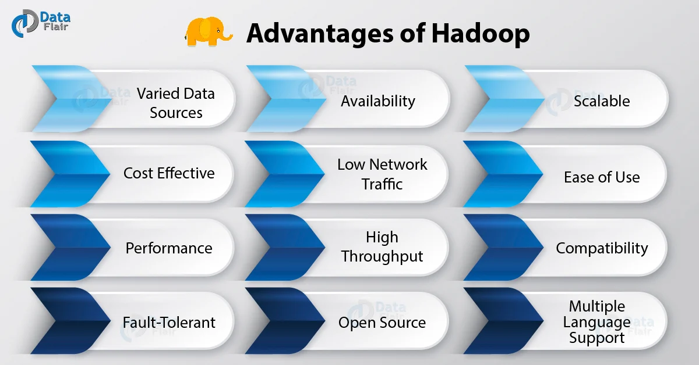

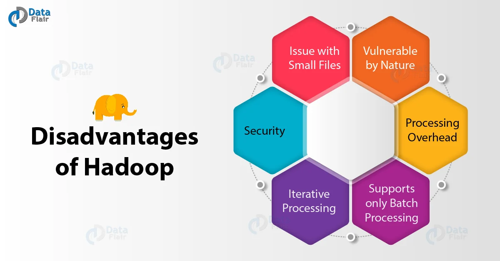

- 하둡에 데이터를 저장할 때에는 파일 사이즈가 큰 것으로 관리하는 것이 좋음
- 작은 파일이 많이 저장되어 있으면 좋지 않음
    1. NameNode의 메모리를 굉장히 많이 쓰게되고 부하를 많이 줌
    2. 성능도 많이 떨어짐
    3. 작은 파일들을 압축하여 관리하는 것이 일반적

### 활용 관점에서 또다른 단점

- MapReduce는 프로그래밍 레벨(Java, Python, C++ 등)의 개발이 필요함
- 더 쉬운 분석 지원을 위해 SQL을 지원하는 쿼리 엔진이 필요함
    - HIVE
        - Hadoop에 저장된 데이터를 쉽게 처리할 수 있는 데이터 웨어하우스 패키지
        - Facebook에서 매일 같이 생산되는 대량의 데이터를 관리하고 학습하기 위해 개발
        - SQL과 유사한 Query Language를 지원
        - SQL 레벨의 ETL 처리 도구로 활용 가능
        - 작성된 쿼리를 내부적으로 MapReduce 형태로 변환
        - 가장 역사가 오래된 SQL on Hadoop 엔진
        - 디스크 단위로 읽고 쓰기를 하기 때문에 데이터의 크기가 전체 클러스터의 메모리 크기를 벗어나도 처리할 수 있음
    - Apache Spark SQL
        - 메모리 상에서 처리하기 때문에 처리 속도가 빠름, 전체 클러스터의 메모리 크기를 벗어나는 데이터는 처리하기 어려움

### HIVE

- 하이브(Hive) 서비스
    - CLI(Command Line Interface)
        - 하이브 셀에 대한 명령행 인터페이스
    - Hiveserver
        - Thrift, JDBC, ODBC 연결자를 사용하는 응용 프로그램은 하이브와 통신하기 위하여 하이브 서버를 필요
    - Metastore
        - 하이브 실행 시 메타 데이터가 저장되는 장소(MySQL 등)
    - HWI
        - 하이브 웹 인터페이스
- 하이브(Hive) 서비스 아키텍처
    
    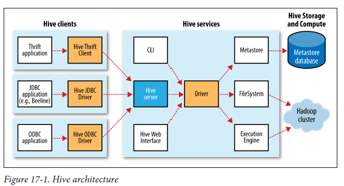
    
- 하이브(Hive) 메타스토어 설정
    
    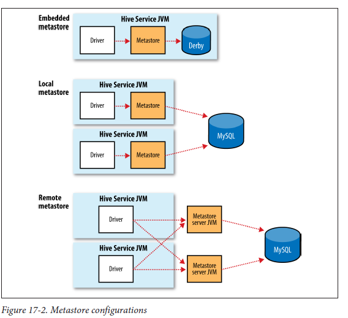
    
    - 하이브 기본 디렉토리
        - hive.metastore.warehouse.dir
    - 임베디드 메타스토어 사용 유무
        - hive.metastore.local
    - 연결할 메타 스토어 서버
        - hive.metastore.uris
    - ETC
        - javax.jdo.option.xxxx

### HIVE vs Database

- 테이블 스키마 검증 시점
    - 전통적 Database
        - 데이터를 적재하는 시점에 검증
        - 만일 Insert 중인 데이터가 스키마에 부합되지 않으면 데이터 거부
        - Column 단위로 색인이 가능하기 때문에 빠른 쿼리 성능을 제공
    - Hive
        - 쿼리 실행 시 데이터 검증
        - 데이터의 매우 빠른 적재를 제공(ex. 파일 복사 or 이동)
        - 동일 데이터를 두 스키마로 다루어야 할 때 훌륭한 유연성을 제공
- 갱신, 트랜잭션, 색인
    - Hive는 갱신을 지원하지 않음
    - Lock Mechanism
        - ZooKeeper를 사용하여 테이블과 파티션 수준의 lock을 지원(0.7.0)
        - 지원 색인
    - 0.7.0부터 특별한 경우를 위한 색인 기능을 제공
        - 컴팩트, 비트맵 타입 지원

### HQL(Hive Query Language)

- 표준 SQL과 주요 차이점
    
    
    | 속성 | SQL | HiveQL |
    | --- | --- | --- |
    | 갱신 | UPDATE, INSERT, DELETE | INSERT OVERWRITE TABLE |
    | 데이터형 | 정수형, 부동소수점, 고정소수점, 텍스트, 바이너리, 시간 | 추가적으로 배열, 맵, 구조체 지원 |
    | 다중 테이블 삽입 | 지원하지 않음 | 지원 |
    | 조인 | FROM 절에서 테이블 조인 WHERE 절에서도 조건 지원(SQL-92 지원) | 내부조인, 외부조인, 세미조인, 맵 조인 지원 WHERE절 조건 지원 X |
    | 서브쿼리 | 어떠한 절에서도 사용 가능 | FROM 절에서만 사용 가능 |
    | 뷰 | 업데이트 가능 | 읽기 전용 |
    | 확장 가능성 | 사용자 정의 함수, 저장 프로시저 | 사용자 정의 함수, MapReduce 스크립트 |

### Columnar File Format

- Columnar vs Row-based File Format(Columnar의 장점)
    
    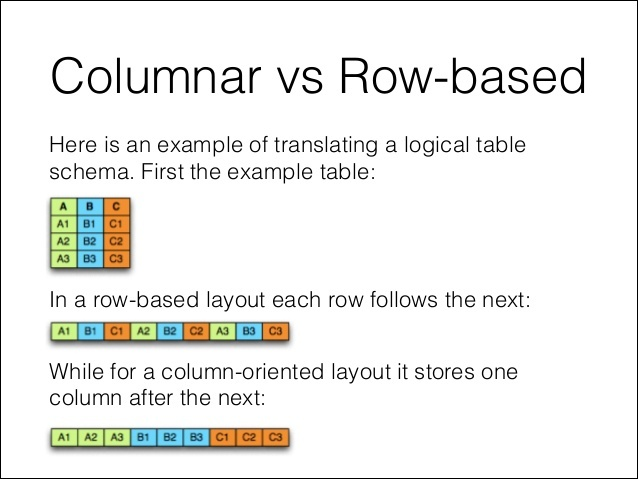
    
    - 압축률이 매우 좋음
    - 데이터 Read 시 I/O 양을 줄일 수 있음(클라우드 전환 시 비용과도 연관됨)
    - 컬럼에 동일한 데이터 타입이 저장되기 때문에 컬럼별로 적합한 인코딩 방식을 사용할 수 있음
    - 위와 같은 이유로 인해 읽기 성능이 증가함
- ORC File Format(Columnar)
    
    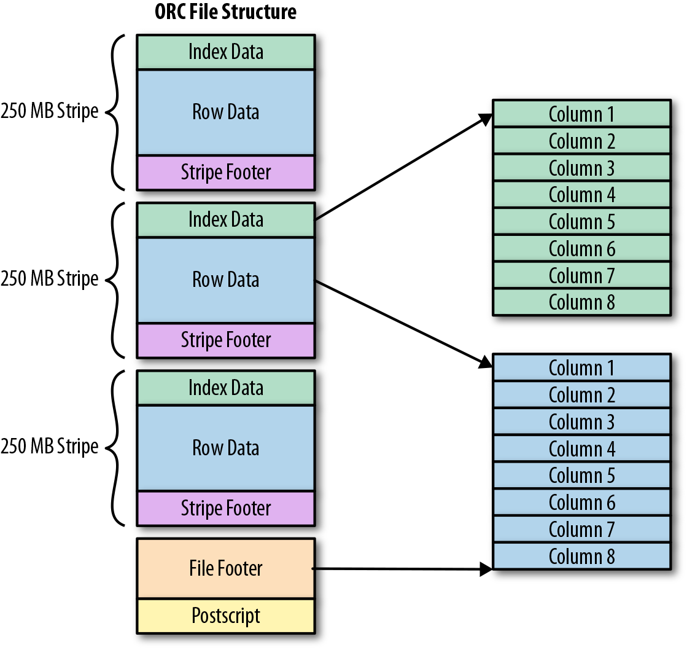
    
    - 오웬 오말리 호튼웍스 부사장이 ORC 파일 포맷 제안
    - Hive와 매우 친밀함(오말리가 Hive 메인 컨트리뷰터)
    - Java만 지원하여 다양한 플랫폼 적용이 어려움
    - 더그 커팅이 트레비니와 ORC 파일의 공존을 제안했으나 오말리가 거절(호튼웍스 vs 클라우데라) 후 각자도생
    - 트레비니는 이후 Avro로 발전하였으나 현재 기준 승자는 ORC 포맷
- Parquet File Format(Columnar)
    
    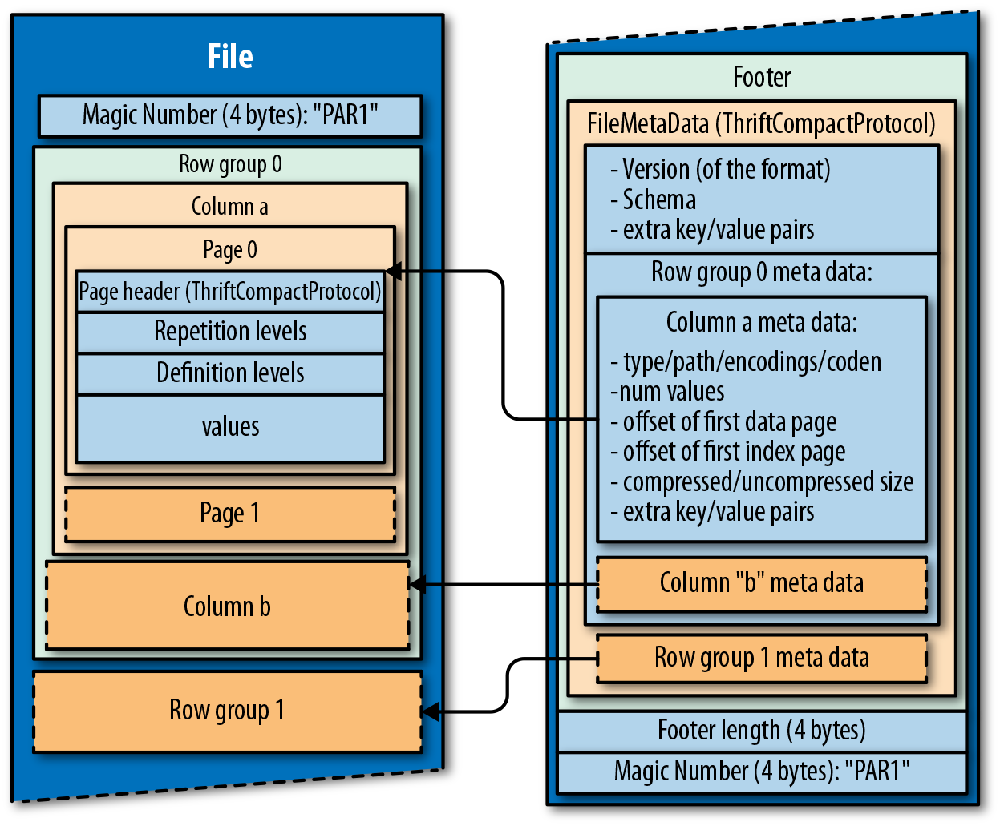
    
    - 파케이(Parquet)는 구글이 발표한 논문을 기반으로 Twitter에서 개발
    - Hive 뿐만 아닌 피그 등 다양한 플랫폼을 지원
    - Twitter에서 스펙 공개 이후 Cloudera가 개발에 참여하여 Impala에 적용
    - 컬럼별로 다양한 압축 코덱 적용 가능
    - Hive에서도 지원되지만, Spark와 매우 친밀함

### 데이터 활용 아키텍처

- 데이터 활용 관점의 전체 아키텍처
    
    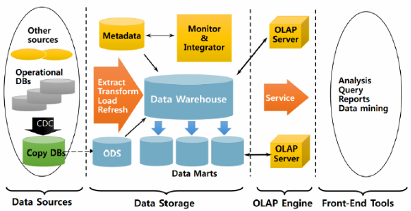
    
- 아파치 스파크(Apache Spark)
    
    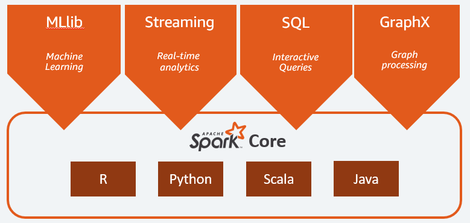
    
    - 머신러닝, 실시간 분석, SQL 쿼리 분석, 그래프 처리 등 안되는 것이 없음
    - 메모리 기반 분산 처리라 속도가 빠름
    - Hadoop과 호환이 잘 됨
    - Hive 메타스토어 공유도 가능
    - Python, Scala, R, Java 지원
    - MapReduce 연산 이외에 Join, Counter, Filter 등 다양한 연산 지원
    - YARN에서 구동 가능함
    - 참고자료 : [https://www.slideshare.net/yongho/rdd-paper-review](https://www.slideshare.net/yongho/rdd-paper-review)
- On-Premise가 아닌 Cloud에서의 활용
    - Amazon AWS
        
        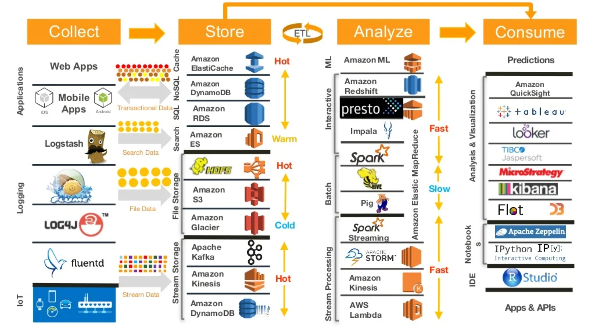
        
    - Amazon AWS 적용 사례
        
        완전관리형 서비스 위주의 아키텍처 구성
        
        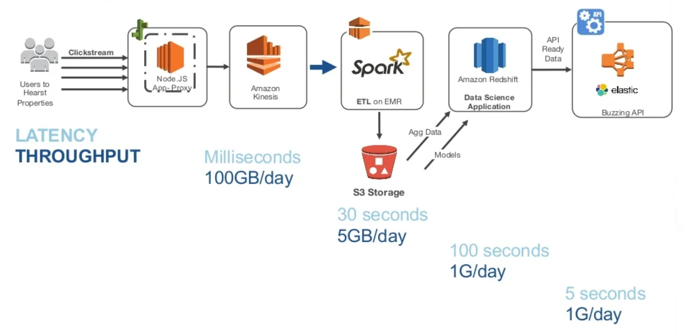
        

### Troubleshooting 사례 공유

[SK텔레콤 Hadoop 3.1 트러블슈팅 사례공유 | Popit](https://www.popit.kr/sk%ED%85%94%EB%A0%88%EC%BD%A4-%ED%95%98%EB%91%A1-3-1hadoop-3-1-%ED%8A%B8%EB%9F%AC%EB%B8%94%EC%8A%88%ED%8C%85-%EC%82%AC%EB%A1%80%EA%B3%B5%EC%9C%A0/)

### References

[[Youtube] SKPlanet Tacademy | 하둡 활용](https://www.youtube.com/watch?v=nrhgH0qShwI)

[[Hadoop] Hive 기본](https://velog.io/@modsiw/Hadoop-Hive-%EA%B8%B0%EB%B3%B8)

[Ad-Tech on AWS 세미나 | AWS와 데이터 분석](https://www.slideshare.net/awskorea/adtech-on-aws-aws)