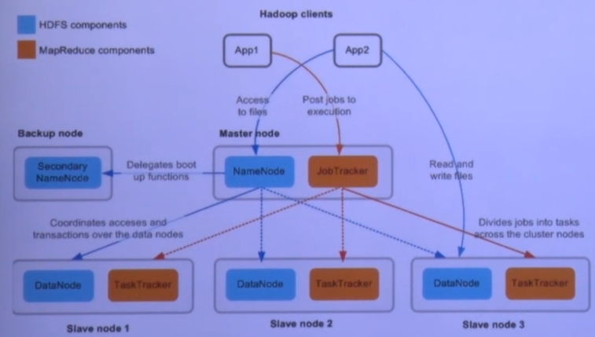
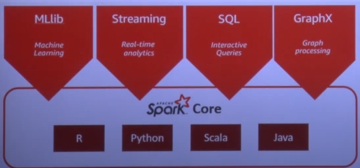

[TOC]


### 0905

###### Tacademy Hadoop 1강

하둡 - 비정형 데이터를 포함한 빅데이터를 다루기 위한 가장 적절한 플랫폼

Lucene(인덱싱 라이브러리) ->(아들 프로젝트, 2002) Nutch ->(아들 프로젝트) Hadoop

Hadoop 개발의 배경

1. Nutch를 사용할 때, 분산병렬처리를 통해 데이터를 색인하는 과정의 어려움
2. GFS(Google File System)이 release된다(2003) -> Hadoop Distributed File System
3. Map Reduce(구글에서 분산병렬처리를 하는 방법) 알고리즘이 공개된다(2004) -> Hadoop MapReduce
4. Nutch의 sub-project로 Hadoop이 개발되기 시작(2006)
5. Hadoop을 지원하던 Yahoo에서 1000 node에 Hadoop을 사용하기 시작(2007)
6. Apache의 top-level project가 된다(2008), 이후 슈퍼컴퓨터의 성능을 뛰어넘다
7. 1.0버젼 발매(2011)
8. 2.0버젼 발매(YARN 포함)(2012)
9. 3.0버젼 발매(2017)

HADOOP 생태계

- Core Hadoop
- HBase(NoSQL) - 분산데이터베이스
- Pig - Script Language
- Zookeeper -  
- Mahout -  SQL로 하기 용이하지 않은 머신러닝등의 알고리즘을 하둡같은 분산데이터베이스에서 처리할 수 있게 한다
- Hive - SQL로 Hadoop에 있는 데이터를 다루게 한다
- Avro
- Whirr
- Sqoop - 관계형데이터베이스(MariaDB 등)과 Hadoop간 데이터 주고받는 것을 용이하게 해주는 프레임워크
- HCatalog - 하둡에서 저장되어 관리하는 스키마를 하나의 카탈로그 서비스에서 관리
- Mrunit - MapReducing Test Framework
- Bigtop
- Oozie - 하둡에 저장된 데이터를 처리하여 데이터마트를 만드는 과정의 workflow를 스케쥴링하는 스케쥴러
- ....


하둡 -> 본래는 많은 데이터를 저장하는데 비용을 아끼는데 의의 -> Data로부터 새로운 Insight와 사업기회를 찾기 위한 노력과 시장확대

컴퓨터, 통신의 소형화, IoT로 많은 센서들이 생기고, 데이터가 계속 생겨난다

### 0906

###### 자바공부

###### 

- 대소문자 구분, 길이 제한 없다
- 예약어(Reserved word) 사용 금지 - true(True는 가능) 등
- 숫자로 싲가해서는 안 된다
- 특수문자는 '_'와 '$'만을 허용
- 권장사항
  - 클래스 이름의 첫 글자는 항상 대문자(변수와 메서드 이름의 첫 글자는 항상 소문자)
  - 여러 단어 이름은 단어의 첫 글자를 대문자로 한다
  - 상수의 일므은 대문자로 한다, 단어는 '_'로 구분한다.

**변수, 상수, 리터럴**

- 변수(variable) - 하나의 값을 저장하기 위한 공간
- 상수(constant) 한 번만 값을 저장할 수 있는 공간
- 리터럴(literal) 그 자체로 값을 의미하는 것

**리터럴과 접미사**

- boolean power = true;
- char ch = 'A';
- char ch = '\u0041';
- char tab = '\t'
- byte b = 127;
- short s = 32767;
- int i = 100;
- int oct = 0100;
- int hex = 0x100;
- long l = 10000000000L;
- float f = 3.14f
- double d = 3.14d
- float f = 100f;
- 10. -> 10.0 
- .10  ->  0.10
- 10f -> 10.0f
- 3.14e3f -> 3140.0f
- 1e1 -> 10.0

**변수의 기본값과 초기화**

- 변수의 초기화 : 변수에 처음으로 값을 저장하는 것

  ​						지역변수는 사용되기 전에 반드시 초기화해준다

  | 자료형  | 기본값      |                                  |
  | ------- | ----------- | -------------------------------- |
  | boolean | false       | boolean isGood  = false;         |
  | char    | '\u0000'    | char grade = ' '; //공백         |
  | byte    | 0           | byte b = 0;                      |
  | short   | 0           | short s = 0;                     |
  | int     | 0           | int i = 0;                       |
  | long    | 0L          | long l = 0; //0L로 자동변환      |
  | float   | 0.0f        | float f = 0; //0.0f로 자동변환   |
  | double  | 0.0d or 0.0 | double d = 0; //0.0으로 자동변환 |
  | 참조형  | null        | String s1 = null;                |
  |         |             | String s2 = ""; // 빈 문자열     |

**문자와 문자열**

- char ch = 'AB' -> 에러
- char ch = ''; -> 에러
- String s1 = "A" + "B"; //"AB"
- "" + 7 -> "" + "7" -> "7"
- "" + 7 + 7 -> "7" + 7 -> "7" + "7" -> "77"
- 7 + 7 + "" -> 14 + "" -> "14"
- 문자열 + any type -> 문자열
- any type + 문자열 -> 문자열

**정수의 오버플로우(Overflow)**

- byte b = 127;

- byte b = 128; // 에러(-128 ~ 127)

- 000 ~ 999

  부호가 없는 정수 0000 ~ 1111

  부호가 있는 정수 1000 ~ 0111

형변환(Casting)

- 값의 타입을 다른 타입으로 변환하는 것

- boolean을 제외한 7개의 기본형은 서로 형변환이 가능

- float f = 1.6f;

- int i = (int)f;

  | 변환         | 수식      | 결과  |
  | ------------ | --------- | ----- |
  | int -> char  | (char)65  | 'A'   |
  | char -> int  | (int)'A'  | 65    |
  | float -> int | (int)1.6f | 1     |
  | int -> float | (float)10 | 10.0f |

- int -> byte (byte크기 감소, 값손실있음)

  int i2 = 300;

  byte b2 = (byte)i2; // 생략불가

- byte -> int(byte크기 증가, 값손실없음)

  byte b = 10;

  int i (int) b; //생략가능

**형식화된 출력 - printf()**

- println()의 단점 - 출력형식 지정불가

  - 실수의 자리수 조절불가

    System.out.println(10.0/3); //3.3333333...

  - 10진수로만 출력

    System.out.pringln(0x1A); // 26

- printf()로 출력형식 지정가능

  System.out.printf("%.2f", 10.3/3); // 3.33

  System.put.printf("%d", 0x1A); //26

  System.out.printf("%X", 0x1A); //1A

**printf()의 지시자**

| 지시자 | 설명           |
| ------ | -------------- |
| %d     | decimal        |
| %o     | octal          |
| %x, %X | hexa-decimal   |
| %f     | floating-point |
| %e, %E | exponent       |
| %c     | character      |
| %s     | string         |
| %b     | boolean        |

System.out.printf("age:%d year:%d\n", 14, 2017);

```
"age:14 year:2017\n"
					// 줄바꿈 o
```

System.out.printf("age:%d%n year:%d\n", 14, 2017);

```
"age:14"
 "year:2017"

```

- 10진수, 8진수, 16진수 출력

  System.out.printf("%d", 15); // 15

  System.out.printf("%o", 15); // 17

  System.out.printf("%x", 15); // f

  System.out.printf("%s", Integer.toBinaryString(15)); // 1111 2진수

- 8진수와 16진수에 접두사 붙이기

  System.out.printf("%#o, 15"); // 017
  System.out.printf("%#x, 15"); //0xf
  System.out.printf("%#X, 15"); //0XF

- 실수 출력을 위한 지시자 %f - 지수형식(%e), 간략한 형식(%g)

  float f = 123.456789f

  System.out.printf("%f", f); // 123.456787, 소수점 아래 6자리
  System.out.printf("%e", f) // 1.234568e+02, 지수형식System.out.printf("g", 123,456789); // 123.457, 간략한 형식
  System.out.printf("g", 0.00000001); // 1.00000e-8, 간략한 형식
  System.out.printf("[%5d]%n", 10); // [   10]
  System.out.printf("[%-5d]%n", 10); // [10   ]
  System.out.printf("[%05d]%n", 10); // [00010]

- %전체자리.소수점아래자리f

  System.out.printf("d = %14.10f%n", d); // 전체 14자리 중 소수점 아래 10자리만 출력

  소수점 왼쪽은 공백처리 소수점 오른쪽은 0으로 채운다

  System.out.printf("[%s]%n", url); // [www.codechobo.com/]
  System.out.printf("[%20s]%n", url); // [  www.codechobo.com/]
  System.out.printf("[%-20s]%n", url); // [www.codechobo.com/  ]
  System.out.printf("[%.8s]%n", url); // [www.code]

**Scanner**

- 화면으로부터 데이터를 입력받는 기능을 제공하는 클래스

- 조건

  - import문 추가

    import java.util.*;

  - Scanner객체의 생성

    Scanner scanner = new Scanner(System.in);

  - Scanner객체를 사용

    int num = scanner.nextInt(); // 화면에서 입력받은 정수를 num에 저장
    String imput = scanner.nextLine(); // 화면에서 입력받은 내용을 input에 저장
    int num = Integer.parseInt(input); // 문자열(input)을 숫자(num)로 변환

**연산자(Operator)**

어떠한 기능을 수행하는 기호(+,-,*,/ 등)

**피연산자(Operand)**

연산자의 작업 대상(변수, 상수, 리터럴, 수식)

**종류**

- 단항 연산자 : + - (타입) ++ -- ~ !

  - 증감 연산자 ++, --
    - 전위형 j = ++i; 
      - 값이 참조되기 전에 증가시킨다
    - 후위형 j = i++;
      - 값이 참조된 후에 증가시킨다.
  - 부호연산자 +, -
    - 피연산자에 1(+) 또는 -1(-)을 곱한다
  - 논리부정연산자 !
    - true는 false로, false는 true로 바꾼다
    - 피연산자가 boolean일 때만 사용가능
  - 비트전환연산자 - ~
    - 정수를 2진수로 표현했을 때, 1을 0으로 0은 1로 바꾼다.
    - 정수형에만 사용가능

- 이항 연산자

  특징(피연산자의 타입을 일치시키기 위해)
  	int보다 크기가 작은 타입은 int로 변환
  	피연산자 중 표현범위가 큰 타입으로 형변환 한다

  ```
  int a = 1,000,000;
  int b = 2,000,000;
  long c = a * b // c = -1454759936
  long c = (long)a*b; // c = 2,000,000,000,000
  
  long a = 1,000,000 * 1,000,000; // a = -727,379,968
  lomng b = 1,000,000 * 1,000,000L;
  // b = 1,000,000,000,000
  int c = 1,000,000 * 1,000,000 / 1,000,000;// c = -272
  in d = 1,000,000 / 1,000,000 * 1,000,000; // d = 1,000,000
  
  char c1 = 'a';
  char c2 = c1 + 1; // error
  char c2 = (char(c1 + 1); // b
  char c2 = ++c1; // b
  char c2 = c1++; // a
  int i = 'B' - 'A'; // 1
  int i = '2' - '0'; // 2
  
  float pi = 3.141592f;
  float shortPi = (int)(pi * 1000) / 1000f; //3.141f
  
  Math.round() : 소수점 첫째자리에서 반올림한 값을 반환
  float shortPi = Math.round(pi*1000) / 1000f; //3.142f
  ```

  

  - 산술 : + - * / % << >> >>>

    - 나머지 연산자 - %

      - 10 % 8 -> 2
      - 10 % -8 -> 2
      - -10 % 8 -> -2
      - -10 % -8 -> -2

    - 쉬프트연산자 << >> >>>

      -  x << n -> x*2^n

      - x >> n -> x/ 2^n

        

  - 비교 : > < >= <= == !=

    - 결과 값은 true or false

    - 기본형(boolean제외)과 참조형에 사용할 수 있으며, 참조형은 ==와 !=만 사용 가능

      ```
      '0' == 0 // 48 == 0, false
      'A' == 65 -> 65 != 65, false
      10.0d == 10.0f // 10.0d == 10.0d, true
      0.1d == 0.1f // 0.1d == 0.1d, false
      (double d = (double)0.1f;
      System.out.println(d); // 0.10000000149011612
      (float)0.1d == 0.1f // 0.1f == 0.1f, true
      ```

    - 

  - 논리 : && || & ^ |

    - 피연산자를 비트단위로 연산
    - float, double을 제외한 모든 기본형에 사용가능
    - OR(|)
    - AND(&)
    - XOR(^) -> 핑녀산자가 서로 다를 때 1
    - OR(||)
    - AND(&&)

  - 삼항 : ? :

    - (조건식) ? 식1 : 식2

  - 대입 : = op=

    - 오른쪽 피연산자의 값을 왼쪽 피연산자에 저장
    - 왼쪽 피연산자는 상수가 아니어야 한다


**조건문과 반복문**

- 조건문은 조건식과 실행될 하나의 문장 또는 블럭{}으로 구성
- Java에서 조건문은 if문과 switch문 두가지
- if문 주로 사용, 경우의 수가 많은 경우 switch문 사용 고려
- 모든 switch문은 if문으로 변경 가능, 반대는 불가능 한 경우 많다

**if문**

조건식의 결과는 true or false

- if(조건식() {

  }

- if(조건식) {

  } else {

  }

- if(조건식1) {

  } else if(조건식2) {

  } else if(조건식3) {

  } else {

  }

**중첩 if문**

- if 문 안에 또 다른 if문을 중첩해서 넣을 수 있다
- if문의 중첩횟수에는 거의 제한이 없다

```
if (조건식1) {
	//
	if(조건식) {
		//
	}else {
		//	
	}
} else {
	//
}
```

**switch문**

- 조건식의 계산결과가 int타입의 정수와 문자열만 가능
- 조건식의 계산결과와 일치하는 case문으로 이동 후 break문을 만날 때까지 문장들 수행(break문이 없으면 switch문의 끝까지 진행)
- 일치하는 case문의 값이 없는 경우 default문으로 이동(default문 생략가능)
- case문의 값으로 변수를 사용할 수 없다.(리터럴, 상수, 문자열 상수만 가능)

```
switch (조건식) {
	case 값1 :
		//
		//
		break;
    case 값2 :
    	//
    	//
    	break;
    //
    default :
    	//
    	break
}
```

**중첩 switch문**

- switch문 안에 또 다른 switch문을 중첩해서 넣을 수 있다
- 중첩에 거의 제한이 없다

**Math.random()**

- Math클래스에 정의된 난수 발생함수
- 0.0과 1.0 사이의 double값을 반환
  (0.0 <= Math.random() < 1.0)

**반복문(for, while, do-while)**

- 문장 또는 문장들을 반복해서 수행할 때 사용

- 조건식과 수행할 블럭{} 또는 문장으로 구성

- 반복회수가 중요한 경우에 for문을 그 외에는 while문을 사용

- for문과 while문은 서로 변경가능

- do-while문은 while문의 변형으로 블럭{}이 최소한 한번은 수행될 것을 보장한다

  ```
  int i=0;
  do {
  	i++;
  	System.out.printIn(i);
  } while(i<=5);
  ```

  ```
  for(int i=1;i<=5;i++) {
  	System.out.printIn(i);
  }
  ```

  ```
  int i=1;
  while(i<=5) {
  	System.out.println(i);
  	i++;
  }
  ```

  **for문**

- 초기화, 조건식, 증감식, 그리고 수행할 블럭{} 또는 문장으로 구성

  ```
  for (초기화;조건식;증강식) {
  
  }
  //반복하려는 문장이 단 하나일 대는 중괄호{}생략 가능
  ```

  ```
  1. 초기화 -> 2. 조건식 -> 3. 수행될 문장 -> 4. 증강식(4->2 반복)
  ```

**중첩 for문**

- for문 안에 또 다른 for문을 포함시킬 수 있다

- for문의 중첩횟수에는 거의 제한이 없다

  ```
  for (int i=2; i<=9; i++) {
  	for(int j=1; j<=9; j++) {
  		System.out.printIn(i+" * " +j+ " = " = "i+j");
  	}
  }
  ```

  ```
  for (int i=2; i<=9; i++)
  	for(int j=1; j<=9; j++)
  		System.out.printIn(i+" * " +j+ " = " = "i+j");
  ```

**while문**

- 조건식과 수행할 블럭{} 또는 문장으로 구성

  ```
  while (조건식) {
  
  }
  ```

**중첩 while문**

- while문 안에 또 다른 while문 포함 가능
- 중첩횟수 거의 제한 없음

**do-while문**

- while문의 변형, 블럭{}을 먼저 수행한 다음에 조건식을 계산

- 블럭{}이 최소한 1번 이상 수행된다

  ```
  do {
  	//
  } while (조건식);
  ```

**break문**

- 자신이 포함된 하나읩 ㅏㄴ복문 또는 switch문을 빠져 나온다
- 주로 if문과 함께 사용해서 특정 조건을 만족하면 반복문을 벗어나게 한다

**continue문**

- 자신이 포함된 반복문의 끝으로 이동(다음 반복으로 넘어간다)
- continue문 이후의 문장들은 수행되지 않는다

**이름 붙은 반복문과 break, continue**

- 반복문 앞에 이름을 붙이고 그 이름을 break, continue와 같이 사용함으로써 둘 이상의 반복문을 벗어나거나 반복을 건너뛰는 것이 가능하다

  ```
  public static void main(String[] args)
  {
  	Loop1 : for(int i=2; i<=9; i++) {
  	for(int j=1; j <=9; j++) {
  	if (j==5);
  		break Loop1;
  		}
  	}
  }
  ```

**배열(array)**

- 여러 타입의 여러 변수를 하나의 묶음으로 다루는 것

- 많은 양의 값(데이터)을 다룰 때 유용

- 배열의 각 요소는 서로 연속적

  ```
  int score1=0, score2=0, score3=0, score4=0, score5=0
  ```

  ```
  int[] score = new int[5];
  ```

**선언과 생성**

배열의 선언(배열을 다루는데 필요한 변수 생성)

- 타입[] 변수이름;
  - int[] score;
  - String[] name;
- 타입 변수이름[];
  - int score[];
  - String name[];

배열의 생성(값을 저장할 공간이 생성)

```
int[] score; //선언
score = new int[5] //생성
->
int[] score = new int[5];
```

**배열의 초기화**

생성된 배열에 처음으로 값을 저장

```
int[] score = { 100, 90, 80, 70, 60}; // 1번
int[] score = new int[] { 100, 90, 80, 70, 60}; //2번
```

```
int[] score;
score = { 100, 90, 80, 70, 60} // 에러발생

int[] score;
score = new int[]{ 100, 90, 80, 70, 60}; // OK
```

```
int add{int [] arr}{

}

int result = add({ 100, 90, 80, 70, 60}}; // 에러 발생
int result = add(new int[]{ 100, 90, 80, 70 60}); // OK
```

**배열의 활용**

```
score[3] = 100; // 배열 score의 4번째 요소에 100을 저장
int value = score[3]; // 배열 score의 4번째 요소에 저장된 값을 읽어서 value에 저장
```

- 배열이름.length -> 배열의 길이를 알려준다

**다차원 배열의 선언과 생성**

'[]'의 개수가 차원의 수를 의미한다

```
타입[][] 변수이름; int[][] score;
타입 변수이름[][]; int score[][];
타입[] 변수이름[]; int[] score[];

int[][] score = new int[5][3]; // 5행 3열의 2차원 배열 생성
```

**가변배열**

다차원 배열에서 마지막 차수의 크기를 지정하지 않고 각각 다르게 지정

```
int[][] score = new int[5][];
score[0] = new int[4];
score[1] = new int[3];
score[2] = new int[2];
score[3] = new int[2];
score[4] = new int[3];
```

**배열의 복사**

- for문을 이용한 배열의 복사

  ```
  int[] number = {1,2,3,4,5};
  int[] newNumber = new int[10];
  
  for(int i=0; i<number.length;i++) {
  	newNumber[i] = number[i];
  }
  ```

- System.arraycopy()를 이용한 배열의 복사

  ```
  System.arraycopy(arr1, 0, arr2, 0, arr1.length);
  //arr1[0]에서 arr2[0]으로 arr.length개의 데이터를 복사
  ```

**사용자 입력받기 - 커맨드라인**

- 커맨드라인에서 입력된 값들은 문자열 배열에 담겨 main메서드에 전달

  ```
  class ArrayEx13
  {
  	public static void main(String[] args)
  	{
  		System.out.println("매개변수의 개수:
  "+args.length);
  		for(int i=0;i< args.length;i++) {
  			System.out.println("args[" +i + "] = \""+ args[i] + "\"");
  		}
  	}
  }
  ```

- Swing패키지의 JOptionPane.showInputDialog()를 사용

  ```
  import javax.swing.*;
  
  class ArrayEx16 {
  	Public static void main(String[] args)
  	{
  		int answer = (int).{Math.random() * 100} + 1;
  		int input = 0;
  		String temp = "";
  		int count = 0;
  		
  		do {
  			count++;
  			temp = JOptionPane.showInputDialog("1~100사이의 숫자를 입력하세요.");
  			
  			if(temp==null || temp.equals("-1")) break;
  			
  			System.out.println("입력값 : "+temp);
  			
  			input = Integer.parseInt(temp);
  		}
  	}
  }
  ```


### 0908

###### Tacademy hadoop 2강

하둡(3.3.0) 설치

- JAVA, JDK 1.8이상 버젼(java -version)
- IntelliJ, Maven Project를 들고 프로젝트를 만든다

Maven?

- dependencies들의 import, build를 용이하게 해주는 도구
- pom.xml 파일을 통해 세팅하여 동작하게 된다(dependency 정의, hadoop mvn repository 검색을 통해 설정한다)

vim 변경 적용 -> source

```
vi .bash_profile
source .bash.profile
```

hadoop-env..sh 수정 - 하둡 환경파일 설정

```
export JAVA_HOME=/Library/Java/JavaVirtualMachines/jdk1.8.0_65.jdk/Contents/Home

export HADOOP_HOME=/Users/SSAFY/Platform/hadoop-3.3.0

export HADOOP_CONF_DIR=${HADOOP_HOME}}/etc/hadoop
```

core-site.xml 수정 - 하둡 코어 설정

````
<configuration>
	<property>
		<name>fs.defaultFS</name>
		<value>hdfs://localhost:9000</value>
    </property>
```
    <property>
    	<name>dfs.namenode.name.dir</name>
    	<value>/Users/SSAFY/Platform/dfs/name
    </property>
```
</configuration>
````

hdfs-site.xml 수정 - 하둡 분산파일 시스템 설정값 설정

- 하둡은 원본파일 포함 3개의 복제파일을 가지게된다

```
<configuration>
	<property>
		<name>dfs.replication</name>
		<value>1</value> #replication을 하나만 해준다(데몬을 하나만 띄울 것이기 때문에)
    </property>
</configuration>
```

yarn-site.xml 수정 - 하둡 yarn에 대한 설정(map-reduce 설정)

ssh 로그인 가능 여부 테스트

```
ssh localhost #자신한테 로그인
안될경우 homedirectory로 간뒤에
ssh-keygen -t rsa -P '' -f ~/.ssh/id_rsa
cat ~/.ssh/id_rsa.pub >> ~/.ssh/authorized_keys
chmod 0600 ~/.ssh/authorized_keys
를 통해 key 생성 및 적용해준다
key를 지우는 방법
vi .ssh/authorized_keys를 통해서 들어간 후에 전부다 지워준다(dd를 연타하여 지운다)
```

하둡 네임노드 포맷

- 포맷 이후 데몬을 띄워야 실행이 되므로 선행 필요
- Platform/hadoop-3.3.0의 bin으로 가서 아래 명령어를 통해서 실행한다

```
bin/hdfs namenod -format
```

DFS 데몬 실행

```
sbin/start-dfs.sh
이후 localhost:9870/을 통해서 접속한다(namenode, 하둡분산파일시스템을 확인할 수 있는 관리도구)
localhost://9000 active가 뜬다
```

mapred-site.xml 수정

- map-reduce demon을 띄우기 위한 설정

```
<configuration>
	<property>
		<name>mapreduce.framework.name</name>
		<value>yarn></value>
	</property>
	<property>
		<name>mapreduce.application.classpath</name>
		<value>$HADOOP_MAPRED_HOME/share/hadoop/mapreduce/*:$HADOOP_MAPRED_HOME/share/hadoop/mapreduce/lib/*</value>
	</property>
</configuration>
```

```
sbin/start-yarn.sh를 통해 실행
```

```
이후 http:localhost:8088을 통해 접속 -> 어플리케이션 실행 상태를 볼 수 있는 관리도구
```

유의사항

```
/tmp/SSAFY/dfs/name/current에 대한 권한이 없을 경우, 이 경로를 수정해준다
그 방법은 
core-site.xml에서 ```로 주석처리한 부분을 적어주는것이다
```

### 0913

###### Tacademy hadoop 3강

분산환경 : 물리적으로 여러개의 서버가 하나의 클러스터처럼 동작하는 플랫폼

- Master-Slave 구조
  - Master Demon가 Slave Demon을 관리
  - Slave server들은 N대의 서버로 확장(scale-out)할 수 있다
  - Master의 안정성을 중요시한다
    -  부하가 가해지면 안된다(client와 slave가 직접 연결된다, 트래픽, 데이터를 주고받는다)
- Master가 없는 구조
  - Master가 가지고 있어야하는 정보들을 모든 노드들이 공유한다

구글 플랫폼

- 철학
  - 요약 : 분산 & 자동화
  - 한대의 고가 장비보다 여러 대의 저가 장비가 낫다
  - 데이터는 분산 저장한다(distributed computing) <-> 데이터를 공유스토리지에 공유하고 CPU Cores, 메모리를 늘려가면서 처리하는것(Parallel computing)
  - 시스템(H/W)은 언제든 죽을 수 있다(Smart S/W)
  - 시스템 확장이 쉬워야 한다

하둡


- 특성
  - 추천대 이상의 리눅스 기반 범용 서버들을 하나의 클러스터로 사용
  - 마스터-슬레이브 구조
  - 파일은 블록(block)단위로 저장
  - 블록 데이터의 복제본 유지로 인한 신뢰성 보장(원본 포함 기본 3개의 복제본)
  - 높은 내고장성(Fault-Tolerance)
  - 데이터 처리의 지역성 보장

- 네트워크 및 데몬 구성
  - 단위는 Rack
    - DFS를 관리하는 Name Node
      - 데이터의 위치, 형식 보관
    - Job을 관리하는 Job Trakcer
    - 데이터를 저장, 관리하는 Data Node
      - 실 데이터 저장
    - 어플리케이션 업무를 수행하는 Task Trakcer
    - switch + master(name, job, secondary, ....) + slave(DN(Data Node)+TT(Task Tracker))
- 블록
  - 하둡에서 데이터를 저장하는 단위
  - 하나의 파일을 여러 개의 Block으로 저장
  - 설정에 의해 하나의 Block은 64MB 혹은 128MB 등의 큰 크기(탐색 비용을 최소화 하기 위해서 큰 크기로 나눈다)로 나누어 저장
  - 블록 크기가 128MB보다 작은 경우는 실제 크기 만큼만 용량을 차지한다
- 블록의 지역성(Locality)
  - 거치는 switch 최소화를 통해 실제 job을 가지는 node가 먼저 일을 수행할 수 있게 한다
  - 장점
    - 네트워크를 이용한 데이터 전송 시간 감소
    - 대용량 데이터 확인을 위한 디스크 탐색 시간 감소
    - 적절한 단위의 블록 크기를 이용한 CPU 처리시간 증가
  - 참고 
    - 클라우드 스토리지를 이용(ex) S3)할 경우 HDFS를 사용하는 것보다 성능 저하가 있을 수 있다
- 블록 캐싱
  - 데이터 노드에 저장된 데이터 중 자주 읽는 블록을 블록캐시라는 데이터 노드의 메모리에 명시적으로 캐싱하는것
  - 파일 단위로 캐싱할 수도 있어서 조인에 사용되는 데이터들을 등록하여 읽기 성능을 높일 수 있다

- 네임노드 역할
  - 전체 hdfs에 대한 Name Space 관리
  - DataNode로 부터 Block 리포트를 받는다
  - Data에 대한 Replication 유지를 위한 커맨더 역할 수행
  - 파일시스템 이미지 파일 관리(fsimage)
  - 파일시스템에 대한 Edit Log 관리


- 보조 네임노드(SNN, Secondary Name Node)
  - 네임노드(NN)와 보조 네임노드(SNN)
    - Active/Standby 구조가 아니다
    - fsiimage와 edits 파일을 주기적으로 병합
  - 체크 포인트
    - 1시간 주기로 실행
    - edits 로그가 일정 사이즈 이상이면 실행
  - 이슈사항
    - 네임노드가 SPOF
    - 보조 네임노드의 장애 상황 감지 툴 없음

- 데이터노드(Datanode)
- 
  - 물리적으로 로컬 파일시스템에 HDFS데이터를 저장한다
  - DataNode는 HDFS에 대한 지식이 없다
  - 일반적으로 레이드 구성을 하지 않는다(JBOD(Just Bunch Of Disk구성), 사용하는 데이터 낭비 방지
  - 블록리포트: NameNode가 시작될 때, 그리고 (주기적으로)로컬 파일시스템에 있는 모든 HDFS 블록들을 검사 후 정상적인 블록의 목록을 만들NameNode에 전송


### 0914

###### Tacademy hadoop 4강

- HDFS 사용자 커맨드
  - hadoop fs 
    - 하둡 파일시스템 커맨드의 usage를 나열
  - version
  - mkdir
    - hadoop dfs -mkdir hadoop_mkdir_test
  - ls
    - hadoop dfs -ls
  - put
    - hadoop fs -mkdir -p
    - hadoop dfs -put <file> <path>
    - hadoop fs -ls -h(human readable) # 용량 포함
  - copyFromLocal
    - hadoop fs -copyFromLocal <localsrc> <hdfs destination>
  - get
    - hadoop fs -get <src> <localdst>
  - copyToLocal
    - hadoop fs -copyToLocal <hdfs source> <localdst>
  - cat
    - hadoop fs -cat /path_to_file_in_hdfs
  - mv
    - hadoop fs -mv <src> <dest>
  - cp //copy
    - hadoop fs -cp <src> <dest>
  - moveFromLocal
    - hadoop fs -moveFromLocal <localsrc> <dest>
  - moveToLocal
  - tail
    - hadoop fs -tail [-f] <file>
  - rm
    - hadoop fs -rm <path>
  - expunge
    - 
  - chown
    - hadoop fs -chown [-R] [owner] [:[group]] <path>
  - chgrp
    - hadoop fs -chgrp <group> <path>
  - setrep #replication 설정(2개, 3개, 등등)
    - hadoop fs -setrep <rep> <path>
  - du
    - hadoop fs -du -s /directory/filename
  - df
    - hadoop fs -du -s /directory/filename
  - touchz
    - hadoop fs -touchz /directory/filename
  - test
  - text #저장된 내용을 확인하는 명령어
    - hadoop fs -text <src>
  - stat #통계정보 출력
    - hadoop fs -stat [format] <path>
  - usage #명령어의 사용방법 조회
    - hadoop fs -usage <command>
  - help #명령어의 옵션들 조회
    - hadoop fs -help <command>
  - chmod
  - appendToFile
  - checksum
    - hadoop fs -checksum <src>
  - count
    - hadoop fs -count [options] <path>
  - find
    - hadoop fs -find <path> ... <expression>
  - getmerge - src의 파일을 merge해서 하나의 파일로 localdest에 받는다
    - hadoop fs -getmerge <src> <localdest>

- HDFS(하둡 분산파일시스템) 이해

  - Rack Awareness Algorithm
    - 블록을 저장할 때 2개의 블록은 같은 랙에, 나머지 하나의 블록은 다른 랙에 저장하도록 구성하여 랙 단위 장애 발생(전원, 스위치 등)에도 전체 블록이 유실되지 않도록 구성한다
  - HDFS 세이프 모드
    - 데이터 노드를 수정할 수 없는 상태
    - 세이프 모드가 되면 데이터는 읽기 전용 상태가 되고 데이터 추가와 수정이 불가능하며 데이터 복제도 일어나지 않는다
    - 관리자가 서버운영 정비를 위해 세이프 모드를 설정할 수 있다
    - 네임노드에 문제가 생겨서 정상적인 동작을 할 수 없을 때 자동으로 세이프 모드로 전환, 주로 missing block이 발생하는 경우, 혹은 클러스터 재 구동시 블록 리포트를 다 받기 전까지 Safe mode로 동작
    - 동작 확인
      - hdfs dfsadmin -safemode get
    - 진입
      - hdfs dfsadmin -safemode enter
    - 해제
      - hdfs dfsadmin -safemode leave
    - 조치방법
      - fsck 명령어로 HDFS의 무결성 체크
      - hdfs dfsadmin -report 명령으로 각 데이터 노드의 상태를 확인하여 문제를 해결 후 세이프 모드 해제

- 커럽트 블록

  - HDFS는 하트비트를 통해 데이터 블록에 문제가 생기는 것을 감지하고 자동으로 복구를 진행
  - 다른 데이터 노드에 복제된 데이터를 가져와서 복구하지만, 모든 복제 블록에 문제가 생겨서 복구하지 못할 때 커럽트 상태가 된다
  - 커럽트 상태의 파일들을 삭제하고, 원본 파일을 다시 HDFS에 올려주어야 해결된다
  - 커럽트 상태 확인
    - hadoop fsck <path> [ -move | -delete | -openforwrite] [files [-blocks [locations | -racks]]]
  - 해결
    - bin/hadoop fsck /user/hadoop에서 
    - 커럽트 파일 삭제
      - hdfs fsck -delete
    - /user/hadoop/의 복제 개수를 5로 조정
      - hadoop fs -setrep 5 /user/hadoop
    - /user/hadoop/ 하위의 모든 파일의 복제 개수를 조정
      - hadoop fs -setrep 5 -R /user/hadoop/
    - bin/hadoop fsck-delete를 통해 커럽트 파일 삭제

- HDFS 휴지통 설정 및 명령어

  - fs.trash.interval 

    - 체크포인트르르 삭제하는 시간 간격(분), 0이면 휴지통 기능을 끈다

  - fs.trash.checkpoint.interval

    - 체크포인트를 확인하는 간격(분), 체크포인터가 실행될 땜 ㅏ다 체크포인트를 생성하고, 유효기간이 지난 체크포인트는 삭제

  - core-site.xml에 아래와 같이 설정

    ```
    <property>
    	<name>fs.trash.interval</name>
    	<value>1440</value>
    </property>
    <property>
    	<name>fs.trash.checkpoint.interval</name>
    	<value>120</value>
    </property>
    
    ```

  - hadoop fs -expunge #휴지통 비우기

  - hadoop fs -rm -skipTrash /user/data/file #휴지통 안거치고 삭제

- 운영자 커맨드

  - namenode

  - datanode

  - secondarynamenode

  - balancer

    - 서로 다른 스펙의 데이터노드들을 하나의 클러스터로 구성할 때, 전체 데이터의 밸런싱이 되지 않는 발생할 수 있으며, 신규 데이터 노드를 추가하는 경우에도 문제가 발생할 수 있으므로 NameNode에서 데이터 적재량이 적은 노드를 우선적으로 선정하여 block을 추가해준다

    - 실행 sudo -u hdfs dhfs balancer [-policy <policy>] [-threshold <threshold>] [-blockpools <comma-separated list of blockpool ids>] [-include [-f<hosts-file> | <comma-separated list of hosts>]] [-exclude [-f<hosts-file> | comma-separated list of hosts>]] [idleiterations <idleiterations>] [-runDuringUpgrade]

    - hdfs-site.xml

      ```
      <property>
      	<name>dfs.datanode.balance.max.concurrent.moves</name>
      	<value>50</value>
      </property>
      
      <property>
      	<name>dfs.datanode.balance.bandwidthPerSec</name>
      	<value>104857600</value>
      </property>
      ```

    - balancer 대역폭을 100M로 올린다

      [root@localhost]# $HADOOP_HOME/bin/hdfs dfsadmin -setBalancerBandwidth 104857600

  - cacheadmin

  - crypto

  - dfsadmin #주로 실행 및 설정관련 명령어

    - dfsadmin -report #HDFS의 각 노드들의 상태 출력 및 전체 사용량과 각 노드의 상태 확인
      ex) hdfs dfsadmin -report -live/dead
    - dfsadmin -safemode -get/enter/leave/wait
    - dfsadmin -setQuota #특정 디렉토리에 용량 Quota를 설정, n 단위는 byte
      - sudo -u hdfs hdfs dfsadmin -setSpaceWuota n directory
      - sudo -u hdfs hdfs dfsadmin -cirSpaceQuota directory 

  - dfsrouter

  - dfsrouteradmin

  - haadmin

  - journalnode

  - mover

  - nfs3

  - portmap

  - storagepolicies

  - zkfc

- WEB HDFS REST API

  - HDFS는 REST API를 이용하여 파일을 조회하고, 생성, 수정, 삭제하는 기능 제공

  - 원격지에서 HDFS의 내용에 접근하는 것이 가능

  - hdfs-site.xml에 아래 설정 필요

    ```
    <property>
    	<name>dfs.webhdfs.enabeld</name>
    	<value>ture</value>
    </property>
    <property>
    	<name>dfs.namenode.http-address</name>
    	<value>0.0.0.0:50070</value>
    </property>
    ```

  - 파일 리스트 확인 예제

    - /user/hadoop의 위치 조회

      curl -s http://127.0.0.1:50070/webhdfs/v1/user/hadoop/?op=LISTSTATUS

- HDFS 암호화 - KMS (Key Management Server)

  - hadoop KMS는 KeyProvider API를 기반으로 하는 암호화 키 관리 서버(REST API 제공)

    ```
    암호화 키 생성
    $ hadoop key create mykey
    
    zone 디렉토리 생성 하고 암호화 지역으로 설정, mykey를 이용하도록 설정
    $ hadoop fs -mkdir /zone
    $ hdfs crypto -createZone -keyName mykey -path /zone
    
    키확인
    $hadoop key list
    
    암호화 지역 확인
    $ hdfs crypto -listZones
    
    파일 넣기 및 읽기
    $ hadoop fs -out helloWorld /zone
    $ hadoop fs -cat /zone/helloWorld
    
    파일의 암호화정보 얻기
    $ hdfs crypto -getFileEncryptionInfo -path /zone/helloWorld
    ```

- Hadoop 2.0 Cluster Architecture


- Master server의 장애를 해결하기 위한 부분이 존재

  - Stanby NameNode 추가

    - Active NameNode가 작동되지 않을 때 Standby NameNode가 작동(NameNode의 이중화), 다만 전환시 다운타임이 발생할 수 있다(NameNode가 클 경우 5~10분)

  - Shared edit logs

    - fs image, edits log가 본래 NameNode의 로컬에 존재하는 1.0과 다르게 Shared edits log에 저장하여 Active NameNode와 Standby NameNode가 공유하게 된다
    - 네입노드 고가용성(High Availabiltiy)
      - 주키퍼(Zoo Keeper) - 분산 코디네이터
      - 저널 노드(Journal Node) - 데몬, 저널링(fsimage와 edits log가 있을 때, edits log만 계속 merge를 하여, 백업등의 장애 대응 처리 방식의 이점을 얻는다), 하둡 2.0은 이런 역할을 하는 저널 노드를 3개 이상 가진다
      - 에디트로그 공유 방식 1 : NFS(Network File System)
        - 별개의 공유 스토리지가 있어서 여러개의 저널노드가 여기서 작업을 한다
        - Active NameNode가 Zookeeper와 Standby NameNode와는 통신이 되지 않고 SharedStorage와 통신이 될 경우 네트워크 단절로 인해  Standby NameNode에서 fencing 처리가 될 수 없어서, 기존 Active NameNode가 여전히 Live한 상태가 되서, SplitBrain이 될 수 있다
      - 에디트로그 공유 방식 2 : Journal Node 그룹 사용
        - QJM(Quorum Journal Manager)은 NameNode 내부에 구현된 HDFS 전용 구현체로, 고가용성 에디트 로그를 지원하기 위한 목적으로 설계
        - QJM은 전러 노드 그룹에서 동작하며, 각 에디트로그는 전체 저널 노드에 동시에 쓰여진다
          - 주키퍼의 동작 방식과 유사
        - HDFS 고가용성은 액티브 네임노드를 선출하기 위해 주키퍼를 이용

  - HDFS Federation

    - 하나의 네임노드에서 관리하는 파일, 블록 개수가 많아지면 물리적 한계가 있다
    - 이럴 때 여러개의 네임노드를 띄워서 블록 풀을 구성한다
    - 이를 도와주는 것이 HDFS Federation으로 파일, 디렉토리의 정보를 가지는 네임스페이스와 블록의 정보를 가지는 블록 풀을 각 네임노드가 독립적으로 관리할 수 있도록 scale-out할 수 있다

  - 아파치 주키퍼(ZooKeeper)

    - 분산 시스템의 코디네이터

      - 설정관리(Configuration Management)
      - 분산 클러스터 관리(Distributed Cluster Management)
      - 명명 서비스(Naming Service: e.g. DNS)
      - 분산 동기화(Distributed Synchronization : locks, barriers, queues)
      - 분산 시스템에서 리더 선출(Leader election in a distributed system)
      - 중앙집중형 신뢰성 있는 데이터 저장소(Centralized and highly reliable data registry)

    - 구성

      - n개의 서버로 단일 클러스터를 구성, 이를 서버 앙상블이라고 한다
      - 복수의 서버에 복제되며, 모든 서버는 데이터 카피본을 저장
      - Leader는 구동 시 주키퍼 내부 알고리즘에 의해 자동 선정
      - Followers 서버들은 클라이언트로부터 받은 모드는 업데이트 이벤트를 리더에게 전달
      - 클라이언트는 모든 주키퍼 서버에서 읽을 수 있으며, 리더를 통해 쓸 수 있고, 과반수 서버의승인(합의)가 필요

    - 데이터 모델

      - 절대 경로로 '/'로 구분
      - 변경이 발생하면 버전 번호 증가
      - 데이터는 항상 전체를 읽고 쓴다
      - znode는 1M 이하의 데이터를 가질 수 있음
      - 영속 종류에 따라
        - Persistent Nodes(영구 노드) - 따로 삭제 하기 전까지 존재
        - Ephemeral Nodes(임시 노드) - 세션 유지되는 동안 활성
        - Sequence Nodes(순차 노드) - 경로의 끝에 일정하게 증가하는 카운터 추가됨, 영구 및 임시노드 모두에 적용 가능

    - Operations

      - create, delete, exists, getChildren, getData, setData

    - WATCH

      - Znode가 변경 시 Noti를 클라이언트로 trigger 해주어, 주키퍼의 znode의 변화를 통지 받는다, 오퍼레이션 등록시 watcher 등록(zk.getChildren("/mysvc/nodes",watcher))

        

    - 아파치 주키퍼(ZooKeeper) 사용예

      - 클러스터 관리
      - 리더 선출
      - 분산 배타적 잠금
      - 기타 용도

      

​					

### 0915

###### Tacademy hadoop 5강

맵리듀스(MapReduce) 알고리즘

Large Cluster에서 Data Processing을 하기 위한 알고리즘

Key-Value 구조가 알고리즘의 핵심

Map Function : (key1, value1) -> (key2, value2)
Reduce Function  : (key2, List of value2) -> (key3, value3)

- 주요 컴포넌트

  - 클라이언트(Client)
    - 구현된 맵리듀스 Job을 제출하는 실행 주체
  - 잡트래커(JobTracker)
    - 맵리듀스 Job이 수행되는 전체 과정 조정, Job에 대한 마스터(Master) 역할 수행
  - 태스크트래커(TaskTracker)
    - Job에 대한 분할된 Task를 수행, 실질적인 Data Processing의 주체
  - 하둡분산파일시스템(HDFS)
    - 각 단계들 간의 Data와 처리과정에서 발생하는 중간 파일들을 공유하기 위해 사용

- InputSplits

  - InputSplit은 물리적 Block들을 논리적으로 그룹핑 한 개념
  - InputSplit은 Mapper의 입력으로 들어오는 데이터를 분할하는 방식을 제공하기 위해, 데이터의 위치와 읽어들이는 길이를 정의한다

- MapReduce 구동절차

  1. Job 실행
  2. 신규 Job ID 할당(JobTracker) 및 수신
  3. Job Resource 공유
  4. Job 제출
  5. Job 초기화
  6. InputSplits 정보 검색
  7. 절절한 TaskTracker에 Task를 할당
  8. TaskTracker가 공유되어 있는 Job Resource를 Local로 복사
  9. TaskTracker가 child JVM 실행
  10. MapTask 또는 ReduceTask 실행

- 맵리듀스 구현 인터페이스

  1. Input | (Text)InputFormat

     - FileInputFormat
     - TextInputFormat
     - KeyValue TextInputFormat
     - SequenceFileInputFormat
       - 하둡 자체적으로 구현된 Binary 파일 포맷, Key-Value Pair로 구성
       - Text 파일 포맷보다 연산 속도가 빠르고
       - 쓰기 읽기, 정렬을 하기 위한 Writer, Reader, Sorter 클래스가 기본적으로 제공
       - Mapper에서 생성하는 Immediate 결과 파일을 저장하는 방식으로 사용
       - 3가지 포맷 존재
         - Uncompressed key/value records - 압축 x
         - Record compressed key/value records - Value만 압축
         - Block compressed key/value records - Block 단위로 압축
       - 주로 Small File 들이 많이 생성되는 경우 키+타임스탬프 형태로 이를 보완할 수 있어 자주 사용
       - Shuffling 과정에서 압축을 통해 트래픽 전송량을 줄이기 위한 목적으로도 사용
     - SequenceFileAsTextInputFormat
     - NLineInputFormat
     - SequenceFileAsBinaryInputFormat
     - DBInputFormat
     - (+ 사용자 정의 InputFormat)
     - RecordReader
       - 실제 파일에 접근하여 데이터를 읽고,  이 데이터를 Key-Value 형태로 반환
       - 128MB를 구분하는 버퍼를 생성하여 큰 데이터를 잘라주고 이를 Mapper에 전달해주는 역할
       - Input -> InputSplit -> RecordReader -> Map -> Intermediate O/p in Dusk

  2. Mapper | (k1, v1) -> (k2, v2)

     - MapReduce 프로그램에서 사용자의 비즈니스 로직이 구현된 첫 데이터 처리 구간(Phase)
     - Intermediate 결과 파일을 로컬 디스크에 Key-Value Pair로 Partition 정보를 포함하여 생성

  3. Combiner | (k2, list(v2)) -> (k2, v2')

     - 데이터 전송량(트래픽)을 줄여주는 역할

  4. Partitioner | (k2,v2', #reducer) -> #partition

     - 서로다른 Mapper에서 생성된 중간결과 Key-Value Pair 들을, Key 중심으로 같은 키를 갖는 데이터는 물리적으로 동일한 Reducer로 데이터를 보내기 위한 용도로 사용

     - 기본(Default) 파티셔너는 데이터의 Key 값을 해싱 처리하고 Reducer의 개수만큼 모듈러 연산

       ```
       package org.apache.hadoop.mapreduce.lib.partition;
       
       @InterfaceAudience.Public
       @InterfaceStability.Stable
       public class HashPartitioner<K, V> extends Partitioner<K, V> {
       	public int get Partiton(K key, V value, int numReduceTaks) {
       	return (key,hashCode() & Interger.MAX_VALUE) % numReduceTaks;
       	}
       }
       ```

       

  5. Shuffle/sort

     - Mapper의 Immediate 결과 파일이 Reducer로 전달되는 과정이 Shuffling(트래픽 발생)
     - 서로 다른 Mapper로부터 받은 데이터를 Key 중심으로 Sorting 수행 -> 같은 키에 해당하는 리스트를 Reducer로 전달

  6. Reducer | (k2, list(v2')) -> (k3,v3)

     - Mapper의 출력 결과를 입력으로 받아 데이터를 처리
     - 처리된 데이터를 OutputFormat의 형태에 맞게 결과로 출력
     - 선택적인 옵션

  7. Output | TextOutputFormat

     - TextOutputFormat(Default)
       - 텍스트 파일의 하나의 라인에, Key-Value Pair를 출력

     - SequenceFileOutFputFormat
       - Mapper의 output을 Reducer로 보내기전, Key-Value Pair 구조를 압축하도록 출력

     - MultipleOutputsFormat
       - 출력 파일의 이름을 Key-Value 등에서 추출된 문자열로 구성하고, 해당파일에 데이터를 쓸 수 있음(여러 개의 파일로 쓰기 가능)

     - LazyOutputFormat
       - 결과로 출력할 데이터가 있는 경우에만, 파일을 생성하는 OutputFOrmat의 Wrapper로 사용

     - DBOutputFormat
       - 관계형 데이터베이스나 Hbase로 데이터를 쓰기 위한 OutputFormat

- setup 함수

  - map, reduce 함수 실행 전 호출되는 함수

  - 작업에 필요한 설정값과 전처리를 여기서 처리

  - ```
    @Override
    public void setup(Context context) throws IOException, InterruptedException {
    	conf = context.gotConfiguration();
    	caseSensitive = conf.getBoolean("wordcount.case.sensitive",
    	...
    	)
    }
    ```

- 카운터(Counter)

  - enum을 이용하여 카운터를 등록하고, 컨텍스트에서 카운터를 가져와서 사용, 사용한 카운터는 로그에서 확인

    ```
    // 문자의 개수를 세는 카운터
    static enum CountersEnum {
    	INPUT_WORDS
    }
    
    // 카운터 이용
    Counter counter = context.getCounter("User Custom Counter", CountersEnum.INPUT_WORDS.toString());
    counter.increment(1);
    ```

- 분산 캐쉬 이용하는 방법

  - 잡에 addCacheFile을 이용하여 등록, 맵, 리듀스에서 이용할 때는 getCacheFiles를 이용한다

    ```
    //main()
    if ("-skit".equals(remainingArgs[i])) {
    	job.addCacheFile(new Path(remainingArgs[++i]).toUri());
    }
    ```

- MR Job 진행 상황과 상태 갱신

  - Task 진행율

    - Map Task : 제출된 Map 개수에 대한 처리 비율
    - Reduce Task : 총 진행을 3단계로 나누어 계산 (Shuffle 포함)

  - Counter를 통한 피드백

    - Task는 카운터를 가지고 있으며, 하둡 프레임워크에 내장되거나 사용자 정의 가능
    - MapReduce 앱 구현 시 원하는 지점에서 카운터를 실행하는 방식으로 이벤트 카운트 가능

  - 진행 상황의 통지

    - Task는 보고 플래그가 설정되어 있다면 TaskTracker에게 진행 상황을 3초마다 보고

    - TaskTracker는 JobTracker에게 Hearbeat를 보낼 때 진행중인 모든 Task의 상태를 포함하여 전송

    - Client Job은 매초마다 JobTracker를 폴링하여 최신정보를 갱신

      

- 맵리듀스(MapReduce) Job Completion

  - JobTracker는 하나의 Job에 대한 마지막 Task가 완료 될 경우 상태를 '성공'으로 변경
  - 클라이언트는 상태를 검사하고, 사용자에게 알려주기 위한 메시지를 출력
    - waitForcompletion 메소드가 종료되고, Job 통계와 카운터가 콘솔로 출력
  - JobTracker의 설정에 따라 HTTP Job 통지 가능
    - Callback을 받고자 하는 클라이언트는 job.end.notification.url을 설정

- MapReduce I과 Yarn(Hadoop 2버젼)의 차이점

  - MapReduce I은 4,000노드 이상의 클러스트 상에서 동작 시 병목현상 이슈가 발생(JobTracker에서 발생)

  - 확장성 문제를 해결하기 위해 JobTracker의 책임을 여러 컨포넌트로 분리

    - ResourceManager : 클러스터의 컴퓨팅 리소스 이용 상태를 관리하고 할당하는 것을 조정함
    - ApplicationMaster : 클러스터에서 실행중인 Job의 LifeCycle을 관리
    - NodeManager : 컨테이너를 모니터링하고, Job이 할당 받은 그 이상의 리소스가 사용되지 않도록 보장

  - JobTracker와 다르게 응용 프로그램의 각 인스턴스는 ApplicationMaster를 고정적으로 할당시켜 응용 프로그램의 지속성을 유지

    

  - HDFS에 저장되어있는 데이터를 MapReduce(Data Processing 영역)에서 바로 처리하는 1.0과 다르게, HDFS에 저장되어있는 데이터를 Yarn(전체 클러스터의 리소스를 관리하는 소스매니저, Cluster Resource Management)을 통해 MapReduce 알고리즘을 돌리거나, 다른 분산처리 알고리즘(MPI 등)를 돌릴 수 있도록 한다(MapReduce 이외의 다른 Data Processing 방식도 수용 가능한 아키텍처로 변경)

  - 2.0의 데몬의 이름

    - Resource Manager - 하둡 클러스터 전체의 리소스를 관리

    - Node Manager - 각 슬레이브 노드마다 하나씩 존재, 컨테이너와 자원의 상태를 RM에 통보

    - Application Master - 어플리케이션의 실행을 관리하고 상태를RM에 통지, 어플리케이션마다 1개(1.0의 JobTracker 역할도 수행)

    - Container - 어플리케이션을 수행하는 역할, 제한된 자원을 소유하며, 상태를 AM에게 통지(Task Tracker 역할)

      

  - YARN MapReduce 동작 흐름

    1. 클라이언트가 RM에게 어플리케이션 제출
    2. NM을 통해 AM 실행
    3. AM은 RM에게 자신을 등록
    4. AM은 RM에게 컨테이너 할당할 공간/위치를 받음
    5. AM은 NM에게 컨테이너를 실행 요청(어플리케이션 정보를 NM에게 제공)
    6. 컨테이너는 어플리케이션의 상태정보를 AM에 알림
    7. 클라이언트는 어플리케이션의 실행정보를 얻기 위해 AM와 직접 통신
    8. 어플리케이션 종료되면 AM은 RM에게서 자신의 자원을 해제하고 종료

    

- YARN MapReduce Job 제출

  - Job 제출 과정은 이전 버젼과 유사
  - Job 제출 과정
    - 사용자 API를 사용하여 Job 제출 실행
    - ResourceManager로부터 새로운 애플리케이션 ID를 할당 받음
    - 클라이언트는 Job 리소스를 분산 파일 시스템으로 복사
    - 리소스 매니저의 submitApplication을 호출하여 Job 제출

- YARN MapReduce Job 초기화(Initialization)

  - 리소스 매니저는 submitApplication이 호출되면 스케쥴러로 요청을 전달
  - 스케쥴러의 Job 할당 과정
    - 컨테이너를 할당하고, RM은 NM의 관리를 받도록 AM을 할당 받은 컨테이너로 배포
    - AM은 Job의 진행 상황을 감시하기 위한 다수의 북키핑 객체를 생성하면서 Job을 초기화
    - AM이 Task로부터 Job의 진행상황과 완료를 통보 받음
    - 공유 파일 시스템으로부터 계산된 InputSplit을 받음
    - ApplicationMaster는 mapreduce.job.reduces 속성으로 정해진 다수의 Reduce 객체와 Map Task 객체를 생성하고 태스크 수행 방법을 결정(작은 Job일 경우 동일 JVM에서 태스크를 실행, uber mode가 true인 경우에만 실행, 기본값은 false)
    - AM은 모든 Task를 실행 전에 출력 디렉토리를 생성하는 Job 설정 메소드를 호출

- YARN MapReduce Task 할당

  - Uber Task로 실행하기 적합하지 않은 Job일 경우 AM은 RM에게 컨테이너를 요청
    - 모든 요청은 Heartbeat 호출에 대한 Feedback으로 전송
    - Map Task의 데이터 Locality와 특별히 InputSplit이 위치한 호스트 및 해당 랙 정보 포함
  - Task는 데이터 Locality를 고려하여 할당
  - 메모리 할당 방식
    - 맵리듀스 I
      - 클러스터 구성 시 설정된 고정 개수의 슬롯을 가짐
      - 슬롯은 최대 메모리 허용치가 클러스터 단위로 고정
      - 적은 태스크로 주어질 경우 이용률이 떨어짐
    - YARN
      - 애플리케이션은 메모리의 최소 할당과 최대 할당에 대한 요청이 가능
      - 기본적인 메모리 할당은 스케쥴러에 지정되어 있음

- YARN MapReduce Task 실행

  - Task 실행 과정
    - AM은 NM에 협조를 얻어 컨테이너를 작동 Tsk는 자바 애플리케이션으로 실행됨 YarnChild
    - 애플리케이션은 Task가 필요로 하는 리소스를 로컬로 가져옴(Localization)
    - Map이나 Reduce Task 실행
  - 맵리듀스 I과 동일하게 YarnChild는 할당된 JVM에서 실행
    - Yarn은 JVM 재사용을 지원하지 않는다, 매번 새로 생성
  - 스트리밍과 파이프 프로그램은 맵리듀스 2와 동일하게 작동

- YARN MapReduce 진행상황과 상태 갱신

  - YARN에서는 진행상황과 상태 정보를 AM에게 보고
  - 클라이언트는 진행 상황의 변화를 확인하기 위하여 매초마다 AM을 조회
  - 진행 상황 모니터링
    - MapReduce I : JobTracker의 웹 UI를 통해 제공
    - YANRN : RM의 웹 UI를 통해 실행중인 모든 애플리케이션을 보여주고, 각 링크가 AM의 웹 UI로 연결

- Hadoop 3.0 주요 변경 내용

  - Java Version
  - Erasure Coding!!!!
    - 3배의 용량을 차지하던 것을 2배의 용량으로 역할을 할 수 있도록 하는 알고리즘, Directory단위로 관리
  - YARN Timeline Service v.2
  - Shell script Rewrite
  - MapReduce Task-level native optimization
  - Support for more than 2 NameNodes
  - Default port
  - Support for MS Azure
  - Intra-datanode balancer
  - Reworked daemon and task heap management


- 성능 최적화 : Mapper, Reducer 개수 조절

  - 분산처리가 잘 될수록 성능은 Linear하게 증가

    ```
    <property>
    	<name>mapreduce.job.maps</name>
    	<value>100</value>
    </property>
    <property>
    	<name>mapreduce.job.reduces</name>
    	<value>50</value>
    </property>
    ```

- 성능 최적화 : 정렬 속도 튜닝

  - 임시 결과 파일 개수를 줄이는 것으로 성능 개선, 
    로컬 디스크에 저장된 파일이 줄어들수록 맵 출력 데이터의 병합, 네트워크 전송, 리듀서의 병합작업 시간 단축
    스필되는 파일을 줄이려면 스필전 메모리 버퍼 크기인 io.sort.mb를 늘이면 된다. 메모리 버퍼가 커져서 로컬에 저장될 출력 데이터가 줄어들게 된다

    ```
    <property>
    	<name>mapreduce.task.io.sort.mb</name>
    	<value>200</value>
    </property>
    <property>
    	<name>mapreduce.map.sort.spill.percent</name>
    	<value>0.80</value>
    </property>
    <property>
    	<name>mapreduce.task.io.sort.factor</name>
    	<value>100</value
    </property>
    ```

- 성능 최적화 : Combiner 클래스 적용

  - 컴바이너를 적용하면 맵 작업의 결과 데이터가 리듀서로 전송되기 전에 컴바이너 작업을 진행하여, 데이터를 줄여서 네트워크 사용량을 줄이고 리듀서의 작업 속도를 향상 시킬 수 있다

    ```
    job.setMapperClass(TokenizerMapper.class)
    job.setCombinerClass(IntSumReducer.class) // 콤바이너 적용
    job.setReducerClass(IntSumReducer.class)
    ```

- 성능 최적화: 맵출력 데이터 압축

  - 맵 출력 데이터를 압축하여 네트워크 트래픽을 줄여 주면 플레인 텍스트를 이용할 때보다 속도가 증가할 수 있다

    ```
    <property>
    	<name>mapreduce.map.output.compress</name>
    	<value>true</value>
    </property>
    <property>
    	<name>mapreduce.map.output.compress.code</name>
    	<value>org.apache.hadoop.io.compress.SnappyCodec</value>
    </property>
    ```

YARN 스케줄러 : Capacity Scheduler

- Capacity Scheduler는 트리 형태로 계층화된 큐를 선언하고, 큐별로 사용가능한 용량을 할당
  - 통합 100G의 클러스터에서 2개의 큐에 40%,60%의 용량을 설정하면 각각 40, 60G의 메모리 사용가능
- 클러스터의 자원에 여유가 있다면 설정을 이용하여 각 큐에 설정된 용량 이상의 자원을 이용하게 할 수도 있고, 운영중에도 큐를 추가할 수 있는 유연성도 가지고 있다


### 0916

###### Tacademy hadoop 6강

하둡 - 여러개의 작은파일을 다루는건 적합하지 않다 -> NM이 커져서 메모리를 많이 사용하고 부하를 많이준다, 성능이 나빠진다
-> 따라서 Hadoop 자체의 압축형식인 HAR로 압축하여 별도의 관리를 한다

- Map-Reduce에서도 마찬가지로 여러개의 작은 파일을 Combine 포맷으로 합쳐서 input 해주는것이 적합하다

- 활용 관점

  - MapReduce는 프로그래밍 레벨의 개발이 필요

    - 더 쉬운 분석 지원을 위해 SQL을 지원하는 쿼리 엔진의 필요성

      - ETL 처리도구로 활용

      - HIVE 
        - 디스크에서 처리(Spark보다 더 처리할 수 있는 단위가 크다)
        - HDFS에 저장되어있는 데이터를 SQL로 처리하기 위한 툴
      - Spark SQL -> Hadoop에 저장된 데이터를 SQL로 받아줄 수 있으며, 성능도 개선된다, 메모리에서 처리

- Columnar File Format

  - Columnar(<-> Row-based File Format)
    - 압축률이 매우 좋음
    - 데이터 Read시 I/O양을 줄일 수 있음(클라우드 전환시 비용 감소)
    - 컬럼에 동일한 데이터 타입이 저장되기 때문에 컬럼별로 적합한 인코딩 방식을 사용할 수 있음
    - 위와 같은 이유로 읽기 성능 증가
    - ORC File Format(Columnar)
      - 자바 지원, 하이브 친화
    - Parquet File Format(Columnar)
      - 하이브 만이 아닌 피그등 플랫폼에서 지원
      - 컬럼별 다양한 압축 코덱 적용
      - Spark 친화
      - Impala에 적용

- 데이터 활용 아키텍쳐

  

- 아파치 스팍(Apache Spark)

  - 머신러닝, 실시간 분석, SQL 쿼리 분석, 그래프 처리 
  - 메모리 기반 분산 처리, 빠른 속도
  - 하둡과 호환성 좋음
  - 하이브 메타스토어 공유 가능
  - 파이썬,스칼라,알,자바 지원
  - Map, Reduce 외에 Join, Counter, Filter등 다양한 연산 지원
  - YARN에서 구동 가능

  

- On-Premise가 아닌 Cloud에서의 활용

  - Amazon AWS

    

  - 적용사례

    

### 0919

###### android tutorial 1장

1

파일구성

- AndroidManifest - 안드로이드 컨트롤 타워
  - 안드로이드 어플리케이션을 구동하는데 필요한 설정 값을 관리
- Gradle Scripts 
  - 어플리케이션을 빌드하기 위해 필요한 옵션, 라이브러리 정보들이 들어있다
- res 
  - Resource 폴더 UI와 관련된 파일과 디자인 리소스, 문자열 리소스를 담고 있다. 
  - 즉 앱에서 겉으로 보이는 모든 것들을 담당
  - (UI, 아이콘, 폰트, 사진파일)
- java - 클래스를 관리하는 폴더
  - 앱이 작동하는 방식에 대해 정의하는 .java 파일들이 모두 이곳에 들어있다
  - 앱에서 보이지 않는 모든 기능들을 담당
  - 버튼 동작, 파일 전송 기능, 사진 촬영 기능

기본파일 구성

- Activity_main.xml(res)
  - 어플리케이션 위에 실행될 화면을 보여준다
- MainActivity.java(java)
  - Activity를 어플리케이션에 띄워준다
  - setContentView 함수는 표시될 화면을 지정한다
  - R-layout.activity_main은 activity_main.xml을 가리킨다
    - 즉 xml 파일에서 화면을 구성하고 java코드에서 화면을 띄우고, 여러 기능을 수행한다
- 응용 activity_setting.xml 파일을 만들고, setContentView(R.layout.activity_setting)을 통해 메인화면에서 설정화면으로 이동할 수 있다.

IDE 기능 알아보기

- Activity_main.xml에서 Code, Split, Design을 지정할 수 있다
  - Code - 텍스트 코드(Palette, Attributes, Component Tree로 이루어져있다.)
  - Design - 미리보기 화면, 디자인 툴(직접 마우스를 드래그 하여 버튼 등의 위젯들을 집어넣고 화면을 구성)
  - Split - 코드와 디자인 탭

AVD 실행하기

혼자해보기

```
Log.d("MainAcitivty", "Hello World"):;
```

- Log -> class

- d(Debug), w(Warn), i(Info), e(Error)

- MainActivity, Hello world -> 첫번째 태그인 argument, 두번째 태그인 실제 메시지

  - 첫번째 태그인 argument는  Logcat pane의 필터링의 기준이 된다,(대개는 Activity를 기준으로 필터링을 한다)

  - 대개(By Convention) log tags는 Activity에 대한 constants로 정의된다

  ```
  private static final String LOG_TAG = MainActivity.class.getSimpleName();
  ```

  - 두번째 태그인 Hello World는 logcat Pane에 출력되는 실제 메시지가 된다

- onCreate()에 위에 적은 Log.d("MainAcitivty", "Hello World"):;를 입력하고 실행한다

2(요약)

ConstraintLayout

- 제약조건을 통한 레이아웃배치(특정 위젯의 위치 결정)

- 위젯을 클릭할 때 나오는 꼭지점을 연결하여 제약조건을 설정하는 방법이 있고

- Attributes 창의 Layout의 Create a connection + 버튼을 통해서 제약조건을 설정하는 방법이 있다

- 우측 상단의 Code 탭을 통해서 설정할 수도 있다

  - layout_width

  - layout_height

    

  - layout_marginStart

  - layout_marginTop

  - layout_marginEnd

  - layout_marginBottom

  

  - layout_constrainBottom_toBottomOf
  - layout_constrainEnd_toEndOf
  - layout_constrainStart_toStartOf
  - layout_constrainTop_toTopOf

Layout 만들기

- File -> New -> XML -> Layout XML을 선택하고 레이아웃 파일의 이름을 입력하고 Root Tag에 'androidx.constraintlayout.widget.ConstraintLayout' 입력

기존 레이아웃을 제약조건 레이아웃으로 변환

- Design 탭이 선택된 상황에서 왼쪽 하단 Component Tree 창에 레이아웃을 마우스 우클릭, Convert layout to ConstraintLayout 클릭

LinearLayout

LinearLayout

- 세로 도는 가로의 단일 방향으로 모든 하위 요소를 정렬하는 뷰 그룹
- Android:orientation특성을 통해 레이아웃방향 지정
  - LinearLayout(Vertical)
  - LinearLayout(Horizontal)

생성방법

- ConstrainLayout일 경우 Component Tree에서 ConstraintLayout 아래 Textview를 우클릭하여 Delete해준다
- Component Tree에서 ConstraintLayout 우클릭 -> Convert view, LinearLayout클릭

RelativeLayout

- 잘 사용되지 않는다

FrameLayout

TableLayout

GridLayout

2

View 

- 화면상 구성요소를 일컫는말
- UI 컴포넌츠의 가장 기본적인 단위(basic building block)가 되는 class
  - TextView
  - EditText
  - Button
    - RadioButton
    - CheckButton
    - Spinner
  - ScrollView
  - RecyclerView
  - ImageView
  - ConstraintLayout
  - LinearLayout
    - 다른 View를 contain하고 position하는 View

Activity

-  UI를 보여주고 조작하는(drives) **Java code**
-  XML(eXtended Marup Language) 파일에서 정의한다
-  XML파일은 Activity에서 이름이 유래하며, 화면상 View 원소들의 레이아웃을 정의한다

constraint

- 요소(element)간의 관계

element attributes

- attributes pane에서 UI element에 부여할 수 있는 모든 XML attributes(properties)를 지원한다
- ConstraintLayout
  - match_constraint
  - wrap_content
  - dp(independent pixcels)

summary - 모든 UI elements는 View의 하위클래스가 되며, View superclass의 많은 속성을 상속받는다

findViewById는 ID를 받아서 View 자체를 return한다

onCreate() method

### 0920

###### ~~andriod - spring boot간 RESTful API 연결~~

Retrofit

- http 통신을 위한 라이브러리
- Okhttp를 기반으로 만들어진 라이브러리

HTTP 통신

- Request url로 파라미터를 포함하여 요청을 보낸다
- 이때 http의 header에 담아서 요청을 보낸다
- 요청은 GET, POST, PUT, DELETE의 형태로 요청을 보낸다
- json또는 html 형태로 응답을 받는다

Setting

- gradle 추가

  - https://github.com/square/retrofit에서 최신 버젼 확인(2.9.0)

  ```
   // Retrofit
       implementation 'com.squareup.retrofit2:retrofit:2.9.0'
      implementation 'com.squareup.retrofit2:converter-gson:2.9.0'
      implementation 'com.google.code.gson:gson:2.9.0'
      implementation 'com.squareup.okhttp3:logging-interceptor:4.10.0'
  ```

- AndroidManifest.xml

  ```
  <uses-permission android:name="android.permission.INTERNET" />
  
  <application
               android:usesCleartextTraffic="true"
  />
  ```

  - android.permission.Internet : 서버와 통신을 하기 위해 인터넷 권한을 얻는다
  - usesCleartextTraffic : http로 시작하는 사이트에 접근하기 위해서 적어준다.(andorid가 기본적으로 http와 허용하지 않는다, https를 지원하는 사이트와 통신할 경우 안 적어주어도 된다)

Retrofit 사용

- API Interface 정의

  ```
  public interface RetrofitAPI {
      @GET("/users/{user}/repos")
      Call<List<Repo>> listRepos(@Path("user") String user);
  }
  ```

  - REST API의 요청에 해당하는 interface 생성
  - 위 예시는 user를 파라미터로 받아 API URL을 완성하여 GET 방식으로 조회를 요청하는 인터페이스
  - 반환 타입은 Call<객체타입>으로 나타낸다. 
    - <> 안의 자료형은 JSON 데이터를 <> 안에 자료형으로 받겠다는 의미

- Json 데이터를 받아오는 Class 선언

  ```
  public class Post{
  	@SerializedName("userId")
      private int userId;
      
      @SerializedName("id")
      private Long id;
      
      //+ getter, setter 등등..
  }
  ```

  - SerializedfName으로 JSON 객체와 해당 변수를 매칭시켜준다
  - SerializedName 괄호 안에는 해당 JSON 객체의 변수 명을 적어준다
  - POST 매핑으로 받아올 값은 굳이 어느테이션을 안붙이고 그냥 JSON 객체의 변수 명과 일치하는 변수만 선언

- MainActivity에서 Retrofit 선언

  - Main Activity에서 Retrofit 객체를 생성

    ```
    ublic class MainActivity extends AppCompatActivity{
    
    	@Override
        protected void onCreate(Bundle savedInstanceState){
        	super.onCreate(savedInstanceState);
            setContentView(R.layout.activity_main);
            
           📌 Retrofit retrofit = new Retrofit.Builder()
            		.baseUrl(데이터가 있는 홈페이지의 baseUrl)
    				.addConverterFactory(GsonConverterFactory.create())
                    .build();
                    
           📌RetrofitAPI retrofitAPI = retrofit.create(RetrofitAPI.class);
           // 위에서 구현한 api interface 구현 
           
           retrofitAPI.getData("1").enqueue(new Callback<List<Post>>(){ // 생성한 인터페이스 getData 에 찾을 id를 넣고 enqueue 해주기 
           		
                @Override
                public void onResponse(Call<List<Post>> call, Response<List<Post>> response){ // 성공적으로 응답하면 실행 
                
                	if(response.isSuccessful()){
                    	List<Post> data = response.body();
                        //data 에서 필요한 내용 꺼내 쓰기
                    }
                
                }
                @Override
                public void onFailure(Call<List<Post>> call, Throwable t){
                //실패하면 실행 
                	t.printStackTrace();
                }
           
           }
        }
    }
    ```

    - 서버 호출이 필요할 때마다 인터페이스를 구현하는건 비효율적, Client 파일은 싱글톤으로 따로 Retrofit 객체를 생성하는것이 바람직하다

      - Retrofit 객체 제작(RetrofitClient.class 추가)

        - API를 부를 때 사용해야 하는 첫번째 클래스, 앞서 설치한 Retrofit의 클래스를 생성하고, api 클래스를 Retrofit.class에 연결시켜주는 역할

          ```
          import com.google.gson.Gson;
          import com.google.gson.GsonBuilder;
           
          import retrofit2.Retrofit;
          import retrofit2.converter.gson.GsonConverterFactory;
           
          public class RetrofitClient {
              private static final String BASE_URL = "http://localhost:8080/";
           
              public static RetrofitAPI getApiService(){return getInstance().create(RetrofitAPI.class);} // api 콜 
           
              private static Retrofit getInstance(){
                  Gson gson = new GsonBuilder().setLenient().create();
                  return new Retrofit.Builder()
                          .baseUrl(BASE_URL)
                          .addConverterFactory(GsonConverterFactory.create(gson))
                          .build();
              }
          }
          ```

- CallRestrofit.class 만들기

  ```
  //모델 경로는 각자 다르므로 주석처리
  //import com.example.Model__CheckAlready;
   
  import android.util.Log;
   
  import retrofit2.Call;
  import retrofit2.Callback;
  import retrofit2.Response;
   
  public class CallRetrofit {
      public boolean callPhoneAlreadyCheck(String phoneNumber){
          boolean isRight = false;
   
          //Retrofit 호출
          Model__CheckAlready modelCheckAlready = new Model__CheckAlready(phoneNumber);
          Call<Model__CheckAlready> call = RetrofitClient.getApiService().postOverlapCheck(modelCheckAlready);
          call.enqueue(new Callback<Model__CheckAlready>() {
              @Override
              public void onResponse(Call<Model__CheckAlready> call, Response<Model__CheckAlready> response) {
                  if(!response.isSuccessful()){
                      Log.e("연결이 비정상적 : ", "error code : " + response.code());
                      return;
                  }
                  Model__CheckAlready checkAlready = response.body();
                  Log.d("연결이 성공적 : ", response.body().toString());
                  if(modelCheckAlready.getMessage() == "can use this number"){
                      Log.d("중복검사: ", "중복된 번호가 아닙니다");
                      modelCheckAlready.setRight(true);
                  }
              }
              @Override
              public void onFailure(Call<Model__CheckAlready> call, Throwable t) {
                  Log.e("연결실패", t.getMessage());
              }
          });
   
          return modelCheckAlready.isRight();
      }
  }
  ```

  - 위의 Main Activity 내용과 중복되는 부분이 있다. 여기는 POST 매핑, 위에서는 GET 매핑을 다룬다

주의사항

- localhost/127.0.0.1:port가 안될 경우
  - (IPv4)/127.0.0.1:port로 주소를 준다
    - cmd창에서 ipconfig를 통해 확인
- Button 객체 할당(findViewById)은 반드시 onCreate안에서 한다


출처 - https://velog.io/@eeheaven/AndroidStudio-SpringBoot-KnockKnock-%EA%B0%9C%EB%B0%9C%EC%9D%BC%EC%A7%80-0118-%EC%95%88%EB%93%9C%EB%A1%9C%EC%9D%B4%EB%93%9C-%EC%8A%A4%ED%8A%9C%EB%94%94%EC%98%A4%EC%8A%A4%ED%94%84%EB%A7%81%EB%B6%80%ED%8A%B8-%EC%97%B0%EA%B2%B0

https://velog.io/@eeheaven/AndroidStudio-SpringBoot-KnockKnock-%EA%B0%9C%EB%B0%9C%EC%9D%BC%EC%A7%80-0119-%EC%95%88%EB%93%9C%EB%A1%9C%EC%9D%B4%EB%93%9C%EC%99%80-%EC%8A%A4%ED%94%84%EB%A7%81%ED%94%84%EB%A1%9C%EC%A0%9D%ED%8A%B8-%EC%97%B0%EA%B2%B02

### 0921

###### android-spring boot간 form RESTful API를 위한 form 작성

https://www.youtube.com/watch?v=8P3lglutFTY

